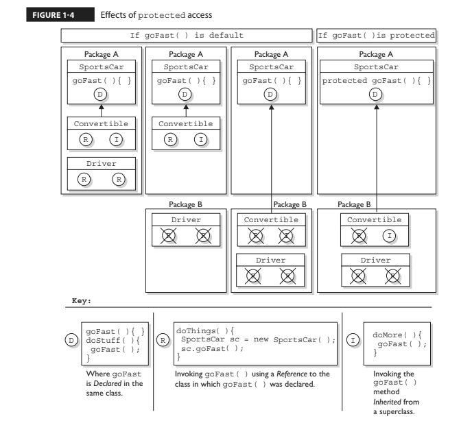

# VARIABLE AND METHODS ACCESS MODIFIERS 

# ACCESS MEMBER MODIFIERS (PUBLIC, PRIVATE, PROTECTED & DEFAULT)

> ## Its crucial that you understand access control inside-out for the exam.  

We've looked at what it means to use a modifier on a class declaration, next we will look at what it means to use a modifier on a method or variable declaration.  You can *modify a member with both **access** and **non-access modifiers*** and you have more modifiers to choose from and combine than when you're declaring a class.

Classes can only use default or public but members can use all four:
- ### 1 public
- ### 2 private
- ### 3 protected &
- ### default 

Default access is what you get when you don't type an access modifier in the variable declaration.  Default and protected access control modifiers have almost identical behavior.  When used in an interfaces method declaration default has a different meaning than what we are describing here.

You need to understand 2 different access issues:

- ### 1 Whether method code in one class can access a member of another class usind ( . ) notation
- ### 2 Whether a subclass can inherit a member of its superclass

The **first** type of access occurs when a method in one class tries to access a method or variable in another class, using the dot operator ( . ) to invoke a method or retrieve a variable.  For example:
```java
class Zoo {
    public String coolMethod(){
        return "Wow baby";
    }
}

class Moo {
    public void useAzoo(){
        Zoo z = new Zoo();
        // If the preceding line compiles Moo has access to the Zoo class, but does it have access to the coolMethod()?
        System.out.println("A Zoo says, " + z.coolMethod());
        // It works because Moo can access the public method
    }
}
```
The **second** type of access revolves around whether a subclass can **inherit** a method of a superclass.  Remember, if a subclass *inherits* a member its exactly as if the subclass actually declared the member itself.  In other words if the subclass *inherits* the member, the subclass *has* the member.
```java
class Zoo {
    public String coolMethod(){
        return "Wow baby";
    }
}

class Moo {
    public void useAzoo(){
        // Does an instance of Moo inherit the coolMethod()?
        System.out.println("A Zoo says, " + this.coolMethod());
        // It works because Moo can inherit the public method and invoke it as its own
        // Can an instance of Moo invoke a coolMethod() on an instance of Zoo?
        Zoo z = new Zoo();
        System.out.println("Zoo says, " + z.coolMethod());
        // coolMethod is public so Moo can invoke it on a Zoo reference
    }
}
```
Much of access control (both types) centers on whether the two classes involved are in the same or different packages.  
> ### First look at the access level of the class even if its members are declared public.  Once you've confirmed a class is visible then it makes sense to look at access levels on individual members. 

## 1 Public Members 

Public Members -> Full Access By Instance Or Inheritance In Any Package

### 1.1 Accessing through a new instance and dot notation

When a method or variable member (field) is delcared public it means that all other classes, regardless of the package they belong to, can access the member (assuming the class itself is visible).
Look at the following source file:
```java
package book;
import cert.*;
class Goo {
    public static void main(String[] args){
        Sludge o = new Sludge();
        o.testIt();
    }
}
```
Now look at the second file:
```java
package cert;
public class Sludge {
    public void testIt(){
        System.out.println("sludge");
    }
}
```
Even though Goo and Sludge are in different packages Goo can invoke the Sludge method after creating a new Sludge instance without problems because both the Sludge class and its testIt() method are marked public.
____

### 1.2 Accessing through inheritance and this. (optional)

For a subclass if a member of its superclass is declared public, the subclass inherits that member regardless of whether both classes are in the same package:
```java
package cert;
public class Roo {
    public String doRooThings(){
        return "fun";
    }
}
```
When a subclass of the Roo class is created any code in the Roo subclass can call its own inherited doRooThings() method.
```java
package notcert;
class Cloo extends Roo {
    public void testCloo(){
        System.out.println(doRooThings());
    }
}
```
If you see a method invoked without the dot operator ( . ) it means the method or variable belongs to the class where you see that code. It also means the method or variable is implicitly being accessed using the *this* reference.  
Code from some other class can also call the doRooThings() method on a Cloo instance. 
```java
package notcert;
class Toon {
    public static void main(String[] args) {
        Cloo c = new Cloo();
        System.out.println(c.doRooThings()); // No problem; method is public 
    }
}
```
____
## 2 Private Members 

Private Members -> Cannot Be Accessed 

> ## A private member is invisible to any code outside the members own class - no other class can access it
Members marked private cannot be accessed by code in any class other than the class in which the member was declared.  This is true for both accessing through a new instance and dot notation ( . ) as well as through inheritance and this. 
```java
package cert;
public class Roo {
    private String doRooThings(){
        // Only the Roo class knows about the fun code that goes here
        return "fun";
    }
}
```
Attempt to access using **inheritance**:
```java
package notcert;
import cert.Roo;
class UseARoo extends Roo {
    public void testIt(){
        System.out.println(this.doRooThings()); // Compiler error method is private!
    }
}
```
Attempt to access using a **new instance and dot ( . ) notation**:   
```java
package notcert;
import cert.Roo;
class UseARoo {
    public void testIt(){
        Roo r = new Roo();
        System.out.println(c.doRooThings()); // Compiler error method is private!
    }
}
```
Overriding depends on inheritance.  A subclass cannot override a private method because it cannot inherit it.  You can however create a newly-declared-but-just-happens-to-match method name with a different return type or anything else.  

Figure 1-3 illustrates the effects of the public and private modifiers from classes on the same or different packages:  


## 3 Protected and Default Members 
Default Members -> Same Package Only
Protected Members -> Inheritance Same Or Different Package

In the next several sections the word default refers to access control - we're not talking about the new Java 8 interface that can be declared default. The protected and default access control levels are almost identical, but with one critical difference.  A **default** member may only be accessed if the class accessing the member **belongs to the same package**, 
whereas a **protected member** can can be **accessed (through inheritance) by a subclass even if the subclass is in a different package**.  

```java
package certification;
public class OtherClass {
    void testIt() { // No modifier means method has default access
        System.out.println("OtherClass");
    }
}
```

```java
package something;
import certification.OtherClass;
class AccessClass {
    public static void main(String[] args) {
        OtherClas o = new OtherClass();
        o.testIt(); // Error testIt() only has default level access/no access from outside package
    }
}
```
## Protected Details (Protected in depth)
Protected Members -> Inheritance Same Or Different Package

Lets take a look at the protected instance variable (an instance variable is a member) of a superclass.  The variable x is protected meaing it will only be accessible through inheritance and available on the instance, a subclass outside the superclass package cannot access it using the parent class reference. 
```java
package certification;
public class Parent {
    protected int x = 9; // Protected access member
}
```
Attempt to access using **inheritance**:
```java
package other;
import certification.Parent;
class Child extends Parent {
    public void testIt(){
        System.out.println("x is " + x); // No problem, child inherits x and is available on the Child instance
    }
}
```
Attempt to access using a **new instance and dot ( . ) notation**: 
```java
package other;
import certification.Parent;
class Child extends Parent {
    public void testIt() {
        System.out.println("x is " + x); //No problem, child inherits x and is available on the Child instance

        Parent p = new Parent();

        System.out.println("X in parent is " + p.x); // Error! Cannot be accessed via p reference!
    }
}
```
So far we've established that a protected member has essentially package level or default access to all classes except for subclasses.  We've seen that subclasses outside the package can inherit a protected member.  Finally we've seen that subclasses outside the package can't use a superclass reference to access a protected member.  For a subclass outside the package, the protected member can only be accessed through inheritance.  

Once a subclass outside-the-package inherits the protected member, that member (as inherited by the subclass) becomes private to any code outside the subclass, with the exception of subclasses of the subclass.  So if a class neighbor instantiates a child object, then even if class neighbor is in the same package as the class Child, class Neighbor won't have access to the Child's inherrited (but protected) variable x. 



## Default details (default in depth)
If you dont type an access modifier in front of a class or member declaration, the access control is default, which means package level only.  
```java
package certification;
public class parent {
    int x = 9; // No access modifier means default (package) access
}
```
```java
package certification;
class Child extends Parent{
    static public void main(String[] args) {
        Child sc = new Child();
        sc.testIt();
    }
    public void testIt(){
        System.out.println("Variable x is " + x); // No problem - same package
    }
}
```
## Local variables and access modifiers
There is never a case where an access modifier can be applied to a local variable.  Only one modifier can be applied to local variables - final. Watch out for code like the following:
```java
class Foo {
    void doStuff(){
        private int x = 7;
        this.doMore(x);
    }
}
```


# NONACCESS MEMBER MODIFIERS (1 FINAL, 2 ABSTRACT, 3 SYNCHRONIZED, 4 NATIVE, 5 STRICTFP, 6 TRANSIENT, 7 STATIC)
We will look at modifiers applied to methods, then we will look at modifiers applied to instance variables.  We will wrap with a look at how static works when applied to variables and methods. 

## 1 Final
The ```final``` keyword prevents a method from being overridden in a subclass and is often used to enforce the API functionality of a method.  For instance, the String class is marked final and cannot be subclassed and overriden.  A typical final declaration looks like this:
```java
class Superclass{
    public final void showSample(){
        System.out.println("One thing.");
    }
}
```
Its legal to extend the Superclass, since the class isn't marked final, but we cant overridee the final method showSample(), as the following code attempts:
```java
class SubClass extends Superclass{
    public void showSample() {
        System.out.println("Another thing."); // Error! Attempt to override the final superclass method
    } 
}
```
## Final Method Arguments
Method arguments are essentially the same as local variables.  This means they can also have the final modifier:
```java
public Record getRecord(int fileNumber, final int recNumber){}
```
Here the recNumber variable is marked final and cannot be reassigned a new value.  A final parameter must keep the same value as the argument had when it was passed into the method. 

## 2 Abstract methods
An abstract method is a method that has been declared (as abstract) but not implemented.  In other words, the method contains no functional code.  An abstract method doesn't even have curly braces for where the implementation code goes, but instead closes with a semicolon.  In other words, it has no method body.

**You mark a method abstract when you want to force subclasses to provide the implementation.**  For instance, if you write an abstract class Car with a method goUpHill(); you might want to force each subtype of Car to define its own goUpHill(); behavior specific to that particular type of car. 

> ## It is illegal to have even a single abstract method in a class that is not explicitly declared abstract, you can however have an abstract class with no abstract methods!

Abstract method in a non-abstract class (illegal):
```java
public class IllegalClass{
    public abstract void doIt(); // Error! Class IllegalClass must be declared abstract!
}
```
Abstract class with no abstract method (legal):
```java
public abstract class LegalClass{
    void goodMethod(){
        // No problem
    } 
}
```
In the preceding class there are three different clues telling us that goodMethod() is not an abstract method:
- ## The method is not marked abstract
- ## Method declaration includes curly braces
- ## Method might provide actual implementation code inside the curly braces

Any class that extends an abstract class must implemented all abstract methods of the superclass, unless the subclass is also abstract.  The rule is this:
> ## The first concrete subclass of an abstract class must implemented all abstract methods of the superclass, unless the subclass is *also* abstract. 
Concrete just means nonabstract, so if you have an abstract class extending another abstract class, the abstract subclass doesnt need to provide implementations for hte inherited abstract methods.  Sooner or later, though, somebodys going to make a nonabstract subclass and that subclass will have to inherit all the abstract methods up the inheritance tree. 

```java
public abstract class Vehicle {
private String type;
public abstract void goUpHill(); // Abstract method
public String getType() { // Non-abstract method
return type;
}
}
public abstract class Car extends Vehicle {
public abstract void goUpHill(); // Still abstract
public void doCarThings() {
// special car code goes here
}
}
public class Mini extends Car {
public void goUpHill() {
// Mini-specific going uphill code
}
}
```
So how many methods does class Mini have? Three. It inherits both the getType() and doCarThings() methods because they're public and concrete (nonabstract). But because goUpHill() is abstract in the superclass Vehicle and is never implemented in the Car class (so it remains abstract), it means class Mini — as the first concrete class below Vehicle — must implement the goUpHill() method. In other words, class Mini can't pass the buck (of abstract method implementation) to the next class down the inheritance tree, but class Car can, since Car, like Vehicle, is abstract.

The effects of the concrete modifier on concrete and abstract subclasses:


Remember to look for concrete classes that don't provide method implementations for
abstract methods of the superclass. The following code won't compile:
```java
public abstract class A {
abstract void foo();
}
class B extends A {
void foo(int I) { }
}
```
Class B won't compile because it doesn't implement the inherited abstract
method foo(). Although the foo(int I) method in class B might appear to be an implementation of the superclass's abstract method, it is simply an **overloaded** method (a method using the same identifier, but different arguments), so it doesn't fulfill the requirements for implementing the superclass's abstract method. We'll look at the differences between overloading and overriding in detail in Chapter 2.
- ## A method can never, ever, ever be marked as both abstract and final, or both abstract and private.
- ## The abstract modifier can never be combined with the static modifier.  
We'll cover static methods later in this objective, but for now just remember that the following would be illegal:
```java
abstract static void doStuff(); // Error illegal combination of modifiers 
```

## 3 Synchronized methods (only methods)

The synchronized keyword indicates that a method can be accessed by only one thread at a time.  
*For now all you must know is that the synchronized keyword may be applied to methods only.*  You should know that a synchronized method declaration can be paired with any of the four access control levels.  When studying for OCP 8 you will study the synchronized keyword extensively.

Typical synchronized declaration:
```java
public synchronized Record retrieveUserInfo(int id){ }
```

## 4 Native methods (only methods)

The native method is implemented in platform-dependent code, often in C.  
*You don't need to know how to use native methods for the exam other than knowing that native is a modifier (thus a reserved keyword) and that it applies only to methods.* 
Note that a native methods code muust be a semicolon (;) like abstract methods, indicating that the implementation is omitted. 

## 5 Strictfp methods 

*For the exam all you need to know is that strictfp can modify a class or method declaration, and that a variable can never be delcared strictfp.* 
Strictfp forces floating points (and any floating point operations) to adhere to the IEEE 754 standard. With strictfp you can predict how your floating points will behave regardless of the underlying platform the JVM is running on.  The downside is that if the underlying platform is capable of supporting greater precision, a strictfp method won't be able to take advantage of it. 

## Methods with variable argument lists (var-args)

Java allows you to create methods that can take a variable number of arguments, also known as "var-ags".  
- ### 1 Arguments are the things you specify between the parentheses when you're invoking a method
```java 
doStuff("a", 2) // "a" and 2 are arguments
```
- ### 2 Parameters are the things in the methods signature that indicate what the method must receive when it is invoked
```java
void doStuff(String s, int a){ }
```

- ### 1 **Var-arg type** 
You must specify the type of the argument(s) this parameter of your method can receive.  This can be a primitive type or an object type.  
- ### 2 **Basic syntax** 
To declare a method using a var-arg parameter, you follow the type with an ellipsis **void doStuff(int... x)**, a space and then the name of the array that will hold the parameters received. 
- ### 3 **Other parameters** 
Its legal to have other parameters in a method that uses a var-arg  **void doStuff(char c, int... x)**. 
- ### 4 **Var-arg limits**
The var-arg must be the last parameter in the methods signature, and you can have only one var-arg in a method **void doStuff(String y, Animal... animal)**.

Legal declarations:
```java
void doStuff(int... x)
void doStuff(char c, int... x)
void doStuff(String y, Animal... animal)
```

Illegal declarations:
```java
void doStuff(int x...) // bad syntax
void doStuff(int... x, char... y) // too many var-args
void doStuff(String... s, byte b) // var-arg must be last
```
# Declarations

## Constructor declarations

In java, objects are constructed.  If you don't create one explicitly, the compiler will build one for you.  Every time you make a new object at least one constructor is invoked.  
```java
class Foo {
    protected Foo(){ } //This is Foo's constructor
    protected void Foo() { } //This is a badly named but legal method
}
```
- ### Constructor arguments can have all the normal access modifiers 
- ### Constructors can take arguments (including var-args), just like methods
- ### Constructors cant be marked static (they are associated with object instantiation)
- ### Constructors cant be marked final or abstract (because they cant be overriden)

Legal constructors:
```java
class Foo2 {
    Foo2() { }
    private Foo2(byte b) { }
    Foo2(int x) { }
    Foo2(int x, int... y) { }
}
```
Illegal constructors:
```java
class Foo2 {
    void Foo2() { } // it's a method, not a constructor (has a return type)
    Foo() { } // not a method or a constructor
    Foo2(short s); // looks like an abstract method (no method body)
    static Foo2(float f) { } // can't be static
    final Foo2(long x) { } // can't be final
    abstract Foo2(char c) { } // can't be abstract
    Foo2(int... x, int t) { } // bad var-arg syntax (var-arg must be last)
}
```

## Variable declarations

There are two types of variables in Java:

- ### 1 Primitives 
Once a primitive is delcared its type cannot change but the value may change.

1.1 Boolean
1.2 Byte
1.3 Short 
1.4 Int 
1.5 Long
1.6 Double
1.7 Float

- ### 2 Reference Variables
A reference variable is usede to refer to or access an object.  A reference variable is declared to be of a certain type and that type can never be changed.  A reference variable can be used to refer to any object of the declared type or of a subtype of the declared type (a compatible type).  More on this in chapter 2. 

Primitive variables can be delcared as:

- ### Class variables (statics)
- ### Instance variables
- ### Method parameters 
- ### Local variables

Their initialization is discussed in chapter 3.
```java
byte b;
boolean myBooleanPrimitive;
int x, y, z; // Declaring three primitives
```

For the current exam it is important to understand that for the integer types the sequence from small to big is byte, short, int, and long and that doubles are bigger than floats.  
You will also need to know that number types (both integer and floating point types) are all signed and how that affects their ranges.  


