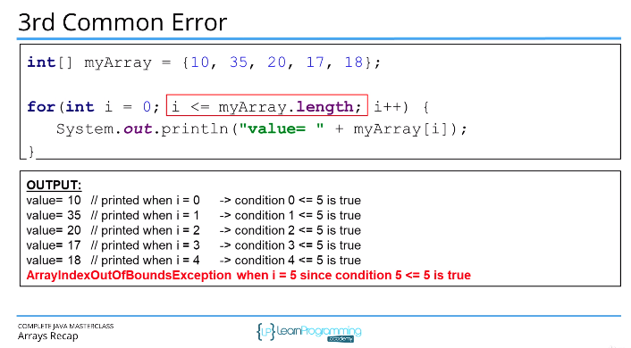

- ### [3 Arrays](#3_Arrays)

# <a name="3_Arrays"></a> 3 Arrays

- An array is a data structure that allows you to store multiple values of the same type into a single variable.
- The default values of numeric array elements are set to `0`, for booleans is `false` and for string and other objects its `null`.
- Arrays are **zero indexed**: an array with n elements is indexed from 0 to n-1, for example 10 elements index range is from 0 to 9.
- If we try to access index that is out of range Java will give us an `ArrayIndexOutOfBoundsException`, which indiciates that the index is out of range in other words out of bounds.
- To access array elements we use the square braces `[]`, also known as array access operator.
- We can also initialize an array inline by using array initializer block `{}`. Values we define need to be separated by a comma `{3, 2, 1}`.

  Common Array errors:




```java
import java.util.Scanner;

public class Main {

    private static Scanner scanner = new Scanner(System.in);

    public static void main(String[] args) {
        int[] myIntegers = getIntegers(5);
        for(int i=0; i<myIntegers.length; i++) {
            System.out.println("Element " + i +", typed value was " + myIntegers[i]);
        }
        System.out.println("The average is " + getAverage(myIntegers));

    }

    public static int[] getIntegers(int number) {
        System.out.println("Enter " + number + " integer values.\r");
        int[] values = new int[number];

        for(int i=0; i<values.length; i++) {
            values[i] = scanner.nextInt();
        }

        return values;
    }

    public static double getAverage(int[] array) {
        int sum = 0;
        for(int i=0; i< array.length; i++) {
            sum += array[i];
        }

        return (double) sum / (double)array.length;

    }
}
```

---

## Arrays continued

---

```java
import java.util.Arrays;
import java.util.Scanner;

public class Main {
    private static Scanner scanner = new Scanner(System.in);

    public static void main(String[] args) {
	    // Create a program using arrays that sorts a list of integers in descending order.
        // Descending order is highest value to lowest.
        // In other words if the array had the values in it 106, 26, 81, 5, 15 your program should
        // ultimately have an array with 106,81,26, 15, 5 in it.
        // Set up the program so that the numbers to sort are read in from the keyboard.
        // Implement the following methods - getIntegers, printArray, and sortIntegers
        // getIntegers returns an array of entered integers from keyboard
        // printArray prints out the contents of the array
        // and sortIntegers should sort the array and return a new array containing the sorted numbers
        // you will have to figure out how to copy the array elements from the passed array into a new
        // array and sort them and return the new sorted array.

        int[] myIntegers = getIntegers(5);
        int[] sorted = sortIntegers(myIntegers);
        printArray(sorted);

    }

    public static int[] getIntegers(int capacity) {
        int[] array = new int[capacity];
        System.out.println("Enter " + capacity +" integer values:\r");
        for(int i=0; i<array.length; i++) {
            array[i] = scanner.nextInt();
        }
        return array;
    }

    public static void printArray(int[] array) {
        for(int i=0; i<array.length; i++) {
            System.out.println("Element " + i + " contents " + array[i]);
        }
    }

    public static int[] sortIntegers(int[] array) {
//        int[] sortedArray = new int[array.length];
//        for(int i=0; i<array.length; i++) {
//            sortedArray[i] = array[i];
//        }
        int[] sortedArray = Arrays.copyOf(array, array.length);

        boolean flag = true;
        int temp;
        while(flag) {
            flag = false;
            // element 0     160
            // element 1     50
            // element 2     40

            for(int i=0; i<sortedArray.length-1; i++) {
                if(sortedArray[i] < sortedArray[i+1]) {
                    temp = sortedArray[i];
                    sortedArray[i] = sortedArray[i+1];
                    sortedArray[i+1] = temp;
                    flag = true;
                }
            }
        }

        return sortedArray;
    }
}
```
