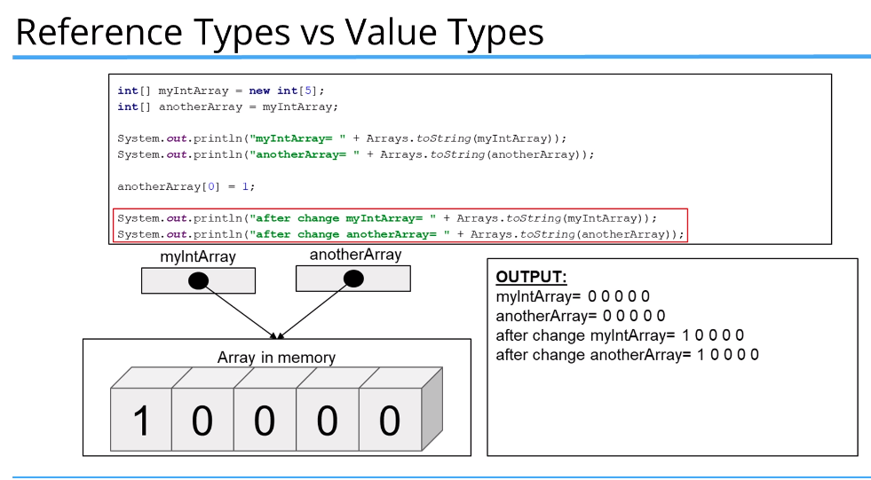

All primitive types such as int, double and boolean are value types i.e. they hold a value.
Unlike primitive types arrays and strings are reference types.



The same thing happens when passing array references to methods. The reference is still pointing to the same array in memory

```java
import java.util.Arrays;

public class Main {

    public static void main(String[] args) {

        int myIntValue = 10;
        int anotherIntValue = myIntValue;

        System.out.println("myIntValue = " + myIntValue);
        System.out.println("anotherIntValue = " + anotherIntValue);

        anotherIntValue++;

        System.out.println("myIntValue = " + myIntValue);
        System.out.println("anotherIntValue = " + anotherIntValue);

        int[] myIntArray = new int[5];
        int[] anotherArray = myIntArray;

        System.out.println("myIntArray= " + Arrays.toString(myIntArray));
        System.out.println("anotherArray= " + Arrays.toString(anotherArray));

        anotherArray[0] = 1;

        System.out.println("after change myIntArray= " + Arrays.toString(myIntArray));
        System.out.println("after change anotherArray= " + Arrays.toString(anotherArray));

        anotherArray = new int[]{4, 5, 6, 7, 8};
        modifyArray(myIntArray);

        System.out.println("after modify myIntArray= " + Arrays.toString(myIntArray));
        System.out.println("after modify anotherArray= " + Arrays.toString(anotherArray));
    }

    private static void modifyArray(int[] array) {

        array[0] = 2;
        array = new int[] {1, 2, 3, 4, 5};
    }
}
```

Outputs:

```java
myIntValue = 10
anotherIntValue = 10
myIntValue = 10
anotherIntValue = 11
myIntArray= [0, 0, 0, 0, 0]
anotherArray= [0, 0, 0, 0, 0]
after change myIntArray= [1, 0, 0, 0, 0]
after change anotherArray= [1, 0, 0, 0, 0]
after modify myIntArray= [2, 0, 0, 0, 0]
after modify anotherArray= [4, 5, 6, 7, 8]
```
