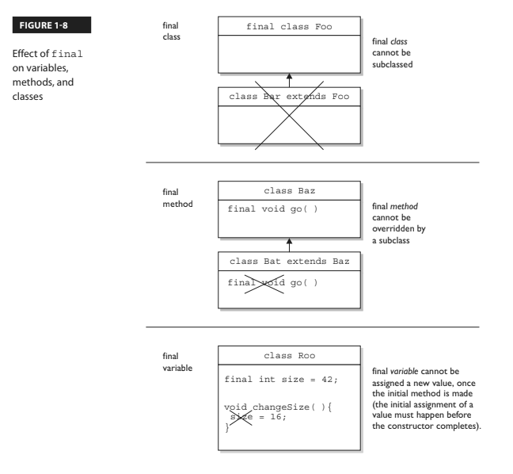
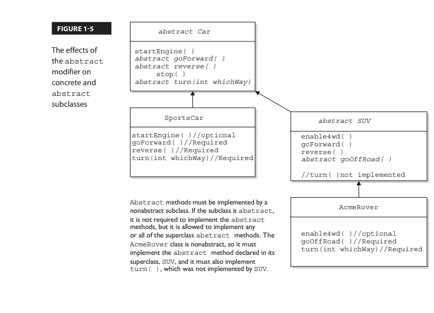
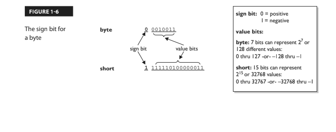
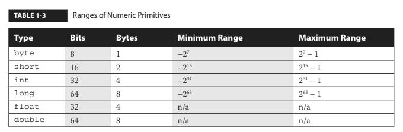
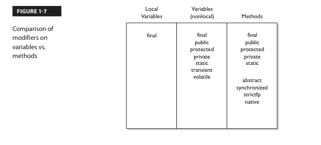
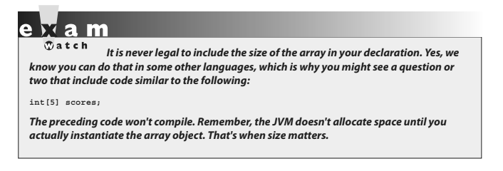

# VARIABLE AND METHODS ACCESS MODIFIERS 

# NONACCESS MEMBER MODIFIERS 
## (1 FINAL, 2 ABSTRACT, 3 SYNCHRONIZED, 4 NATIVE, 5 STRICTFP, 6 TRANSIENT, 7 VOLATILE, 8 STATIC)
We will look at modifiers applied to methods, then we will look at modifiers applied to instance variables.  We will wrap with a look at how static works when applied to variables and methods. 

## 1 Final
The ```final``` keyword prevents a method from being overridden in a subclass and is often used to enforce the API functionality of a method.  For instance, the String class is marked final and cannot be subclassed and overriden.  A typical final declaration looks like this:
```java
class Superclass{
    public final void showSample(){
        System.out.println("One thing.");
    }
}
```
Its legal to extend the Superclass, since the class isn't marked final, but we cant overridee the final method showSample(), as the following code attempts:
```java
class SubClass extends Superclass{
    public void showSample() {
        System.out.println("Another thing."); // Error! Attempt to override the final superclass method
    } 
}
```
## Final Method Arguments
Method arguments are essentially the same as local variables.  This means they can also have the final modifier:
```java
public Record getRecord(int fileNumber, final int recNumber){}
```
Here the recNumber variable is marked final and cannot be reassigned a new value.  A final parameter must keep the same value as the argument had when it was passed into the method. 

[**I've moved the section below up from the end of the chapter (after array declarations) because I thought it fits in here**]

- For primitives, once the variable has been assigned a value, the value cannot be altered.  
For example assigning 10 to an int variable x will result in x being 10 forever.  
- For objects a reference variable marked final can never be reassigned to refer to a different object. 
The data within the object can be modified, but the reference variable cannot be changed.  In other words, a final reference still allows you to modify the state of an object but you cant modify the reference variable to make it refer to a different object. 
> ### There are no final objects, only final references!

The figure below highlights the key differences of the various applications of final:



## 2 Abstract methods
An abstract method is a method that has been declared (as abstract) but not implemented.  In other words, the method contains no functional code.  An abstract method doesn't even have curly braces for where the implementation code goes, but instead closes with a semicolon.  In other words, it has no method body.

**You mark a method abstract when you want to force subclasses to provide the implementation.**  For instance, if you write an abstract class Car with a method goUpHill(); you might want to force each subtype of Car to define its own goUpHill(); behavior specific to that particular type of car. 

> ## It is illegal to have even a single abstract method in a class that is not explicitly declared abstract, you can however have an abstract class with no abstract methods!

Abstract method in a non-abstract class (illegal):
```java
public class IllegalClass{
    public abstract void doIt(); // Error! Class IllegalClass must be declared abstract!
}
```
Abstract class with no abstract method (legal):
```java
public abstract class LegalClass{
    void goodMethod(){
        // No problem
    } 
}
```
In the preceding class there are three different clues telling us that goodMethod() is not an abstract method:
- ## The method is not marked abstract
- ## Method declaration includes curly braces
- ## Method might provide actual implementation code inside the curly braces

Any class that extends an abstract class must implemented all abstract methods of the superclass, unless the subclass is also abstract.  The rule is this:
> ## The first concrete subclass of an abstract class must implemented all abstract methods of the superclass, unless the subclass is *also* abstract. 
Concrete just means nonabstract, so if you have an abstract class extending another abstract class, the abstract subclass doesnt need to provide implementations for hte inherited abstract methods.  Sooner or later, though, somebodys going to make a nonabstract subclass and that subclass will have to inherit all the abstract methods up the inheritance tree. 

```java
public abstract class Vehicle {
private String type;
public abstract void goUpHill(); // Abstract method
public String getType() { // Non-abstract method
return type;
}
}
public abstract class Car extends Vehicle {
public abstract void goUpHill(); // Still abstract
public void doCarThings() {
// special car code goes here
}
}
public class Mini extends Car {
public void goUpHill() {
// Mini-specific going uphill code
}
}
```
So how many methods does class Mini have? Three. It inherits both the getType() and doCarThings() methods because they're public and concrete (nonabstract). But because goUpHill() is abstract in the superclass Vehicle and is never implemented in the Car class (so it remains abstract), it means class Mini — as the first concrete class below Vehicle — must implement the goUpHill() method. In other words, class Mini can't pass the buck (of abstract method implementation) to the next class down the inheritance tree, but class Car can, since Car, like Vehicle, is abstract.

The effects of the concrete modifier on concrete and abstract subclasses:



Remember to look for concrete classes that don't provide method implementations for
abstract methods of the superclass. The following code won't compile:
```java
public abstract class A {
abstract void foo();
}
class B extends A {
void foo(int I) { }
}
```
Class B won't compile because it doesn't implement the inherited abstract
method foo(). Although the foo(int I) method in class B might appear to be an implementation of the superclass's abstract method, it is simply an **overloaded** method (a method using the same identifier, but different arguments), so it doesn't fulfill the requirements for implementing the superclass's abstract method. We'll look at the differences between overloading and overriding in detail in Chapter 2.
- ## A method can never, ever, ever be marked as both abstract and final, or both abstract and private.
- ## The abstract modifier can never be combined with the static modifier.  
We'll cover static methods later in this objective, but for now just remember that the following would be illegal:
```java
abstract static void doStuff(); // Error illegal combination of modifiers 
```

## 3 Synchronized methods (only methods)

The synchronized keyword indicates that a method can be accessed by only one thread at a time.  
*For now all you must know is that the synchronized keyword may be applied to methods only.*  You should know that a synchronized method declaration can be paired with any of the four access control levels.  When studying for OCP 8 you will study the synchronized keyword extensively.

Typical synchronized declaration:
```java
public synchronized Record retrieveUserInfo(int id){ }
```

## 4 Native methods (only methods)

The native method is implemented in platform-dependent code, often in C.  
*You don't need to know how to use native methods for the exam other than knowing that native is a modifier (thus a reserved keyword) and that it applies only to methods.* 
Note that a native methods code muust be a semicolon (;) like abstract methods, indicating that the implementation is omitted. 

## 5 Strictfp methods 

*For the exam all you need to know is that strictfp can modify a class or method declaration, and that a variable can never be delcared strictfp.* 
Strictfp forces floating points (and any floating point operations) to adhere to the IEEE 754 standard. With strictfp you can predict how your floating points will behave regardless of the underlying platform the JVM is running on.  The downside is that if the underlying platform is capable of supporting greater precision, a strictfp method won't be able to take advantage of it. 

## Methods with variable argument lists (var-args)

Java allows you to create methods that can take a variable number of arguments, also known as "var-ags".  
- ### 1 Arguments are the things you specify between the parentheses when you're invoking a method
```java 
doStuff("a", 2) // "a" and 2 are arguments
```
- ### 2 Parameters are the things in the methods signature that indicate what the method must receive when it is invoked
```java
void doStuff(String s, int a){ }
```

- ### 1 **Var-arg type** 
You must specify the type of the argument(s) this parameter of your method can receive.  This can be a primitive type or an object type.  
- ### 2 **Basic syntax** 
To declare a method using a var-arg parameter, you follow the type with an ellipsis **void doStuff(int... x)**, a space and then the name of the array that will hold the parameters received. 
- ### 3 **Other parameters** 
Its legal to have other parameters in a method that uses a var-arg  **void doStuff(char c, int... x)**. 
- ### 4 **Var-arg limits**
The var-arg must be the last parameter in the methods signature, and you can have only one var-arg in a method **void doStuff(String y, Animal... animal)**.

Legal declarations:
```java
void doStuff(int... x)
void doStuff(char c, int... x)
void doStuff(String y, Animal... animal)
```

Illegal declarations:
```java
void doStuff(int x...) // bad syntax
void doStuff(int... x, char... y) // too many var-args
void doStuff(String... s, byte b) // var-arg must be last
```
# Declarations (Constructors & Variables)

# Constructor declarations

In java, objects are constructed.  If you don't create one explicitly, the compiler will build one for you.  Every time you make a new object at least one constructor is invoked.  
```java
class Foo {
    protected Foo(){ } //This is Foo's constructor
    protected void Foo() { } //This is a badly named but legal method
}
```
- ### Constructor arguments can have all the normal access modifiers 
- ### Constructors can take arguments (including var-args), just like methods
- ### Constructors cant be marked static (they are associated with object instantiation)
- ### Constructors cant be marked final or abstract (because they cant be overriden)

Legal constructors:
```java
class Foo2 {
    Foo2() { }
    private Foo2(byte b) { }
    Foo2(int x) { }
    Foo2(int x, int... y) { }
}
```
Illegal constructors:
```java
class Foo2 {
    void Foo2() { } // it's a method, not a constructor (has a return type)
    Foo() { } // not a method or a constructor
    Foo2(short s); // looks like an abstract method (no method body)
    static Foo2(float f) { } // can't be static
    final Foo2(long x) { } // can't be final
    abstract Foo2(char c) { } // can't be abstract
    Foo2(int... x, int t) { } // bad var-arg syntax (var-arg must be last)
}
```

# Variable declarations

There are two types of variables in Java:

- ### 1 Primitives 
Once a primitive is delcared its **type** cannot change but the **value** may change.

1.1 Boolean
1.2 Byte
1.3 Short 
1.4 Int 
1.5 Long
1.6 Double
1.7 Float

- ### 2 Reference Variables
A reference variable is used to refer to or access an object.  A reference variable is declared to be of a certain type and that type can never be changed.  A reference variable can be used to refer to any object of the declared type or of a subtype of the declared type (a compatible type).  More on this in chapter 2. 

Primitive variables can be delcared as:

- ### Class variables (statics)
- ### Instance variables
- ### Method parameters 
- ### Local variables

**Their initialization is discussed in chapter 3.**
```java
byte b;
boolean myBooleanPrimitive;
int x, y, z; // Declaring three primitives
```

> ### For the current exam it is important to understand that for the integer types the sequence from small to big is byte, short, int, and long and that doubles are bigger than floats.  
> ### You will also need to know that number types (both integer and floating point types) are all signed and how that affects their ranges.  

Lets review the concepts:

- ### All 6 number types in Java are made up of a certain number of 8 bit bytes and are signed meaning they can be negative or positive 
- ### The leftmost bit is the most signigicant digit is used to represent the sign
- ### The rest of the bits represent the value, using two's complement notation 



The table below shows the primitive types with their ranges and sizes.  

With a byte for example there are 256 possible numbers or (2<sup>8</sup>).  Half of these are negative and the other half - 1 are positive.  The positive range is one less than the negative range because the number 0 is stored as a positive binary number.  We use the formula -2<sup>(bits-1)</sup>, and we use 2<sup>(bits-1)-1</sup> for the positive range.

> ### If you know the first two columns of this table you will be in good shape for the exam



## Declaring reference variables (class variables, instance variables, method parameters, local variables)

Reference variables can be declared as static variables, instance variables, method parameters, or local parameters.  
You can also declare one or more reference variables of the same type, in a single line. 
Examples of reference variables:
```java
Object o;
Dog myNewDogReferenceVariable;
String s1, s2, s3;
```

## Instance variables - normally what the constructor refers to

Instance variables are defined inside the class, but outside of any method, and are initialized only when the class is instantiated. Instance variables are the fields which belong to each unique object.  

Instance variables for the name, title and manager for employee objects example:
```java
class Employee {
// define fields (instance variables) for employee instances
private String name;
private String title;
private String manager;
// other code goes here including access methods for private fields
}
```
This employee class says that each employee instance will know its own name, title and manager. 

> ### For the exam you need to know that instance variables:

- ### Can use any of the four access levels
- ### Can be marked final or transient
- ### Cannot be marked abstract, synchronized, strictfp, native or static (static would make them become class variables)

Later in this chapter we will look at what it means to apply the final or transient modifier to an instance variable.  Lets take a look at the difference between instance and local variables.



## Local (Automatic/Stack/Method) variables

A local variable is a variable declared within a method.  It is declared and initialized within the method.  Just as the local variable starts its life inside the method, its also destroyed when the method has completed.  

- Local variables are always on the **stack** not the *heap* but this will be discussed more in chapter 3
- There is no such thing as a stack object, only a stack variable

Although the value of the variable might be passed into, say, another method that then stores the value on an instance variable, the variable itself lives only within the scope of the method.

- Local variable declarations **cant use most of the modifiers that can be applied to instance variables** such as public, but they can be marked as **final**. 
- Before a local variable can be used it must be initialised with a value - local variables dont get default values.  The compiler will reject any local variable initialised without a value.  
- Local variables are only available within the scope of the method body in which they are initialised.   

The following code is illegal:
```java
class TestServer {
    public void logIn() {
        int count = 10;
    }
    
    public void doSomething(int i) {
        count = i; // Won't compile! Can't access count outside method logIn()                                                            
    }
}
```
___

Note that it is possible to declare a local variable with the same name as an instance variable but it **not recommended**.  Its known as **shadowing**, as the following code demonstrates:
```java
class TestServer {
    int count = 9; // Declare an instance variable named count
    
    public void logIn() {
        int count = 10; // Declare a local variable named count
        System.out.println("local variable count is " + count);
    }

    public void count() {
        System.out.println("instance variable count is " + count);
    }

    public static void main(String[] args) {
        new TestServer().logIn();
        new TestServer().count();
    }
}
```
The preceding code produces the following output:
```java
local variable count is 10
instance variable count is 9
```
____

You might also decide you want to give a method parameter the same name as the instance variable its value is destined for.  The best way to go about resolving the naming collision is to use the **this** keyword.
> ### The keyword **this** always refers to the object currently running. 
Example:

```java
class Foo {
    int size = 27;
    public void setSize(int size) {
        this.size = size; // this.size means the current object's instance variable, size. The size on the right is the parameter
    }
}
```


# Array declarations 
In Java arrays are objects that store multiple variables of the same type or variables that are all subclasses of thje same type.  
Arrays can hold either primitives or object references.
It is never legal to include the size of the array in your declaration. 
An array will always be an object on the heap even if it is declared to hold primitive elements.  

> ### For the exam you need to know three things about arrays

- ### How to make an array reference variable (declare)
- ### How to make an array object (construct)
- ### How to populate the array with elements (initialize)

In this chapter we will look at declaring an array:

> ### Arrays are great but one day when you are on the job you'll often use one of the collection types from java.util (including *Hashmap, Arraylist, Treeset*).  These collection classes can expand or contract dynamically as you add or remove elements and also offer more flexible ways to access an object (for insertion, deletion, reading and so on).  Fast sorts, objects without duplicates, ways to access name-value pairs are all benefits of these collection types.

> ### The only collection type in the exam is *ArrayList* and this collection type is discussed in more detail in chapter 5.

Arrays are declared by stating the type of elements the array will hold (an objector a primitive), followed by square brackets to either side of the identifier.  When declaring an array reference, you should always put the array brackets immediately after the declared type,rather than after the identifier (variable name).

1. Declaring an array of primitives:
```java
int [] key;
int key []; // Square brackets after identifier - legal but not recommended
```
2. Declaring an array of object references:
```java
Thread [] threads; 
Thread threads [];  // Legal but not recommended
```
Multidimensional array declarations:
```java
String[][][] occupantName; // Three dimensional array - array of array of arrays
String[] managerName []; // Two dimensional array - notice one square bracket before and one after the identifier - this declaration style is legal but not recommended
```


## 6 Transient variables

Marking an instance variable as **transient**, tells the JVM to skip (ignore) this variable when you attempt to serialize the object containing it.

Serialization is one of the coolest features of Java; it lets you save (sometimes called "flatten") an object by writing its state (in other words, the value of its instance variables) to a special type of I/O stream. With serialization, you can save an object to a file or even ship it over a wire for reinflating (deserializing) at the other end in another JVM.
> ### Serialization is no longer in the exam

## 7 Volatile variables

The volatile modifier tells the JVM that a thread accessing the variable must always reconcile its own private copy of the variable with the master copy in memory. Say what!? Don't worry about it. 
> ### For the exam, all you need to know about volatile is that it exists.

## 8 Static variables and methods 

The discussion of static in this section DOES NOT include the new static interface method discussed earlier in this chapter.

The **static** modifier modifier is used to create variables and methods that will exist independently of any instances created for the class.  All **static** members exist before you ever make a new instance of a class, and there will be only one copy of a **static** member regardless of the number of instances of that class.

> ### In other words all instances of a given class share the same value for any given static variable.

Static members are covered in great detail in chapter 2. 

Things you can mark as static:
- Methods
- Variables
- A class nested within another class, 
- Initialization blocks

Things you cannot mark as static:
- Constructors (Makes no sense; a constructor is used only to create instances)
- Classes (Unless they are nested)
- Interfaces (Unless they are nested)
- Local variables
- Method local inner classes (not on the OCA 8 exam)
- Inner class methods and instance variables (not on the OCA 8 exam)
