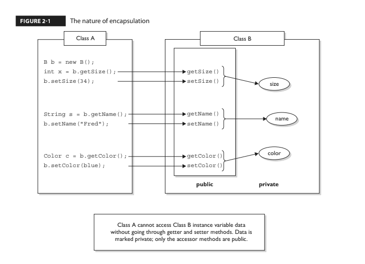
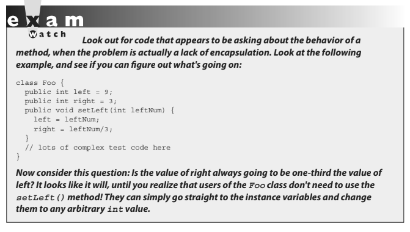

- ### [1 Encaptulation](#1_Encaptulation)
- ### [2 Inheritance & Polymorphism](#2_Inheritance_&_Polymorphism)
- ### [3 Polymorphism](#3_Polymorphism)
- ### [4 Overriding/Overloading](#4_Overriding/Overloading)
- ### [5 Casting](#5_Casting)
- ### [6 Implementing an Interface](#6_Implementing_an_Interface)
- ### [7 Legal Return Types](#7_Legal_Return_Types)
- ### [8 Constructors & Instantiation](#8_Constructors_&_Instantiation)
- ### [9 Initialization Blocks](#9_Initialization_Blocks)
- ### [10 Statics](#10_Statics)

# <a name="1_Encaptulation"></a> 1 Encaptulation

If you want maintainability, flexibility and extensibility your design must include encaptulation:
- ### Keep instance variables hidden with an access modifier (often private)
- ### Make public accessor methods (Getters and Setters) rather than directly accessing the instance variable
- ### Use the correct naming convention for setters and getters set(SomeProp) & get(SomeProp)

Image below illustrates the use of getters and setters (also known as accessors and mutators):



**Always force calling code to go through your methods rather than going directly to instance variables**.  You can then rework your method implementations later.  In chapter 6 we will revisit the topic of encaptulation has it applies to instance variables that are also reference variables.



# <a name="2_Inheritance_&_Polymorphism"></a> 2 Inheritance & Polymorphism

### OCA Objectives

- **7.1 Describe inheritance and its benefits.**
- **7.2 Develop code that demonstrates the use of polymorphism; including overriding and object type versus reference type (sic).**

Inheritance is everywhere in Java.  Remember that the instance of operator returns true if the reference variable being tested is of the type it is being compared to. 

```java
class Test {
    public static void main(String [] args) {
        Test t1 = new Test();
        Test t2 = new Test();
    
        if (!t1.equals(t2))
            System.out.println("they're not equal");
        if (t1 instanceof Object)
            System.out.println("t1's an Object");
    }
}
//produces this output:
// they're not equal
// t1's an Object
```
How do we have access to this equals method if the reference variable is of type test and there is no equals method in the test class?
How can the second if statement test true to t1 being an instance of object if we just said it is of type test?

> ### This is because every class in Java is a subclass of type object and therefore every class you will ever use or ever write will inherit from class object.

You will always have an an equals method, a clone method, notify, wait, and others available to use. Whenever you create a class, you automatically inherit all of class Object's methods.  That one equals method has been inherited billions of times.  (To be fair, equals has also been overridden billions of times, but we're getting
ahead of ourselves.)

## The evolution of inheritance 

As the following table shows, it's now possible to inherit concrete methods from interfaces. This is a big change. - For the rest of the chapter, when we talk about inheritance generally, we will tend to use the terms "subtypes" and "supertypes" to acknowledge that both classes and interfaces need to be accounted for. 
- We will tend to use the terms "subclass" and "superclass" when we're discussing a specific example that's under discussion.

Inheritance is a key aspect of most of the topics we will be discussing in this chapter so be prepared for lots of discussion on the interaction between supertypes and subtypes. 

As you study the following table you will notice that as of Java 8 interfaces can contain two types of concrete methods, static and default. 
This table summarizes the elements of classes and interfaces relative to inheritance:


> ### For the exam you will need to know that you can create inheritance relationships in Java by extending a class or by implementing an interface.  

It's also important to understand that the two most common reasons to use inheritance are:
- **To promote code reuse**
- **To use polymorphism**

### To promote code reuse 
A common design approach is to create a fairly generic version of a class with the intention of creating more specialized subclasses that inherit from it.  For example:
```java
class GameShape {
    public void displayShape() {
        System.out.println("displaying shape");
    }
// more code
}
class PlayerPiece extends GameShape {
    public void movePiece() {
        System.out.println("moving game piece");
    }
// more code
}
public class TestShapes {
    public static void main (String[] args) {
        PlayerPiece shape = new PlayerPiece();
        shape.displayShape();
        shape.movePiece();
    }
}
// outputs:
// displaying shape
// moving game piece
```
Notice that the PlayerPiece class inherits the generic displayShape() method from the less-specialized class GameShape and also adds its own method, movePiece(). Code reuse through inheritance means that methods with generic functionality—such as displayShape(), which could apply to a wide range of different kinds of shapes in a game—don't have to be reimplemented. That means all specialized subclasses of GameShape are guaranteed to have the capabilities of the more general superclass. 

### To use polymorphism 

The beautiful thing about polymorphism ("many forms") is that you can treat any subclass of GameShape as a GameShape. In other words, you can write code in your GameLauncher class that says, "I don't care what kind of object you are as long as you inherit from (extend) GameShape. And as far as I'm concerned, if you extend GameShape, then you've definitely got a displayShape() method, so I know I can call it."

Imagine we now have two specialized subclasses that extend the more generic GameShape class, PlayerPiece and TilePiece:
```java
class GameShape {
    public void displayShape() {
        System.out.println("displaying shape");
    }
// more code
}
class PlayerPiece extends GameShape {
    public void movePiece() {
        System.out.println("moving game piece");
    }
// more code
}
class TilePiece extends GameShape {
    public void getAdjacent() {
        System.out.println("getting adjacent tiles");
    }
// more code
}
```
Now imagine a test class has a method with a declared argument type of GameShape, which means it can take any kind of GameShape. In other words, any subclass of GameShape can be passed to a method with an argument of type GameShape.
```java
public class TestShapes {
    public static void main (String[] args) {
        PlayerPiece player = new PlayerPiece();
        TilePiece tile = new TilePiece();
        doShapes(player);
        doShapes(tile);
    }

    public static void doShapes(GameShape shape) {
        shape.displayShape();
    }
}

// Outputs:
// displaying shape
// displaying shape 
```
The key point is that the doShapes() method is declared with a GameShape argument but can be passed any subtype (in this example, a subclass) of GameShape.  The method can then invoke any method of GameShape, without any concern for the actual runtime class type of the object passed to the method.

There are implications, though. The doShapes() method knows only that the objects are a type of GameShape since that's how the parameter is declared. And using a reference variable declared as type GameShape—regardless of whether the variable is a method parameter, local variable, or instance variable—means that only the methods of GameShape can be invoked on it. The methods you can call on a reference are totally dependent on the declared type of the variable, no matter what the actual object is, that the reference is referring to. That means you can't use a GameShape variable to call, say, the getAdjacent() method even if the object passed in is of type TilePiece. (We'll see this again when we look at interfaces.)

## IS-A and HAS-A relationships

> ### The OCA 8 exam won't ask you directly about IS-A and HAS-A relationships. But understanding IS-A and HAS-A relationships will help OCA 8 candidates with many of the questions on the exam.

### IS-A
> ### OCA exam won't ask you directly about IS-A and HAS-A relationships.

In OO, the concept of IS-A is based on inheritance.  For example, Sabaru IS-A Car or Broccoli IS-A vegetable.

You express the IS-A relationship in Java through the keywords extends (for class inheritance) and implements (for interface implementation).

```java
public class Car {
    // Cool Car code goes here
}

public class Subaru extends Car {
    // Important Subaru-specific stuff goes here
    // Sabaru also inherits accessible car members which can include both methods and variables
}
```
A car is a type of Vehicle, so the inheritance tree might start from the vehicle class as follows:
```java
public class Vehicle {...}
public class Car extends Vehicle {...}
public class Subaru extends Car {...}
```
In OO terms, you can say the following:
```java
Vehicle is the superclass of Car.
Car is the subclass of Vehicle.
Car is the superclass of Subaru.
Subaru is the subclass of Vehicle.
Car inherits from Vehicle.
Subaru inherits from both Vehicle and Car.
Subaru is derived from Car.
Car is derived from Vehicle.
Subaru is derived from Vehicle.
Subaru is a subtype of both Vehicle and Car.
```
Returning to our IS-A relationship, the following statements are true:
```java
"Car extends Vehicle" means "Car IS-A Vehicle."
"Subaru extends Car" means "Subaru IS-A Car."
```
And we can also say:
```java
"Subaru IS-A Vehicle"
```

### HAS-A

HAS-A relationships are based on use, rather than inheritance. In other words, class A HAS-A B if code in class A has a reference to an instance of class B. For example, you can say the following: A Horse IS-A Animal. A Horse HAS-A Halter.
```java
public class Horse extends Animal {
    private Halter myHalter = new Halter();

    public void tie(LeadRope rope) {
        myHalter.tie(rope); // Delegate tie behavior to the
        // Halter object
    }
}

public class Halter {
    public void tie(LeadRope aRope) {
        // Do the actual tie work here
    }
}
```
In OO, we don't want callers to worry about which class or object is actually doing the real work. To make that happen, the Horse class hides implementation details from Horse users. Horse users ask the Horse object to do things (in this case, tie itself up), and the Horse will either do it or, as in this example, ask something else (like perhaps an inherited Animal class method) to do it. To the caller, though, it always appears that the Horse object takes care of itself. Users of a Horse should not even need to know that there is such a thing as a Halter class.

# <a name="3_Polymorphism"></a> 3 Polymorphism

Remember that any Java object that can pass more than one IS-A test can be
considered polymorphic. Other than objects of type Object, all Java objects are polymorphic in that they pass the IS-A test for their own type and for class Object. Remember, too, that the only way to access an object is through a reference variable. 

There are a few key things you should know about references:

- ### A reference variable can be of only one type and once declared that type can never be changed (although the object it references can change)
- ### The reference variable can be reassigned to other objects (unless the reference is declared final)
- ### A reference variables type determines the methods that can be invoked on the object the variable is referencing

- ### A reference variable can refer to any object of the same type as the declared reference, or **it can refer to any subtype of the declared type!**

- ### A reference variable can be declared as a class type or an interface type.  If the variable is declared as an interface type, it can reference any object of the class that *implements* the interface. 

*Earlier we created a GameShape class that was extended by two other classes, PlayerPiece and TilePiece. Now imagine you want to animate some of the shapes on the gameboard. But not all shapes are able to be animated, so what do you do with class inheritance?*

*Could we create a class with an animate() method and have only some of the GameShape subclasses inherit from that class?* 

**No**

A class cannot extend more than one class: that means one parent per class. A class can have multiple ancestors, however, since class B could extend class A, and class C could extend class B, and so on. So any given class might have multiple classes up its inheritance tree, but that's not the same as saying a class directly extends two classes.

*So if that doesn't work, what else could you do? You could simply put the animate() code in GameShape, and then disable the method in classes that can't be animated. But that's a bad design choice for many reasons—it's more error prone; it makes the GameShape class less cohesive; and it means the GameShape API "advertises" that all shapes can be animated when, in fact, that's not true since only some of the GameShape subclasses will be able to run the animate() method successfully.*

The solution: Create an Animatable interface, and have only the GameShape subclasses that can be animated implement the interface.  Heres the interface and the modified PlayerPiece class that implements the interface:

```java
public interface Animatable {
    public void animate();
}

class PlayerPiece extends GameShape implements Animatable {
    public void movePiece() {
        System.out.println("moving game piece");
    }
    
    public void animate() {
        System.out.println("animating...");
    }
// more code
}
```

So now we have a PlayerPiece that passes the IS-A test for both the GameShape class and the Animatable interface. That means a PlayerPiece can be treated polymorphically as one of four things at any given time, depending on the declared type of the reference variable:

- ### An Object (since any object inherits from Object)
- ### A GameShape (since PlayerPiece extends GameShape)
- ### A PlayerPiece (since that's what it really is)
- ### An Animatable (since PlayerPiece implements Animatable)

Which of the preceding reference variables can invoke the displayShape() method?

Remember that method invocations allowed by the compiler are based slely on the declared type of the reference, regardless of the object type.  

Looking at the four reference types again—Object, GameShape, PlayerPiece, and Animatable — which of these four types know about the displayShape() method?

Both the GameShape class and the PlayerPiece class are known (by the compiler) to have a displayShape() method, so either of those reference types can be used to invoke displayShape(). Remember that to the compiler, a PlayerPiece IS-A GameShape, so the compiler says, "I see that the declared type is PlayerPiece, and since PlayerPiece extends
GameShape, that means PlayerPiece inherited the displayShape() method. Therefore, PlayerPiece can be used to invoke the displayShape() method."

Which methods can be invoked when the PlayerPiece object is being referred to using a reference declared as type Animatable? Only the animate() method. Of course, the cool thing here is that any class from any inheritance tree can also implement Animatable, so that means if you have a method with an argument declared as type Animatable, you can pass in PlayerPiece objects, SpinningLogo objects, and anything else that's an instance of a class that implements Animatable. And you can use that parameter (of type Animatable) to invoke the animate() method, but not the displayShape() method (which it might not even have), or anything other than what is known to the compiler based on the reference type.

The compiler always knows, though, that you can invoke the methods of class Object on any object, so those are safe to call regardless of the reference—class or interface—used to refer to the object.

We've left out one big part of all this, which is that even though the compiler only knows about the declared reference type, the Java Virtual Machine (JVM) at runtime knows what the object really is. And that means that even if the PlayerPiece object's displayShape() method is called using a GameShape reference variable, if the PlayerPiece overrides the displayShape() method, the JVM will invoke the PlayerPiece version! The JVM looks at the real object at the other end of the reference, "sees" that it has overridden the method of the declared reference variable type, and invokes the method of the object's actual class. 

But there is one other thing to keep in mind:

**Polymorphic method invocations apply only to instance methods. You can always refer to an object with a more general reference variable type (a superclass or interface), but at runtime, the ONLY things that are dynamically selected based on the actual object (rather than the reference type)are instance methods. Not static methods. Not variables.** 

**Only overridden instance methods are dynamically invoked based on the real object's type.**

Because this definition depends on a clear understanding of overriding and the distinction between static methods and instance methods, we'll cover those later in the chapter.

# <a name="4_Overriding/Overloading"></a> 4 Overriding/Overloading

### OCA Objectives

- **6.1 Create methods with arguments and return values; including overloaded methods.**
- **7.2 Develop code that demonstrates the use of polymorphism; including overriding and object type versus reference type (sic).**

> ### The exam will use overridden and overloaded methods on many, many questions. It's important to get really clear about which "over" uses which rules!

Any time a type inherits a method from a supertype, you have the opportunity to override the method (unless, as you learned earlier, the method is marked final). The key benefit of overriding is the ability to define behavior that's specific to a particular subtype. The following example demonstrates a Horse subclass of Animal overriding the Animal version of the eat() method:

```java
public class Animal {
    public void eat() {
        System.out.println("Generic Animal Eating Generically");
    }
}

class Horse extends Animal {
    public void eat() {
        System.out.println("Horse eating hay, oats, " + "and horse treats");
    }
}
```

- ### For abstract methods you inherit from a supertype, you have no choice: You must implement the method in the subtype unless the subtype is also abstract.
- ### Abstract methods must be implemented by the first concrete subclass, but this is a lot like saying the concrete subclass overrides the abstract methods of the supertype(s). 

So you could think of abstract methods as methods you're forced to override — eventually.

The Animal class creator might have decided that for the purposes of polymorphism, all Animal subtypes should have an eat() method defined in a unique way.

Polymorphically, when an Animal reference refers not to an Animal instance, but to an Animal subclass instance, the caller should be able to invoke eat() on the Animal reference, but the actual runtime object (say, a Horse instance) will run its own specific eat() method. Marking the eat() method abstract is the Animal programmer's way of saying to all subclass developers, "It doesn't make any sense for your new subtype to use a generic eat() method, so you have to come up with your own eat() method implementation!" 

A (nonabstract) example of using polymorphism looks like this:

```java
public class TestAnimals {
    public static void main (String [] args) {
        Animal a = new Animal();
        Animal b = new Horse(); // Animal ref, but a Horse object
        a.eat(); // Runs the Animal version of eat()
        b.eat(); // Runs the Horse version of eat()
    }
}

class Animal {
    public void eat() {
    System.out.println("Generic Animal Eating Generically");
    }
}

class Horse extends Animal {
    public void eat() {
        System.out.println("Horse eating hay, oats, " + "and horse treats");
    }

    public void buck() { }
}
```

In the preceding code, the test class uses an Animal reference to invoke a method on a Horse object. Remember, the compiler will allow only methods in class Animal to be invoked when using a reference to an Animal. The following would not be legal given the preceding code:

```java
Animal c = new Horse();
c.buck(); // Can't invoke buck();
// Animal class doesn't have that method
```

> ### **To reiterate, the compiler looks only at the reference type, not the instance type.**

- ### Polymorphism lets you use a more abstract supertype (including an interface) reference to one of its subtypes (including interface implementers).

- ### The overriding method cannot have a more restrictive access modifier than the method being overridden (for example, you can't override a method marked public and make it protected).

*Think about it: If the Animal class advertises a public eat() method and someone has an Animal reference (in other words, a reference declared as type Animal), that someone will assume it's safe to call eat() on the Animal reference regardless of the actual instance that the Animal reference is referring to. If a subtype were allowed to sneak in and change the access modifier on the overriding method, then suddenly at runtime—when the JVM invokes the true object's (Horse) version of the method rather than the reference type's (Animal) version—the program would die a horrible death.*

```java
public class TestAnimals {
    public static void main (String [] args) {
        Animal a = new Animal();
        Animal b = new Horse(); // Animal ref, but a Horse object
        a.eat(); // Runs the Animal version of eat()
        b.eat(); // Runs the Horse version of eat()
    }
}

class Animal {
    public void eat() {
        System.out.println("Generic Animal Eating Generically");
    }
}

class Horse extends Animal {
    private void eat() { // whoa! - it's private!
        System.out.println("Horse eating hay, oats, " + "and horse treats");
    }
}
```
If this code compiled (which it doesn't), the following would fail at runtime:
```java
Animal b = new Horse(); // Animal ref, but a Horse object, so far so good
b.eat(); // Meltdown at runtime!
```

The variable b is of type Animal, which has a public eat() method. But remember that at runtime, Java uses virtual method invocation to dynamically select the actual version of the method that will run, based on the actual instance. An Animal reference can always refer to a Horse instance, because Horse IS-A(n) Animal.
Whether the Horse instance overrides the inherited methods of Animal or simply inherits them, anyone with an Animal reference to a Horse instance is free to call all accessible Animal methods. For that reason, an overriding method must fulfill the contract of the superclass. 

Note: In Chapter 5 we will explore exception handling in detail. Once you've studied Chapter 5, you'll appreciate this single handy list of overriding rules. 

## The rules for overriding a method are as follows:

- ### The argument list must exactly match that of the overridden method. If they don't match, you can end up with an overloaded method you didn't intend.
- ### The return type must be the same as, or a subtype of, the return type declared in the original overridden method in the superclass. 
(More on this in a few pages when we discuss covariant returns.)
- ### The access level can't be more restrictive than that of the overridden method.
- ### The access level CAN be less restrictive than that of the overridden method.


# <a name="5_Casting"></a> 5 Casting

# <a name="#6_Implementing_an_Interface"></a> 6 Implementing an Interface

# <a name="7_Legal_Return_Types"></a> 7 Legal Return Types

# <a name="8_Constructors_&_Instantiation"></a> 8 Constructors & Instantiation

# <a name="9_Initialization_Blocks"></a> 9 Initialization Blocks

# <a name="10_Statics"></a> 10 Statics