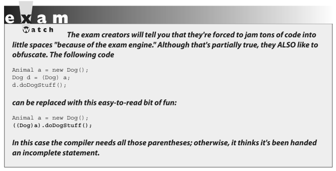

- ### [5 Casting](#5_Casting)
- ### [6 Implementing an Interface](#6_Implementing_an_Interface)
- ### [7 Legal Return Types](#7_Legal_Return_Types)
- ### [8 Constructors & Instantiation](#8_Constructors_&_Instantiation)
- ### [9 Initialization Blocks](#9_Initialization_Blocks)
- ### [10 Statics](#10_Statics)

# <a name="5_Casting"></a> 5 Casting

### OCA Objectives

- **2.2 Differentiate between object reference variables and primitive variables.**
- **7.3 Determine when casting is necessary.**

You've seen how it's both possible and common to use general reference variable types to refer to more specific object types. It's at the heart of polymorphism.

`Animal animal = new Dog();`

What happens when you want to use that animal reference variable to invoke a method that only class Dog has? You know it's referring to a Dog, and you want to do a Dog-specific thing? Let's agree for now that all this code is okay, except that we're not sure about the line of code that invokes the playDead method.

```java
class Animal {
    void makeNoise() {System.out.println("generic noise"); }
}

class Dog extends Animal {
    void makeNoise() {System.out.println("bark"); }
    void playDead() { System.out.println("roll over"); }
}

class CastTest2 {
    public static void main(String [] args) {
        Animal [] a = {new Animal(), new Dog(), new Animal() };
    
        for(Animal animal : a) {
            animal.makeNoise();
            if(animal instanceof Dog) {
                animal.playDead(); // try to do a Dog behavior?
            }
        }
    }
}
```

When we try to compile this code, the compiler says something like this:

`cannot resolve symbol`

The compiler is saying, "Hey, class Animal doesn't have a playDead() method." Let's modify the if code block:

```java
if(animal instanceof Dog) {
    Dog d = (Dog) animal; // casting the ref. var.
    d.playDead();
}
```

The new and improved code block contains a **cast**, which in this case is sometimes called a downcast, because we're casting down the inheritance tree to a more specific class. Now the compiler is happy. Before we try to invoke playDead, we cast the animal variable to type Dog. What we're saying to the compiler is, "We know it's really referring to a Dog object, so it's okay to make a new Dog reference variable to refer to that object." In this case we're safe, because before we ever try the cast, we do an instanceof test to make sure. It's important to know that the compiler is forced to trust us when we do a downcast, even when we screw up:

```java
class Animal { }
class Dog extends Animal { }
class DogTest {

    public static void main(String [] args) {
        Animal animal = new Animal();
        Dog d = (Dog) animal; // compiles but fails later
    }
}
```

All the compiler can do is verify that the two types are in the same inheritance tree, so that depending on whatever code might have come before the downcast, it's possible that animal is of type Dog. The compiler must allow things that might possibly work at runtime. However, if the compiler knows with certainty that the cast could not possibly work, compilation will fail. The following replacement code block will NOT compile:

```java
Animal animal = new Animal();
Dog d = (Dog) animal;
String s = (String) animal; // animal can't EVER be a String
```

In this case, you'll get an error like this:

```incovertible types```

Unlike *downcasting*, **upcasting** (casting up the inheritance tree to a more general type) works implicitly (that is, you don't have to type in the cast) because when you upcast you're implicitly restricting the number of methods you can invoke, as opposed to *downcasting*, which implies that later on, you might want to invoke a more specific method. Here's an example:

```java
class Animal { }
class Dog extends Animal { }
class DogTest {
    public static void main(String [] args) {
        Dog d = new Dog();
        Animal a1 = d; // upcast ok with no explicit cast
        Animal a2 = (Animal) d; // upcast ok with an explicit cast
    }
}
```

Both of the previous upcasts will compile and run without exception because a `Dog` IS-A(n) Animal, which means that anything an `Animal` can do, a `Dog` can do. 

A `Dog` can do more, of course, but the point is that anyone with an `Animal` reference can safely call `Animal` methods on a `Dog` instance. The `Animal` methods may have been *overridden* in the `Dog` class, but all we care about now is that a `Dog` can always do at least everything an `Animal` can do. 

> The compiler and JVM know it, too, so the implicit upcast is always legal for assigning an object of a subtype to a reference of one of its supertype classes (or interfaces).
___

If `Dog` implements `Pet` and `Pet` defines `beFriendly()`, then a `Dog` can be implicitly cast to a `Pet`, but the only `Dog` method you can invoke then is `beFriendly()`, which Dog was forced to implement because `Dog` implements the `Pet` interface. One more thing...if `Dog` implements `Pet`, then, if `Beagle` extends `Dog` but `Beagle` does not declare that it implements `Pet`, `Beagle` is still a `Pet`! 

> ### `Beagle` is a `Pet` simply because it extends `Dog`, and Dog's **already taken care of the `Pet` parts for itself and for all its children when it implemented the `Pet` interface**. 

The `Beagle` class can always override any method it inherits from `Dog`, including methods that `Dog` implemented to fulfill its interface contract.

And just one more thing...if `Beagle` does declare that it implements `Pet`, just so that others looking at the `Beagle` class API can easily see that `Beagle` IS-A Pet without having to look at Beagle's superclasses, `Beagle` still doesn't need to implement the `beFriendly()` method if the Dog class (Beagle's superclass) has already taken care of that. In other words, if `Beagle` IS-A `Dog`, and `Dog` IS-A `Pet`, then `Beagle` IS-A `Pet` and has already met its `Pet` obligations for implementing the `beFriendly()` method since it inherits the `beFriendly()` method. The compiler is smart enough to say, "I know `Beagle` already IS a `Dog`, but it's okay to make it more obvious by adding a cast." 

So don't be fooled by code that shows a concrete class that declares it implements an interface but doesn't implement the methods of the interface. Before you can tell whether the code is legal, you must know what the supertypes of this implementing class have declared. 

> ### If any supertype in its inheritance tree has already provided concrete (that is, nonabstract) method implementations, then regardless of whether the supertype declares that it implements the interface, the subclass is under no obligation to reimplement (override) those methods.



## More on Casting

[](https://www.youtube.com/watch?v=Qpz2MA4KE9U)

# <a name="#6_Implementing_an_Interface"></a> 6 Implementing an Interface

# <a name="7_Legal_Return_Types"></a> 7 Legal Return Types

# <a name="8_Constructors_&_Instantiation"></a> 8 Constructors & Instantiation

# <a name="9_Initialization_Blocks"></a> 9 Initialization Blocks

# <a name="10_Statics"></a> 10 Statics