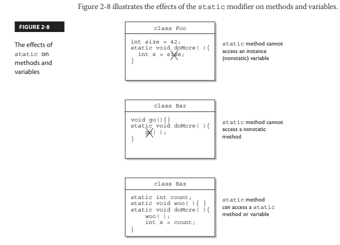

- ### [5 Casting](#5_Casting)
- ### [6 Implementing an Interface](#6_Implementing_an_Interface)
- ### [7 Legal Return Types](#7_Legal_Return_Types)
- ### [8 Constructors & Instantiation](#8_Constructors_&_Instantiation)
- ### [9 Initialization Blocks](#9_Initialization_Blocks)
- ### [10 Statics](#10_Statics)

# <a name="5_Casting"></a> 5 Casting

### OCA Objectives

- **2.2 Differentiate between object reference variables and primitive variables.**
- **7.3 Determine when casting is necessary.**

You've seen how it's both possible and common to use general reference variable types to refer to more specific object types. It's at the heart of polymorphism.

`Animal animal = new Dog();`

What happens when you want to use that animal reference variable to invoke a method that only class Dog has? You know it's referring to a Dog, and you want to do a Dog-specific thing? Let's agree for now that all this code is okay, except that we're not sure about the line of code that invokes the playDead method.

```java
class Animal {
    void makeNoise() {System.out.println("generic noise"); }
}

class Dog extends Animal {
    void makeNoise() {System.out.println("bark"); }
    void playDead() { System.out.println("roll over"); }
}

class CastTest2 {
    public static void main(String [] args) {
        Animal [] a = {new Animal(), new Dog(), new Animal() };
    
        for(Animal animal : a) {
            animal.makeNoise();
            if(animal instanceof Dog) {
                animal.playDead(); // try to do a Dog behavior?
            }
        }
    }
}
```

When we try to compile this code, the compiler says something like this:

`cannot resolve symbol`

The compiler is saying, "Hey, class Animal doesn't have a playDead() method." Let's modify the if code block:

```java
if(animal instanceof Dog) {
    Dog d = (Dog) animal; // casting the ref. var.
    d.playDead();
}
```

The new and improved code block contains a **cast**, which in this case is sometimes called a downcast, because we're casting down the inheritance tree to a more specific class. Now the compiler is happy. Before we try to invoke playDead, we cast the animal variable to type Dog. What we're saying to the compiler is, "We know it's really referring to a Dog object, so it's okay to make a new Dog reference variable to refer to that object." In this case we're safe, because before we ever try the cast, we do an instanceof test to make sure. It's important to know that the compiler is forced to trust us when we do a downcast, even when we screw up:

```java
class Animal { }
class Dog extends Animal { }
class DogTest {

    public static void main(String [] args) {
        Animal animal = new Animal();
        Dog d = (Dog) animal; // compiles but fails later
    }
}
```

All the compiler can do is verify that the two types are in the same inheritance tree, so that depending on whatever code might have come before the downcast, it's possible that animal is of type Dog. The compiler must allow things that might possibly work at runtime. However, if the compiler knows with certainty that the cast could not possibly work, compilation will fail. The following replacement code block will NOT compile:

```java
Animal animal = new Animal();
Dog d = (Dog) animal;
String s = (String) animal; // animal can't EVER be a String
```

In this case, you'll get an error like this:

```incovertible types```

Unlike *downcasting*, **upcasting** (casting up the inheritance tree to a more general type) works implicitly (that is, you don't have to type in the cast) because when you upcast you're implicitly restricting the number of methods you can invoke, as opposed to *downcasting*, which implies that later on, you might want to invoke a more specific method. Here's an example:

```java
class Animal { }
class Dog extends Animal { }
class DogTest {
    public static void main(String [] args) {
        Dog d = new Dog();
        Animal a1 = d; // upcast ok with no explicit cast
        Animal a2 = (Animal) d; // upcast ok with an explicit cast
    }
}
```

Both of the previous upcasts will compile and run without exception because a `Dog` IS-A(n) Animal, which means that anything an `Animal` can do, a `Dog` can do. 

A `Dog` can do more, of course, but the point is that anyone with an `Animal` reference can safely call `Animal` methods on a `Dog` instance. The `Animal` methods may have been *overridden* in the `Dog` class, but all we care about now is that a `Dog` can always do at least everything an `Animal` can do. 

> The compiler and JVM know it, too, so the implicit upcast is always legal for assigning an object of a subtype to a reference of one of its supertype classes (or interfaces).
___

If `Dog` implements `Pet` and `Pet` defines `beFriendly()`, then a `Dog` can be implicitly cast to a `Pet`, but the only `Dog` method you can invoke then is `beFriendly()`, which Dog was forced to implement because `Dog` implements the `Pet` interface. One more thing...if `Dog` implements `Pet`, then, if `Beagle` extends `Dog` but `Beagle` does not declare that it implements `Pet`, `Beagle` is still a `Pet`! 

> ### `Beagle` is a `Pet` simply because it extends `Dog`, and Dog's **already taken care of the `Pet` parts for itself and for all its children when it implemented the `Pet` interface**. 

The `Beagle` class can always override any method it inherits from `Dog`, including methods that `Dog` implemented to fulfill its interface contract.

And just one more thing...if `Beagle` does declare that it implements `Pet`, just so that others looking at the `Beagle` class API can easily see that `Beagle` IS-A Pet without having to look at Beagle's superclasses, `Beagle` still doesn't need to implement the `beFriendly()` method if the Dog class (Beagle's superclass) has already taken care of that. In other words, if `Beagle` IS-A `Dog`, and `Dog` IS-A `Pet`, then `Beagle` IS-A `Pet` and has already met its `Pet` obligations for implementing the `beFriendly()` method since it inherits the `beFriendly()` method. The compiler is smart enough to say, "I know `Beagle` already IS a `Dog`, but it's okay to make it more obvious by adding a cast." 

So don't be fooled by code that shows a concrete class that declares it implements an interface but doesn't implement the methods of the interface. Before you can tell whether the code is legal, you must know what the supertypes of this implementing class have declared. 

> ### If any supertype in its inheritance tree has already provided concrete (that is, nonabstract) method implementations, then regardless of whether the supertype declares that it implements the interface, the subclass is under no obligation to reimplement (override) those methods.


## More on Casting

[A great video on casting](https://www.youtube.com/watch?v=Qpz2MA4KE9U)

# <a name="6_Implementing_an_Interface"></a> 6 Implementing an Interface

When you implement an interface, you're agreeing to adhere to the contract defined in the interface.

The JVM runs a compiler check on any class that claims to implement an interface. If the class says it's implementing an interface, it darn well better have an implementation for each abstract method in the interface (with a few exceptions that we'll look at in a moment). Assuming an interface Bounceable with two methods, bounce() and setBounceFactor(), the following class will compile:

```java
public class Ball implements Bounceable { // Keyword
// 'implements'
    public void bounce() { }
    public void setBounceFactor(int bf) { }
}
```

It compiles, though. And it runs. The interface contract guarantees that a class will have the method (in other words, others can call the method subject to access control), but it never guaranteed a good implementation—or even any actual implementation code in the body of the method. Keep in mind, though, that if the interface declares that a method is NOT void, your class's implementation code has to include a return statement.

Implementation classes must adhere to the same rules for method implementation as a class extending an abstract class. To be a legal implementation class, a nonabstract implementation class must do the following:

- ### Provide concrete (nonabstract) implementations for all abstract methods from the declared interface.
- ### Follow all the rules for legal overrides, such as the following:

#### 1 *Declare no checked exceptions on implementation methods other than those declared by the interface method or subclasses of those declared by the interface method.*

#### 2 *Maintain the signature of the interface method, and maintain the same return type (or a subtype). (But it does not have to declare the exceptions declared in the interface method declaration.)*


An implementation class can itself be abstract! For example, the following is legal for a class Ball implementing Bounceable: 

`abstract class Ball implements Bounceable { }`

Notice anything missing? We never provided the implementation methods. And that's okay. If the implementation class is *abstract*, it can simply pass the buck to its first concrete subclass. For example, if class BeachBall extends Ball, and BeachBall is not abstract, then BeachBall has to provide an implementation for all the abstract methods from Bounceable:

```java
class BeachBall extends Ball {
// Even though we don't say it in the class declaration above,
// BeachBall implements Bounceable, since BeachBall's abstract superclass (Ball) implements Bounceable
// Therefore it must declare all the methods in the Bounceable interface

    public void bounce() {
    // interesting BeachBall-specific bounce code
    }

    public void setBounceFactor(int bf) {
    // clever BeachBall-specific code for setting a bounce factor
    }
    
// If Ball defined any abstract methods they would have to be implemented here also
}
```

> Look for classes that claim to implement an interface but don't provide the correct method implementations. Unless the implementing class is abstract, the implementing class must provide implementations for all abstract methods defined in the interface.

### There are two more rules:

#### A class can implement more than one interface. It's perfectly legal to say, for example, the following:

`public class Ball implements Bounceable, Serializable, Runnable { ... }`

*You can extend only one class, but you can implement many interfaces (which, as of Java 8, means a form of multiple inheritance, which we'll discuss shortly). In other words:*

 - Subclassing defines who and what you are, whereas 
 - Implementing defines a role you can play or a hat you can wear, despite how different you might be from some other class implementing the same interface (but from a different inheritance tree). 
 
 *For example, a Person extends HumanBeing (although for some, that's debatable). But a Person may also implement Programmer, Snowboarder, Employee, Parent, or PersonCrazyEnoughToTakeThisExam.*

#### An interface can itself extend another interface (or multiple). The following code is perfectly legal: 

`public interface Bounceable extends Moveable { }`

The first concrete (nonabstract) implementation class of Bounceable must implement all the abstract methods of Bounceable, plus all the abstract methods of Moveable! 

> ### The subinterface, as we call it, simply adds more requirements to the contract of the superinterface.

The first concrete (nonabstract) implementation class of Bounceable must implement all the abstract methods of Bounceable, plus all the abstract methods of Moveable! The subinterface, as we call it, simply adds more requirements to the contract of the superinterface.

*You'll see this concept applied in many areas of Java, especially Java EE, where you'll often have to build your own interface that extends one of the Java EE interfaces.*

As we mentioned earlier, a class is not allowed to extend multiple classes in Java.

An interface, however, is free to extend multiple interfaces:
```java
interface Bounceable extends Moveable, Spherical { // ok!
    void bounce();
    void setBounceFactor(int bf);
}

interface Moveable {
    void moveIt();
}

interface Spherical {
    void doSphericalThing();
}
```

In the next example, `Ball` is required to implement `Bounceable`, plus all abstract methods from the interfaces that `Bounceable` extends (including any interfaces those interfaces extend, and so on, until you reach the top of the stack—or is it the bottom of the stack?). So Ball would need to look like the following:
```java
class Ball implements Bounceable {
    public void bounce() { } // Implement Bounceable's methods
    public void setBounceFactor(int bf) { }
    public void moveIt() { } // Implement Moveable's method
    public void doSphericalThing() { } // Implement Spherical
}
```
`Ball` needs to implement all of the abstract methods from `Bounceable`, unless `Ball` is marked abstract. In that case,`Ball` could choose to implement any, all, or none of the abstract methods from anyof the interfaces, thus leaving the rest of the implementations to a concrete subclass of `Ball`, as follows:
```java
abstract class Ball implements Bounceable {
    public void bounce() { ... } // Define bounce behavior
    public void setBounceFactor(int bf) { ... }
    // Don't implement the rest; leave it for a subclass
}

class SoccerBall extends Ball { 
    // class SoccerBall must
    // implement the interface
    // methods that Ball didn't
    public void moveIt() { ... }
    public void doSphericalThing() { ... }
    // SoccerBall can choose to override the Bounceable methods
    // implemented by Ball
    public void bounce() { ... }
}
```


Figure 2-5 compares ***concrete*** and ***abstract*** examples of extends and implements for both classes and interfaces.


A class CAN implement interfaces with duplicate, concrete method signatures! But the good news is that the compiler's got your back, and if you DO want to implement both interfaces, you'll have to provide an overriding method in your class. 

Let's look at the following code:
```java
interface I1 {
    default int doStuff() { return 1; }
}
interface I2 {
    default int doStuff() { return 2; }
}
    
public class MultiInt implements I1, I2 { // needs to override
    public static void main(String[] args) {
        new MultiInt().go();
    }

    void go() {
        System.out.println(doStuff());
    }
    // public int doStuff() {
    // return 3;
    // }
}
```
As the code stands, it WILL NOT COMPILE because it's not clear which version of `doStuff()` should be used. In order to make the code compile, you need to ***override*** `doStuff()` in the class. Uncommenting the class's `doStuff()` method would allow the code to compile and when run produce the following output:

`3`

# <a name="7_Legal_Return_Types"></a> 7 Legal Return Types

This section covers two aspects of return types: what you can declare as a return type, and what you can actually return as a value. We'll take just a quick look at the difference between return type rules for overloaded and overriding methods, because we've already covered that in this chapter. We'll cover a small bit of new ground, though, when we look at polymorphic return types and the rules for what is and is not legal to actually return.

## Return Type Declarations

This section looks at what you're allowed to declare as a return type, which depends primarily on whether you are overriding, overloading, or declaring a new method.

### Return Types on Overloaded Methods 

Method overloading is not much more than name reuse. The overloaded method is a completely different method from any other method of the same name. So if you inherit a method but overload it in a subtype, you're not subject to the restrictions of overriding, which means you can declare any return type you like.

> ### What you can't do is change only the return type. To overload a method, remember, you must change the argument list.

Legal overload: 
```java
public class Foo{
    void go() { }
}

public class Bar extends Foo {
    String go(int x) {  // Legal! Return type and argument list changed
        return null;
    }
}
```

Illegal overload:
```java
public class Foo{
    void go() { }
}

public class Bar extends Foo {
    String go() { // Not legal! Can't change only the return type
        return null;
    }
}
```

### Overriding and Return Types and Covariant Returns

When a subtype wants to change the method implementation of an inherited method (an override), the subtype must define a method that matches the inherited version exactly. 

> ### Or, since Java 5, you're allowed to change the return type in the overriding method as long as the new return type is a subtype of the declared return type of the overridden (superclass) method.

Let's look at a covariant return in action:

```java
class Alpha {
    Alpha doStuff(char c) {
        return new Alpha();
    }
}

class Beta extends Alpha {
    Beta doStuff(char c) { // legal override since Java 1.5
        return new Beta();
    }
}
```


## Returning a Value 

You have to remember only **six rules** for returning a value:

- 1. In a method with an ***object reference return type*** you can return `null`.
```java
public Button doStuff() {
    return null;
}
```
- 2. An `array` is a perfectly legal return type 
```java
public String[] go() {
    return new String[] {"Fred", "Barney", "Wilma"};
}
```
- 3. In a method with a ***primitive return type***, you can return any value or variable that can be ***implicitly converted to the declared return type***.
```java
public int foo() {
    char c = 'c';
    return c; // char is compatible with int
}
```
- 4. In a method with a ***primitive return type***, you can return any value or variable that can be ***explicitly cast to the declared return type***.
```java
public int foo() {
    float f = 32.5f;
    return (int) f;
}
```
- 5. You must not return anything from a method with a ***void*** return type. Al though you can say `return`. 
```java
public void bar() {
    return "this is it"; // Not legal!!
}
```
- 6. In a method with an ***object reference return type***, you can ***return any object type that can be implicitly cast to the declared return type***.
```java
public Animal getAnimal() {
    return new Horse(); // Assume Horse extends Animal
}
public Object getObject() {
    int[] nums = {1,2,3};
    return nums; // Return an int array, which is still an object
}
public interface Chewable { }
public class Gum implements Chewable { }
public class TestChewable {
    // Method with an interface return type
    public Chewable getChewable() {
        return new Gum(); // Return interface implementer
    }
}
```
Another look at returning a subtype of a declared abstract class return type. 


# <a name="8_Constructors_&_Instantiation"></a> 8 Constructors & Instantiation

### OCA Objectives

- **6.3 Create and overload constructors; including impact on default constructors (sic)**
- **7.4 Use super and this to access objects and constructors.**

Objects are constructed. You CANNOT make a new object without invoking a constructor. In fact, you can't make a new object without invoking not just the constructor of the object's actual class type, but also the constructor of each of its superclasses! Constructors are the code that runs whenever you use the keyword new.

*To be a bit more accurate, there can also be ***initialization blocks*** that run when you say new, and we're going to cover init blocks and their static initialization counterparts in the next section.* 

## Constructor Basics

Every class, ***including abstract classes***, MUST have a constructor. But just because a class must have a constructor doesn't mean the programmer has to type it.

> ### Two key points to remember about constructors are that they have no return type, and their names must exactly match the class name.

```java
class Foo {
    int size;
    String name;

    Foo(String name, int size) {
        this.name = name;
        this.size = size;
    }
}
```

In the preceding code example, the Foo class does not have a no-arg constructor. That means the following will fail to compile: 

`Foo f = new Foo(); // Won't compile, no matching constructor `

but the following will compile: 

`Foo f = new Foo("Fred", 43); // No problem. Arguments match the Foo constructor.`

It's very common (and desirable) for a class to have a no-arg constructor, regardless of how many other overloaded constructors are in the class (yes, constructors can be overloaded). You can't always make that work for your classes; occasionally you have a class where it makes no sense to create an instance without supplying information to the constructor.

## Constructor Chaining 

We know that constructors are invoked at runtime when you say new on some class type as follows:
`Horse h = new Horse();`
But what really happens when you say new `Horse()`? (Assume `Horse` extends `Animal` and `Animal` extends `Object`.)


## Rules for Constructors

> ### The following list summarizes the rules you'll need to know for the exam (and to understand the rest of this section). You MUST remember these, so be sure to study them more than once.

- ####  1. Constructors can use any access modifier, including private. 

*(A private constructor means only code within the class itself can instantiate an object of that type, so if the private constructor class wants to allow an instance of the class to be used, the class must provide a static method or variable that allows access to an instance created from within the class.)*

- #### 2. The constructor name must match the name of the class.
- #### 3. Constructors must not have a return type.
- #### 4. It's legal (but stupid) to have a method with the same name as the class, but that doesn't make it a constructor.

*If you see a return type, it's a method rather than a constructor. In fact, you could have both a method and a constructor with the same name — the name of the class—in the same class, and that's not a problem for Java. Be careful not to mistake a method for a constructor — be sure to look for a return type.*

- #### 5. If you don't type a constructor into your class code, a default constructor will be automatically generated by the compiler.
- #### 6. The default constructor is ALWAYS a no-arg constructor.
- #### 7. If you want a no-arg constructor and you've typed any other constructor(s) into your class code, the compiler won't provide the no-arg constructor (or any other constructor) for you.

*In other words, if you've typed in a constructor with arguments, you won't have a no-arg constructor unless you typed it in yourself!*

- #### 8. Every constructor has, as its first statement, either a call to an overloaded constructor (this()) or a call to the superclass constructor (super()), although remember that this call can be inserted by the compiler.

- #### 9. If you do type in a constructor (as opposed to relying on the compiler-generated default constructor), and you do not type in the call to super() or a call to this(), the compiler will insert a no-arg call to super() for you as the very first statement in the constructor.

- #### 10. A call to super() can either be a no-arg call or can include arguments passed to the super constructor.

- #### 11. A no-arg constructor is not necessarily the default (that is, compiler-supplied) constructor, although the default constructor is always a no-arg constructor. The default constructor is the one the compiler provides! Although the default constructor is always a no-arg constructor, you're free to put in your own no-arg constructor.

- #### 12. You cannot make a call to an instance method or access an instance variable until after the super constructor runs.

- #### 13. Only static variables and methods can be accessed as part of the call to super() or this(). 

*Example: `super(Animal.NAME)` is OK, because NAME is declared as a static variable.*

- #### 14. Abstract classes have constructors, and those constructors are always called when a concrete subclass is instantiated.

- #### 15. Interfaces do not have constructors. Interfaces are not part of an object's inheritance tree.

- #### 16. The only way a constructor can be invoked is from within another constructor. 

*In other words, you can't write code that actually calls a constructor as follows:*

```java
class Horse {
    Horse() { } // constructor
    
    void doStuff() {
        Horse(); // calling the constructor - illegal!
    }
}
```

## Determine Whether a Default Constructor Will Be Created

The following example shows a Horse class with two constructors:
```java
class Horse {
    Horse() { }
    Horse(String name) { }
}
```
Will the compiler put in a default constructor for this class? **No!**

How about for the following variation of the class?
```java
class Horse {
    Horse(String name) { }
}
```
Now will the compiler insert a default constructor? **No!**

What about this class?

`class Horse { }`

Now we're talking. The compiler will generate a default constructor for this class because the class doesn't have any constructors defined.

Okay, what about this class?
```java
class Horse {
    void Horse() { }
}
```
What's wrong with the `Horse()` constructor? It isn't a constructor at all! It's simply a method that happens to have the same name as the class. Remember, the return type is a dead giveaway that we're looking at a method, not a constructor.

> #### 1 How do you know for sure whether a default constructor will be created?

Because you didn't write any constructors in your class.

> #### 2 How do you know what the default constructor will look like?

- The default constructor has the same access modifier as the class.
- The default constructor has no arguments.
- The default constructor includes a no-arg call to the super constructor (super()).

> #### 3 What happens if the super constructor has arguments?

Constructors can have arguments just as methods can, and if you try to invoke a method that takes, say, an int, but you don't pass anything to the method, the compiler will complain as follows:

```java
class Bar {
    void takeInt(int x) { }
}

class UseBar {
    public static void main (String [] args) {
        Bar b = new Bar();
        b.takeInt(); // Try to invoke a no-arg takeInt() method
    }
}
```

This table shows what the compiler will (or won't) generate for your class: 


If your super constructor (that is, the constructor of your immediate superclass/parent) has arguments, you must type in the call to `super()`, supplying the appropriate arguments. Crucial point: if your superclass does not have a no-arg constructor, you must type a constructor in your class (the subclass) because you need a place to put in the call to `super()` with the appropriate arguments. The following is an example of the problem:
```java
class Animal {
    Animal(String name) { }
}

class Horse extends Animal {
    Horse() {
    super(); // Problem!
    }
}
```
The compiler treats us with stunning lucidity:
```java
Horse.java:7: cannot resolve symbol
symbol : constructor Animal ()
location: class Animal
super(); // Problem!
^
```

*If you're lucky (and it's a full moon), your compiler might be a little more explicit. But again, the problem is that there just isn't a match for what we're trying to invoke with super()—an Animal constructor with no arguments.* 

Another way to put this is that if your superclass does not have a no-arg constructor, then in your subclass you will not be able to use the default constructor supplied by the compiler. It's that simple. Because the compiler can ***only*** put in a call to a no-arg `super()`, you won't even be able to compile something like this:

```java
class Clothing {
    Clothing(String s) { }
}

class TShirt extends Clothing { }
```
Or here is the exact same thing but we've supplied a constructor for TShirt that's identical to the default constructor supplied by the compiler:
```java
class Clothing {
    Clothing(String s) { }
}
class TShirt extends Clothing {
    // Constructor identical to compiler-supplied default constructor
    TShirt() {
        super(); // Won't work! Tries to invoke a no-arg Clothing constructor but there isn't one
    }            
}
```
Trying to compile this code gives us exactly the same error we got when we put a constructor in the subclass with a call to the no-arg version of `super()`:

```java
Clothing.java:4: cannot resolve symbol
symbol : constructor Clothing ()
location: class Clothing
class TShirt extends Clothing { }
^
```

> ### ***Always remember that constructors are never inherited.*** They aren't methods. They can't be overridden (because they aren't methods, and only instance methods can be overridden). So the type of constructor(s) your superclass has in no way determines the type of default constructor you'll get.

Remember, the default constructor is always a no-arg. So although constructors can't be overridden, you've already seen that ***they can be overloaded***, and typically are. 

## Overloaded Constructors

Overloading a constructor means typing in multiple versions of the constructor, each having a different argument list, like the following examples:

```java
class Foo {
    Foo() { }
    Foo(String s) { }
}
```

The preceding `Foo` class has two overloaded constructors: one that takes a string, and one with no arguments. Because there's no code in the no-arg version, it's actually identical to the default constructor the compiler supplies—but remember, since there's already a constructor in this class (the one that takes a string), the compiler won't supply a default constructor. If you want a no-arg constructor to overload the with-args version you already have, you're going to have to type it yourself, just as in the `Foo` example.

> ### ***Overloading a constructor is typically used to provide alternate ways for clients to instantiate objects of your class.***

For example, if a client knows the animal name, they can pass that to an Animal constructor that takes a string. But if they don't know the name, the client can call the no-arg constructor, and that constructor can supply a default name. Here's what it looks like:

```java
public class Animal {
    String name;
 
    Animal(String name) {
        this.name = name; 
    } 

    Animal() { 
        this(makeRandomName()); 
    }

    static String makeRandomName() {
        int x = (int) (Math.random() * 5);
        String name = new String[] {"Fluffy", "Fido",
                                    "Rover", "Spike","Gigi"}[x];
        return name;
    }

    public static void main (String [] args) {
        Animal a = new Animal();
        System.out.println(a.name);
        Animal b = new Animal("Zeus");
        System.out.println(b.name);
    }
}
```

Running the code three times produces this output:
```java
Gigi
Zeus
```
```java
Rover
Zeus
```
```java
Fluffy
Zeus
```
This table shows the call stack for constructor invocations when a constructor is overloaded:


The key point to get from this code example is in line 8. Rather than calling `super()`, we're calling `this()`, and `this()` always means a call to another constructor in the same class. Okay, fine, but what happens after the call to `this()`? Sooner or later the `super()` constructor gets called, right? Yes, indeed. A call to `this()` just means you're delaying the inevitable. Some constructor, somewhere, must make the call to `super()`.

> ### ***Key Rule: The first line in a constructor must be a call to super() or a call to this().***

No exceptions. If you have neither of those calls in your constructor, the compiler will insert the no-arg call to `super()`. 
**If constructor `A()` has a call to `this()`, the compiler knows that constructor `A()` will not be the one to invoke `super()`.** The preceding rule means a constructor can never have both a call to `super()` and a call to `this()`. Because each of those calls must be the first statement in a constructor, you can't legally use both in the same constructor. That also means the compiler will not put a call to `super()` in any constructor that has a call to `this()`.

*Remember, the compiler won't put in a default constructor if you've already got one or more constructors in your class. And when the compiler doesn't put in a default constructor, it still inserts a call to super() in any constructor that doesn't explicitly have a call to the super constructor—unless, that is, the constructor already has a call to this().*

The benefit of having overloaded constructors is that you offer flexible ways to instantiate objects from your class. The benefit of having one constructor invoke another overloaded constructor is to avoid code duplication.

*Constructors and instantiation become even more exciting (just when you thought it was safe) when you get to inner classes, but we know you can stand to have only so much fun in one chapter, and besides, you don't have to deal with inner classes until you tackle the OCP exam.*

# <a name="9_Initialization_Blocks"></a> 9 Initialization Blocks

### OCA Objectives

**1.2 Define the structure of a Java class**
**6.3 Create and overload constructors; including impact on default constructors**

There are three places in a Java program in which operations can be performed - methods, constructors and initialization blocks. 

The rules for initialization blocks are as follows:

> ### **1 *Static initialization blocks* run when the class is first loaded.** 
> ### **2 *Instance initialization blocks* run whenever a new instance is created after the constructors call to super.** (a bit similar to a constructor)

Let's look at an example:

```java
class SmallInit {
    static int x;
    int y;
    static { x = 7 ; } // static init block
    { y = 8; } // instance init block
}
```
*As you can see, the syntax for initialization blocks is pretty terse. They don't have names, they can't take arguments, and they don't return anything.*

Instance init block code runs right after the call to super() in a constructor—in other words, after all super constructors have run. You can have many initialization blocks in a class. It is important to note that unlike methods or constructors, **the order in which initialization blocks appear in a class matters.** When it's time for initialization blocks to run, if a class has more than one, they will run in the order in which they appear in the class file—in other words, from the top down.

With this in mind, lets look at another programme: 

```java
class Init {
    Init(int x) { System.out.println("1-arg const"); }
    Init() { System.out.println("no-arg const"); }
    static { System.out.println("1st static init"); }
    { System.out.println("1st instance init"); }
    { System.out.println("2nd instance init"); }
    static { System.out.println("2nd static init"); }
    public static void main(String [] args) {
        new Init();
        new Init(7);
    }
}
```

To figure out the execution order, remember these rules:
> - init blocks execute in the order in which they appear.


> - **Static init blocks run once, when the class is first loaded.**
> - **Instance init blocks run every time a class instance is created.**
> - Instance init blocks run after the constructor's call to super().

```java
1st static init
2nd static init
1st instance init
2nd instance init
no-arg const
1st instance init
2nd instance init
1-arg const
```

As you can see, the *instance init blocks* each ran twice. *Instance init blocks* are often used as a place to put code that all the constructors in a class should share. That way, the code doesn't have to be duplicated across constructors.


# <a name="10_Statics"></a> 10 Statics

### OCA Objectives

**6.2 Apply the static keyword to methods and fields.**




