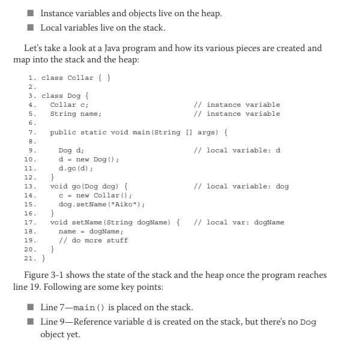
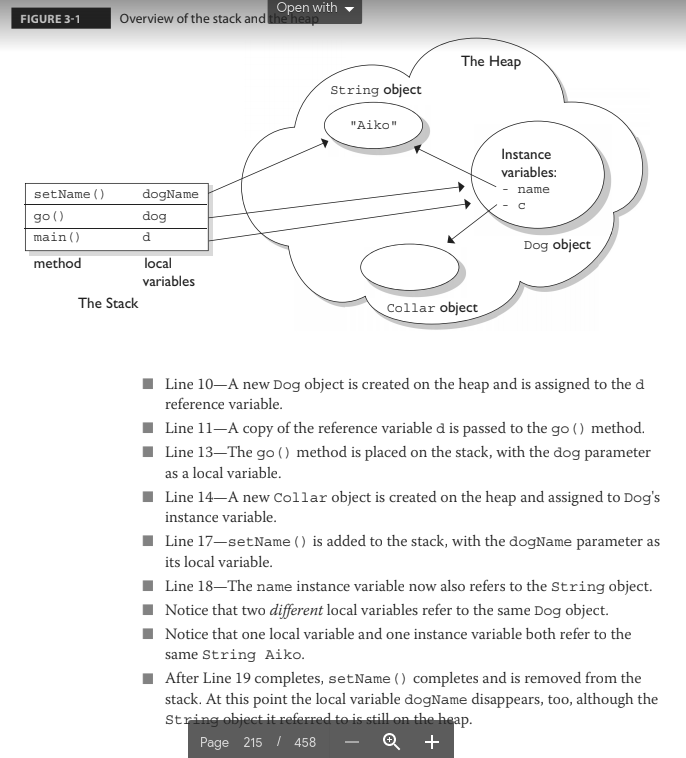
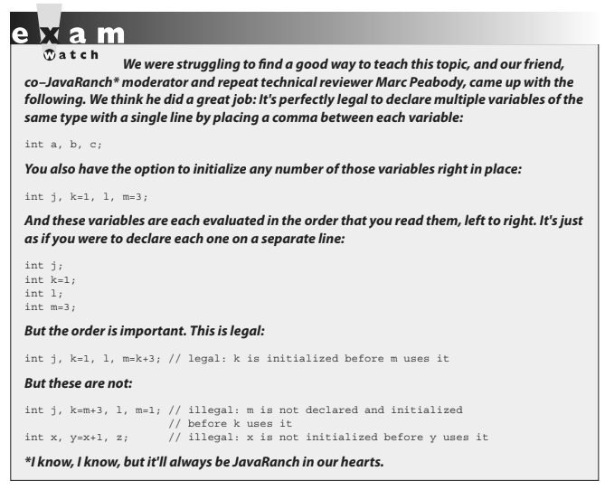
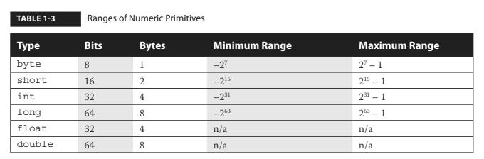
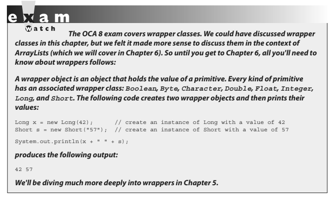
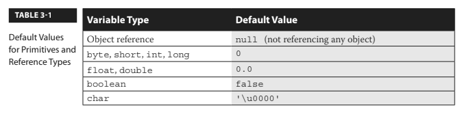
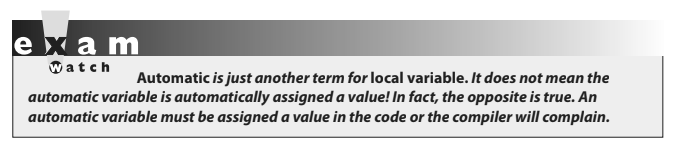
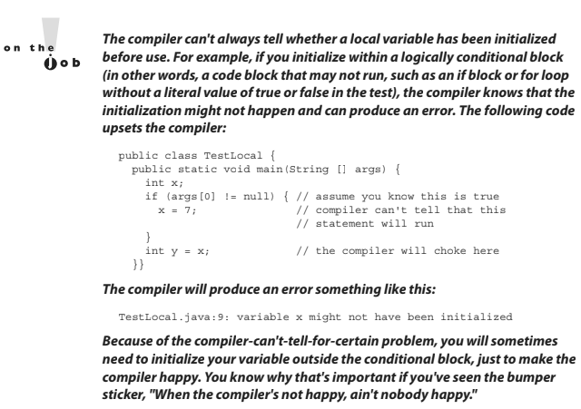

# CHAPTER 3: ASSIGNMENTS

- ## [1 Stack & Heap](#1_Stack_&_Heap)
- ## [2 Literals, Assignments & Variables](#2_Literals,_Assignments_&_Variables)
- ## [3 Scope](#3_Scope)
- ## [4 Variable Initialization](#4_Variable_Initialization)
- ## [5 Passing Variables Into Methods](#5_Passing_Variables_Into_Methods)
- ## [6 Garbage Collection](#6_Garbage_Collection)

# <a name="1_Stack_&_Heap"></a> 1 Stack & Heap

For the most part, the various pieces (methods, variables, and objects) of Java programs live in one of two places in memory: the stack or the heap. For now, we're concerned about only three types of things—instance variables, local variables, and objects:

- ### Instance variables and objects live on the heap.
- ### Local variables live on the stack.





# <a name="2_Literals,_Assignments_&_Variables"></a> 2 Literals, Assignments & Variables

### OCA Objectives

**2.1 Declare and initialize variables (including casting of primitive data types).**
**2.2 Differentiate between object reference variables and primitive variables.**
**2.3 Know how to read or write to object fields.**

# Literals 

## Literal Values for All Primitive Types

A primitive literal is merely a source code representation of the primitive data types—in other words, an ***integer***, ***floating-point number***, ***boolean***, or ***character*** that you type in while writing code. The following are examples of primitive literals:
```java
'b'           // char literal
42            // int literal
false         // boolean literal
2546789.343   // double literal
```

## Integer Literals

***There are four ways to represent integer numbers in the Java language: decimal (base 10), octal (base 8), hexadecimal (base 16), and, as of Java 7, binary (base 2).***

> #### Most exam questions with integer literals use decimal representations, but the few that use octal, hexadecimal, or binary are worth studying for. The odds that you'll use octal in the real world are slim, but they were included in the exam just for fun.

#### Numeric literals with underscores

As of Java 7, numeric literals can be declared using underscore characters (_), ostensibly to improve readability.

```java
int pre7 = 1000000; // pre Java 7 – we hope it's a million
int with7 = 1_000_000; // much clearer!
```
Remember: 

- 1 **You CANNOT use the underscore literal at the beginning or end of the literal.** The potential gotcha here is that you're free to use the underscore in "weird" places: 

- 2 You can use the underscore character for any of the numeric types (including doubles and floats), but for doubles and floats, **you CANNOT add an underscore character directly next to the decimal point**, or **next to the X or B in hex or binary numbers** (which are coming up soon).

```java
int i1 = _1_000_000;  // illegal, can't begin with an "_" 
int i2 = 10_0000_0;   // legal, but confusing
float f1 = 32_,1      // illegal, can't place _ next to decimal point
```
___

### 1 Decimal

Decimal integers need no explanation; in Java they are presented as-is with no prefix of any kind. 

```java
int length = 323;
```

### 2 Binary

Also new to Java 7 is the addition of binary literals. 
- Binary literals can use only the digits `0` and `1`. 
- Binary literals must start with either `0B` or `0b`, as shown:

```java
int b1 = 0B101010;   // set b1 to binary 101010 (decimal 42)
int b2 = 0b00011;    // set b2 to binary 11 (decimal 3)
```

### 3 Octal

- Octal integers use only the digits `0` to `7`. 
- You represent an integer in octal form by placing a zero in front of the number.
- You can have up to 21 digits in an octal number, not including the leading 0.

```java
class Octal {
  public static void main(String [] args) {
    int six = 06;     // Equal to decimal 6
    int seven = 07;   // Equal to decimal 7
    int eight = 010;  // Equal to decimal 8
    int nine = 011;   // Equal to decimal 9
    System.out.println("Octal 010 = " + eight);
  }
}
```
If we run the preceding program, it displays the following:

```java
Octal 010 = 8
```

### 4 Hexadecimal 

- Hexadecimal (hex for short) numbers are constructed using 16 distinct symbols. 
- Because we never invented single-digit symbols for the numbers 10 through 15, we use alphabetic characters to represent these digits. 
- Java will accept uppercase or lowercase letters for the extra digits (one of the few places Java is not case sensitive!).
- You are allowed up to 16 digits in a hexadecimal number, not including the prefix 0x (or 0X) or the optional suffix extension L, which will be explained a bit later in the chapter.

Counting from 0 through 15 in hex looks like this:

`0 1 2 3 4 5 6 7 8 9 a b c d e f`

All of the following hexadecimal assignments are legal:

```java
class HexTest {
  public static void main (String [] args) {
    int x = 0X0001;
    int y = 0x7fffffff;
    int z = 0xDeadCafe;
    System.out.println("x = " + x + " y = " + y + " z = " + z);
  }
}
```

Running HexTest produces the following output:

`x = 1 y = 2147483647 z = -559035650`

Don't be misled by changes in case for a hexadecimal digit or the x preceding it. 0XCAFE and 0xcafe are both legal and have the same value. All four integer literals (binary, octal, decimal, and hexadecimal) are defined as int by default, but they may also be specified as long by placing a suffix of L or l after the number:

```java
long jo = 110599L;
long so = 0xFFFFl; // Note the lowercase 'l'
```

## Floating point literals

Floating-point numbers are defined as a number, a decimal symbol, and more numbers representing the fraction. In the following example, the number `11301874.9881024` is the literal value: 

`double d = 11301874.9881024;`

> #### Floating-point literals are defined as double (64 bits) by default, so if you want to assign a floating-point literal to a variable of type float (32 bits), you must attach the suffix `F` or `f` to the number. 

If you don't do this, the compiler will complain about a possible loss of precision, because you're trying to fit a number into a (potentially) less precise "container." The `F` suffix gives you a way to tell the compiler, "Hey, I know what I'm doing, and I'll take the risk, thank you very much."

```java
float f = 23.467890;        // Compiler error, possible loss of precision
float g = 49837849.029847F; // OK; has the suffix "F"
```

You may also optionally attach a D or d to double literals, but it is not necessary because this is the default behavior.
```java
double d = 110599.995011D;  // Optional, not required
double g = 987.897;         // No 'D' suffix, but OK because the literal is a double by default
```
Look for numeric literals that include a comma; here's an example:

```java
int x = 25,343;             // Won't compile because of the comma
```

## Boolean literals 

Boolean literals are the source code representation for boolean values. A boolean value can be defined only as true or false.

```java
boolean t = true;           // Legal
boolean f = 0;              // Compiler error!
```

Be on the lookout for questions that use numbers where booleans are required. You might see an if test that uses a number, as in the following:

`int x = 1; if (x) { } // Compiler error!`

## Character literals 

A char literal is represented by a single character in single quotes:
```java
char a = 'a';
char b = '@';
```

You can also type in the Unicode value of the character, using the Unicode notation of prefixing the value with \u, as follows: 

```java
char letterN = '\u004E';    // The letter 'N'
```

> #### Remember, characters are just 16-bit unsigned integers under the hood. That means you can assign a number literal, assuming it will fit into the unsigned 16-bit range (0 to 65535). 

For example, the following are all legal:

```java
char a = 0x892;             // hexadecimal literal
char b = 982;               // int literal
char c = (char)70000;       // The cast is required; 70000 is out of char range
char d = (char) -98;        // Ridiculous, but legal
```

And the following are not legal and produce compiler errors:

```java
char e = -29;               // Possible loss of precision; needs a cast
char f = 70000;             // Possible loss of precision; needs a cast
```

You can also use an escape code (the backslash) if you want to represent a character that can't be typed in as a literal, including the characters for linefeed, newline, horizontal tab, backspace, and quotes:

```java
char c = '\"';              // A double quote
char d = '\n';              // A newline
char tab = '\t';            // A tab
```

A string literal is a source code representation of a value of a String object. Although strings are not primitives, they're included in this section because they can be represented as literals—in other words, they can be typed directly into code.

The following is an example of two ways to represent a string literal:
```java
String s = "Bill Joy";
System.out.println("Bill" + " Joy");
```

The only other nonprimitive type that has a literal representation is an array, which we'll look at later in the chapter.
```java
Thread t = ??? // what literal value could possibly go here?
```
___

# Assignments 

## Assignment Operators

Assigning a value to a variable seems straightforward enough; you simply assign the stuff on the right side of the = to the variable on the left. Well, sure, but don't expect to be tested on something like this:

`x = 6;`

> #### You will, however, be tested on the trickier assignments involving complex expressions and casting. We'll look at both primitive and reference variable assignments.


Before we begin, let's back up and peek inside a variable. What is a variable? How are the variable and its value related?

> #### Variables are just bit holders with a designated type. You can have an int holder, a double holder, a Button holder, and even a String[] holder. Within that holder is a bunch of bits representing the value.

For primitives, the bits represent a numeric value A byte with a value of 6, for example, means that the bit pattern in the variable (the byte holder) is 00000110, representing the 8 bits. So the value of a primitive variable is clear, but what's inside an object holder? If you say,

`Button b = new Button();`

What's inside the Button holder b? Is it the Button object? No! A variable referring to an object is just that—a reference variable. A reference variable bit holder contains bits representing a way to get to the object.

The way in which object references are stored is virtual-machine specific (it's a pointer to something, we just don't know what that something really is). **All we can say for sure is that the variable's value is not the object, but rather a value representing a specific object on the heap. Or null.** If the reference variable has not been assigned a value or has been explicitly assigned a value of null, the variable holds bits representing—you guessed it—null. You can read Button b = null; as "The Button variable b is not referring to any object." 

So now that we know a variable is just a little box o' bits, we can get on with the work of changing those bits. We'll look first at assigning values to primitives and then finish with assignments to reference variables.

### Primitive Assignments 

The equal (`=`) sign is used for assigning a value to a variable, and it's cleverly named the assignment operator. 
> #### There are actually 12 assignment operators, but only the 5 most commonly used assignment operators are on the exam, and they are covered in Chapter 4. 
You can assign a primitive variable using a literal or the result of an expression.

Take a look at the following:
```java
int x = 7;        // literal assignment
int y = x + 2;    // assignment with an expression (including a literal)
int z = x * y;    // assignment with an expression
```

The most important point to remember is that a literal integer (such as `7`) is always implicitly an int. You'll recall that an `int` is a 32-bit value. No big deal if you're assigning a value to an `int` or a `long` variable, but what if you're assigning to a `byte` variable? After all, a byte-sized holder can't hold as many bits as an int-sized holder. 

Here's where it gets weird. The following is legal, 

`byte b = 27;`

but only because the compiler automatically narrows the literal value to a byte. In other words, the compiler puts in the cast. The preceding code is identical to the following: 

`byte b = (byte) 27; // Explicitly cast the int literal to a byte` 

It looks as though the compiler gives you a break and lets you take a shortcut with assignments to integer variables smaller than an `int`. (Everything we're saying about `byte` applies equally to `char` and `short`, both of which are smaller than an `int`.) We're not actually at the weird part yet, by the way. We know that a literal integer is always an `int`, but more importantly, 
> #### the result of an expression involving anything int-sized or smaller is always an int. 
In other words, add two bytes together and you'll get an `int` — even if those two bytes are tiny. Multiply an `int` and a `short` and you'll get an `int`. Divide a `short` by a `byte` and you'll get...an `int`. Okay, now we're at the weird part. 

Check this out:

```java
byte a = 3;       // No problem, 3 fits in a byte
byte b = 8;       // No problem, 8 fits in a byte
byte c = a + b;   // Should be no problem, sum of the two bytes fits in a byte
```
The last line won't compile! You'll get an error.

```java
TestBytes.java:5: possible loss of precision
found : int
required: byte
byte c = a + b;
          ^
```

We tried to assign the sum of two bytes to a `byte` variable, the result of which (`11`) was definitely small enough to fit into a `byte`, but the compiler didn't care. **It knew the rule about int-or-smaller expressions always resulting in an `int`. It would have compiled if we'd done the explicit cast:**

```java
byte c = (byte) (a + b);
```




## Primitive Casting

A reminder of the ranges of numeric primitives: 



**Primitive Casting Casting lets you convert primitive values from one type to another.** We mentioned primitive casting in the previous section, but now we're going to take a deeper look. (Object casting was covered in Chapter 2.)

> #### Casts can be implicit or explicit. 

- An **implicit cast** means you don't have to write code for the cast; the conversion happens automatically. Typically, an implicit cast happens when you're doing a **widening conversion** — in other words, putting a smaller thing (say, a byte) into a bigger container (such as an int). 

Remember those "possible loss of precision" compiler errors we saw in the assignments section? Those happened when we tried to put a larger thing (say, a `long`) into a smaller container (such as a `short`). 

- The large-value-into-small-container conversion is referred to as narrowing and requires an **explicit cast**.

This is where you tell the compiler that you're aware of the danger and accept full responsibility.

First we'll look at an implicit cast:
```java
int a = 100;
long b = a;         // Implicit cast, an int value always fits in a long
```
An explicit cast looks like this:
```java
float a = 100.001f;
int b = (int)a;     // explicit cast, the int less precise & might lose some of float's info!
```
___
Integer values may be assigned to a double variable without explicit casting, because any `int` value can fit in a 64-bit `double`. The following line demonstrates this:
```java
double d = 100L;    // Implicit cast
```
In the preceding statement, a `double` is initialized with a `long` value (as denoted by the `L` after the numeric value). No cast is needed in this case because a `double` can hold every piece of information that a `long` can store. 

If, however, we want to assign a `double` value to an `int` type, we're attempting a narrowing conversion and the compiler knows it:

```java
class Casting {
  public static void main(String [] args) {
    int x = 3957.229; // illegal
  }
}
```

If we try to compile the preceding code, we get an error something like this:

```java
%javac Casting.java
Casting.java:3: Incompatible type for declaration. Explicit cast
needed to convert double to int.
int x = 3957.229;   // illegal
1 error
```

In the preceding code, a floating-point value is being assigned to an integer variable. Because an integer is not capable of storing decimal places, an error occurs. To make this work, we'll cast the floating-point number to an int:

```java
class Casting {
  public static void main(String [] args) {
    int x = (int)3957.229; // legal cast
    System.out.println("int x = " + x);
  }
}
```
When you cast a floating-point number to an integer type, the value loses all the digits after the decimal. The preceding code will produce the following output:
```java
int x = 3957
```

We can also cast a larger number type, such as a `long`, into a smaller number type, such as a `byte`. Look at the following:
```java
class Casting {
  public static void main(String [] args) {
    long l = 56L;
    byte b = (byte)l;
    System.out.println("The byte is " + b);
  }
}
```

The preceding code will compile and run fine. But what happens if the long value is larger than 127 (the largest number a byte can store)? Let's modify the code:
```java
class Casting {
public static void main(String [] args) {
long l = 130L;
byte b = (byte)l;
System.out.println("The byte is " + b);
}
}
```
The code compiles fine, and when we run it we get the following:
```java
%java Casting
The byte is -126
```
We don't get a runtime error, even when the value being narrowed is too large or the type. The bits to the left of the lower `8` just...go away. If the leftmost bit (the sign bit) in the `byte` (or any integer primitive) now happens to be a `1`, the primitive will have a negative value.

## Assigning floating point numbers

Floating-point numbers have a slightly different assignment behavior than integer types. First, you must know that every floating-point literal is implicitly a `double` (64 bits), not a `float`. So the literal 32.3, for example, is considered a double. If you try to assign a `double` to a `float`, the compiler knows you don't have enough room in a 32-bit float container to hold the precision of a 64-bit double, and it lets you know. The following code looks good, but it won't compile:
```java
float f = 32.3;
```
You can see that 32.3 should fit just fine into a float-sized variable, but the compiler won't allow it. In order to assign a floating-point literal to a `float` variable, you must either **cast** the value or append an `f` to the end of the literal. The following assignments will compile:
```java
float f = (float) 32.3;
float g = 32.3f;
float h = 32.3F;
```

# Variables

## Assigning a literal that is too large for the variable 

We'll also get a compiler error if we try to assign a literal value that the compiler knows is too big to fit into the variable.

```java
byte a = 128; // byte can only hold up to 127
```
The preceding code gives us an error something like this:
```java
TestBytes.java:5: possible loss of precision
found : int
required: byte
byte a = 128;
```

We can fix it with a cast:
```java
byte a = (byte) 128;
```
*But then what's the result? When you narrow a primitive, Java simply truncates the higher-order bits that won't fit. In other words, it loses all the bits to the left of the bits you're narrowing to. Let's take a look at what happens in the preceding code. There, 128 is the bit pattern 10000000. It takes a full 8 bits to represent 128. But because the literal 128 is an int, we actually get 32 bits, with the 128 living in the rightmost (lower order) 8 bits. So a literal 128 is actually*

`00000000000000000000000010000000`

*Take our word for it; there are 32 bits there. To narrow the 32 bits representing 128, Java simply lops off the leftmost (higher order) 24 bits. What remains is just the 10000000. But remember that a byte is signed, with the leftmost bit representing the sign (and not part of the value of the variable). So we end up with a negative number (the 1 that used to represent 128 now represents the negative sign bit). Remember, to find out the value of a negative number using 2's complement notation, you flip all of the bits and then add 1. Flipping the 8 bits gives us 01111111, and adding 1 to that gives us 10000000, or back to 128! And when we apply the sign bit, we end up with –128.*

You must use an explicit cast to assign 128 to a byte, and the assignment leaves you with the value –128. A cast is nothing more than your way of saying to the compiler, "Trust me. I'm a professional. I take full responsibility for anything weird that happens when those top bits are chopped off." That brings us to the compound assignment operators. This will compile:
```java
byte b = 3;
b += 7; // No problem - adds 7 to b (result is 10)
```

and it is equivalent to this:

```java
byte b = 3;
b = (byte) (b + 7); // Won't compile without the cast, since b + 7 results in an int
```
The compound assignment operator += lets you add to the value of b, without putting in an explicit cast. In fact, +=, -=, *=, and /= will all put in an implicit cast.

## Assigning one primitive variable to another primitive variable

When you assign one primitive variable to another, the contents of the right-hand variable are copied. For example:
```java
int a = 6;
int b = a;
```
*This code can be read as, "Assign the bit pattern for the number 6 to the int variable a. Then copy the bit pattern in a, and place the copy into variable b." So both variables now hold a bit pattern for 6, but the two variables have no other relationship. We used the variable a only to copy its contents. At this point, a and b have identical contents (in other words, identical values), but if we change the contents of either a or b, the other variable won't be affected.*

Take a look at the following example:
```java
class ValueTest {
  public static void main (String [] args) {
    int a = 10; // Assign a value to a
    System.out.println("a = " + a);
    int b = a;
    b = 30;
    System.out.println("a = " + a + " after change to b");
  }
}
```
The output from this program is:

```java
%java ValueTest
a = 10
a = 10 after change to b
```

Notice the value of a stayed at 10. 
> #### The key point to remember is that even after you assign a to b, a and b are not referring to the same place in memory. 
The a and b variables do not share a single value; they have identical copies.

## Reference variable assignments 

You can assign a newly created object to an object reference variable as follows:

```java
Button b = new Button();
```

The preceding line does three key things:

- Makes a reference variable named `b`, of type `Button`
- Creates a new `Button` object on the heap
- Assigns the newly created `Button` object to the reference variable `b`

You can also assign null to an object reference variable, which simply means the variable is not referring to any object:

```java
Button c = null;
```
The preceding line creates space for the Button reference variable (the bit holder for a reference value), but it doesn't create an actual Button object. As we discussed in the last chapter, you can also use a reference variable to refer to any object that is a subclass of the declared reference variable type, as follows:
```java
public class Foo {
  public void doFooStuff() { }
}

public class Bar extends Foo {
  public void doBarStuff() { }
}

class Test {
  public static void main (String [] args) {
    Foo reallyABar = new Bar(); // Legal because Bar is a subclass of Foo
    Bar reallyAFoo = new Foo(); // Illegal! Foo is not a subclass of Bar
  }
}
```

> #### The rule is that you can assign a subclass of the declared type but not a superclass of the declared type. 

Remember, a `Bar` object is guaranteed to be able to do anything a `Foo` can do, so anyone with a `Foo` reference can invoke `Foo` methods even though the object is actually a `Bar`. In the preceding code, we see that `Foo` has a method `doFooStuff()` that someone with a `Foo` reference might try to invoke. If the object referenced by the `Foo` variable is really a `Foo`, no problem. But it's also no problem if the object is a `Bar` because `Bar` inherited the `doFooStuff()` method. You can't make it work in reverse, however. If somebody has a `Bar` reference, they're going to invoke `doBarStuff()`, but if the object is a `Foo`, it won't know how to respond.



# <a name="3_Scope"></a> 3 Scope

Once you've declared and initialized a variable, a natural question is, **"How long will this variable be around?"** This is a question regarding the scope of variables.

> #### And not only is scope an important thing to understand in general, it also plays a big part in the exam. 

Let's start by looking at a class file:
```java
class Layout {                    // class
  static int s = 343;             // static variable
  int x;                          // instance variable
  { x = 7; int x2 = 5; }          // initialization block
  Layout() { x += 8; int x3 = 6;} // constructor

  void doStuff() {                // method
    int y = 0;                    // local variable
    for(int z = 0; z < 4; z++) {  // 'for' code block
      y += z + x;
    }
  }
}
```
As with variables in all Java programs, the variables in this program (s, x, x2, x3, y, and z) all have a scope:

- s is a static variable.
- x is an instance variable.
- y is a local variable (sometimes called a "method local" variable).
- z is a block variable.
- x2 is an init block variable, a flavor of local variable.
- x3 is a constructor variable, a flavor of local variable.

For the purposes of discussing the scope of variables, we can say that there are four basic scopes:

- 1. **Static** variables have the longest scope; they are created when the class is loaded, and they survive as long as the class stays loaded in the Java Virtual Machine (JVM).
- 2. **Instance** variables are the next most long-lived; they are created when a new instance is created, and they live until the instance is removed.
- 3. **Local** variables are next; they live as long as their method remains on the stack. As we'll soon see, however, local variables can be alive and still be "out of scope."
- 4. **Block** variables live only as long as the code block is executing.

Scoping errors come in many sizes and shapes. One common mistake happens when a variable is shadowed and two scopes overlap. We'll take a detailed look at shadowing in a few pages. The most common reason for scoping errors is an attempt to access a variable that is not in scope. 

Let's look at three common examples of this type of error:

- 1. Attempting to access an **instance** variable from a static context (typically from `main()`):

```java
class ScopeErrors {
  int x = 5;
  public static void main(String[] args) {
    x++;  // won't compile, x is an 'instance' variable
  }
}
```

- 2. Attempting to access a local variable of the method that invoked you. When a method, say `go()`, invokes another method, say `go2()`,`go2()` won't have access to `go()`'s local variables. While `go2()` is executing, `go()`'s local variables are still alive, but they are out of scope. When `go2()` completes, it is removed from the stack, and `go()` resumes execution. At this point, all of `go()`'s previously declared variables are back in scope.
```java
class ScopeErrors {
  public static void main(String [] args) {
    ScopeErrors s = new ScopeErrors();
    s.go();
  }
  void go() {
    int y = 5;
    go2();
    y++; // once go2() completes, y is back in scope
  }
  void go2() {
    y++; // won't compile, y is local to go()
  }
}
```
- 3. Attempting to use a `block` variable after the code `block` has completed. It's very common to declare and use a variable within a code `block`, but be careful not to try to use the variable once the `block` has completed:
```java
void go3() {
  for(int z = 0; z < 5; z++) {
    boolean test = false;
    if(z == 3) {
      test = true;
    break;
  }
}
System.out.print(test); // 'test' is an ex-variable, it has ceased to be...
}
```

In the last two examples, the compiler will say something like this: 
```java
cannot find symbol 
```
This is the compiler's way of saying, "That variable you just tried to use? Well, it might have been valid in the distant past (like one line of code ago), but this is Internet time, baby, I have no memory of such a variable."


# <a name="4_Variable_Initialization"></a> 4 Variable Initialization

**2.1 Declare and initialize variables (including casting of primitive datatypes).**
**4.1 Declare, instantiate, initialize and use a one-dimensional array**
**4.2 Declare, instantiate, initialize and use multi-dimensional array (sic)**

# Using a Variable or Array Element That Is Uninitialized and Unassigned

> #### Java gives us the option of initializing a declared variable or leaving it uninitialized. When we attempt to use the uninitialized variable, we can get different behavior depending on what type of variable or array we are dealing with (primitives or objects). The behavior also depends on the level (scope) at which we are declaring our variable. 

- #### An **instance variable** is declared within the class but outside any method or constructor.
- #### A **local variable** (aka automatic, method or stack) is declared within a method (or in the argument list of the method). 

Although you can leave a local variable uninitialized, the compiler complains if you try to use a local variable before initializing it with a value, as we shall see.

## 1 Primitive and object type instance variables

**Instance variables** (aka member variables) are variables defined at the class level. That means the variable declaration is not made within a method, constructor, or any other initializer block. Instance variables are initialized to a default value each time a new instance is created, although they may be given an explicit value after the object's superconstructors have completed. 

Table 3-1 lists the default values for primitive and object types.



### 1.1 Primitive Instance Variables

In the following example, the integer `year` is defined as a class member because it is within the initial curly braces of the class and not within a method's curly braces:

```java
public class BirthDate {
  int year; // Instance variable
  public static void main(String [] args) {
    BirthDate bd = new BirthDate();
    bd.showYear();
  }
  public void showYear() {
    System.out.println("The year is " + year);
  }
}
```
When the program is started, it gives the variable year a value of zero, the default value for primitive number instance variables.


___

### 1.2 Object Reference Instance Variables

When compared with uninitialized primitive variables, object references that aren't initialized are a completely different story. Let's look at the following code:
```java
public class Book {
  private String title; // Uninitialized instance reference variable
  public String getTitle() {
  return title;
  }
  public static void main(String [] args) {
    Book b = new Book();
    System.out.println("The title is " + b.getTitle());
  }
}
```

This code will compile fine. When we run it, the output is

`The title is null`

The `title` variable has not been explicitly initialized with a String assignment, so the instance variable value is `null`. Remember that `null` is not the same as an empty String (""). A `null` value means the reference variable is not referring to any object on the heap. The following modification to the `Book` code runs into trouble:

```java
public class Book {
  private String title; // instance reference variable
  public String getTitle() {
    return title;
  }
  public static void main(String [] args) {
    Book b = new Book();
    String s = b.getTitle(); // Compiles and runs
    String t = s.toLowerCase(); // Runtime Exception!
  }
}
```

The preceding code checks to make sure the object referenced by the variable s is not `null` before trying to use it. Watch out for scenarios on the exam where you might have to trace back through the code to find out whether an object reference will have a value of `null`. In the preceding code, for example, you look at the instance variable declaration for title, see that there's no explicit initialization, recognize that the title variable will be given the default value of `null`, and then realize that the variable `s` will also have a value of `null`. Remember, the value of `s` is a copy of the value of title (as returned by the `getTitle()` method), so if title is a `null` reference, s will be, too.

### 1.3 Array Instance Variables

*In Chapter 5 we'll be taking a very detailed look at declaring, constructing, and initializing arrays and multidimensional arrays.*

For now, we're just going to look at the rule for an array element's default values. An array is an object; thus, an array instance variable that's declared but not explicitly initialized will have a value of null, just as any other object reference instance variable. But...if the array is initialized, what happens to the elements contained in the array? All array elements are given their default values—the same default values that elements of that type get when they're instance variables.

> #### The bottom line: Array elements are always, always, always given default values, regardless of where the array itself is instantiated. 

If we initialize an array, object reference elements will equal null if they are not initialized individually with values. If primitives are contained in an array, they will be given their respective default values. For example, in the following code, the array year will contain 100 integers that all equal to 0 (zero) by default:

```java
public class BirthDays {
  static int [] year = new int[100];
    public static void main(String [] args) {
      for(int i=0;i<100;i++)
      System.out.println("year[" + i + "] = " + year[i]);
    }
}
```
When the preceding code runs, the output indicates that all 100 integers in the array have a value of `0`.

## 2 Local (Stack, Automatic) Primitives and Objects

Local variables are defined within a method, and they include a method's parameters.



### 2.1 Local Primitives

In the following time-travel simulator, the integer year is defined as an automatic variable because it is within the curly braces of a method:
```java
public class TimeTravel {
  public static void main(String [] args) {
    int year = 2050;
    System.out.println("The year is " + year);
  }
}
```

Local variables, including primitives, always, always, always must be initialized before you attempt to use them (though not necessarily on the same line of code). Java does not give local variables a default value; you must explicitly initialize them with a value, as in the preceding example. If you try to use an uninitialized primitive in your code, you'll get a compiler error: 
```java
public class TimeTravel {
  public static void main(String [] args) {
    int year; // Local variable (declared but not initialized)
    System.out.println("The year is " + year); // Compiler error
  }
}
```

Compiling produces output something like this:

```java
%javac TimeTravel.java
TimeTravel.java:4: Variable year may not have been initialized.
System.out.println("The year is " + year);
1 error
```

To correct our code, we must give the integer year a value. In this updated example, we declare it on a separate line, which is perfectly valid:
```java
public class TimeTravel {
  public static void main(String [] args) {
    int year; // Declared but not initialized
    int day; // Declared but not initialized
    System.out.println("You step into the portal.");
    year = 2050; // Initialize (assign an explicit value)
    System.out.println("Welcome to the year " + year);
  }
}
```
Notice in the preceding example we declared an integer called day that never gets initialized, yet the code compiles and runs fine. Legally, you can declare a local variable without initializing it as long as you don't use the variable — but, let's face it, if you declared it, you probably had a reason.



### 2.2 Local Object References


# <a name="5_Passing_Variables_Into_Methods"></a> 5 Passing Variables Into Methods

# <a name="6_Garbage_Collection"></a> 6 Garbage Collection
