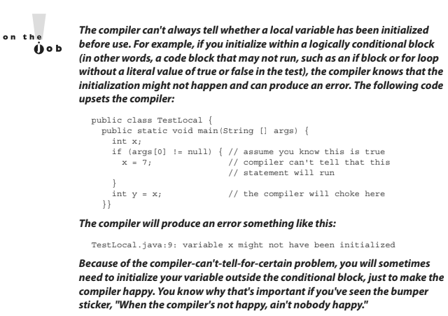

- ## [4 Variable Initialization](#4_Variable_Initialization)
- ## [5 Passing Variables Into Methods](#5_Passing_Variables_Into_Methods)
- ## [6 Garbage Collection](#6_Garbage_Collection)

# <a name="4_Variable_Initialization"></a> 4 Variable Initialization

**2.1 Declare and initialize variables (including casting of primitive datatypes).**
**4.1 Declare, instantiate, initialize and use a one-dimensional array**
**4.2 Declare, instantiate, initialize and use multi-dimensional array (sic)**

# Using a Variable or Array Element That Is Uninitialized and Unassigned

> #### Java gives us the option of initializing a declared variable or leaving it uninitialized. When we attempt to use the uninitialized variable, we can get different behavior depending on what type of variable or array we are dealing with (primitives or objects). The behavior also depends on the level (scope) at which we are declaring our variable.

- #### An **instance variable** is declared within the class but outside any method or constructor.
- #### A **local variable** (aka automatic, method or stack) is declared within a method (or in the argument list of the method).

Although you can leave a local variable uninitialized, the compiler complains if you try to use a local variable before initializing it with a value, as we shall see.

## 1 Primitive and object type instance variables

**Instance variables** (aka member variables) are variables defined at the class level. That means the variable declaration is not made within a method, constructor, or any other initializer block. Instance variables are initialized to a default value each time a new instance is created, although they may be given an explicit value after the object's superconstructors have completed.

Table 3-1 lists the default values for primitive and object types.


### 1.1 Primitive Instance Variables

In the following example, the integer `year` is defined as a class member because it is within the initial curly braces of the class and not within a method's curly braces:

```java
public class BirthDate {
  int year; // Instance variable
  public static void main(String [] args) {
    BirthDate bd = new BirthDate();
    bd.showYear();
  }
  public void showYear() {
    System.out.println("The year is " + year);
  }
}
```

When the program is started, it gives the variable year a value of zero, the default value for primitive number instance variables.


---

### 1.2 Object Reference Instance Variables

When compared with uninitialized primitive variables, object references that aren't initialized are a completely different story. Let's look at the following code:

```java
public class Book {
  private String title; // Uninitialized instance reference variable
  public String getTitle() {
  return title;
  }
  public static void main(String [] args) {
    Book b = new Book();
    System.out.println("The title is " + b.getTitle());
  }
}
```

This code will compile fine. When we run it, the output is

`The title is null`

The `title` variable has not been explicitly initialized with a String assignment, so the instance variable value is `null`. Remember that `null` is not the same as an empty String (""). A `null` value means the reference variable is not referring to any object on the heap. The following modification to the `Book` code runs into trouble:

```java
public class Book {
  private String title; // instance reference variable
  public String getTitle() {
    return title;
  }
  public static void main(String [] args) {
    Book b = new Book();
    String s = b.getTitle(); // Compiles and runs
    String t = s.toLowerCase(); // Runtime Exception!
  }
}
```

The preceding code checks to make sure the object referenced by the variable s is not `null` before trying to use it. Watch out for scenarios on the exam where you might have to trace back through the code to find out whether an object reference will have a value of `null`. In the preceding code, for example, you look at the instance variable declaration for title, see that there's no explicit initialization, recognize that the title variable will be given the default value of `null`, and then realize that the variable `s` will also have a value of `null`. Remember, the value of `s` is a copy of the value of title (as returned by the `getTitle()` method), so if title is a `null` reference, s will be, too.

### 1.3 Array Instance Variables

_In Chapter 5 we'll be taking a very detailed look at declaring, constructing, and initializing arrays and multidimensional arrays._

For now, we're just going to look at the rule for an array element's default values. An array is an object; thus, an array instance variable that's declared but not explicitly initialized will have a value of null, just as any other object reference instance variable. But...if the array is initialized, what happens to the elements contained in the array? All array elements are given their default values—the same default values that elements of that type get when they're instance variables.

> #### The bottom line: Array elements are always, always, always given default values, regardless of where the array itself is instantiated.

If we initialize an array, object reference elements will equal null if they are not initialized individually with values. If primitives are contained in an array, they will be given their respective default values. For example, in the following code, the array year will contain 100 integers that all equal to 0 (zero) by default:

```java
public class BirthDays {
  static int [] year = new int[100];
    public static void main(String [] args) {
      for(int i=0;i<100;i++)
      System.out.println("year[" + i + "] = " + year[i]);
    }
}
```

When the preceding code runs, the output indicates that all 100 integers in the array have a value of `0`.

## 2 Local (Stack, Automatic) Primitives and Objects

Local variables are defined within a method, and they include a method's parameters.


### 2.1 Local Primitives

In the following time-travel simulator, the integer year is defined as an automatic variable because it is within the curly braces of a method:

```java
public class TimeTravel {
  public static void main(String [] args) {
    int year = 2050;
    System.out.println("The year is " + year);
  }
}
```

Local variables, including primitives, always, always, always must be initialized before you attempt to use them (though not necessarily on the same line of code). Java does not give local variables a default value; you must explicitly initialize them with a value, as in the preceding example. If you try to use an uninitialized primitive in your code, you'll get a compiler error:

```java
public class TimeTravel {
  public static void main(String [] args) {
    int year; // Local variable (declared but not initialized)
    System.out.println("The year is " + year); // Compiler error
  }
}
```

Compiling produces output something like this:

```java
%javac TimeTravel.java
TimeTravel.java:4: Variable year may not have been initialized.
System.out.println("The year is " + year);
1 error
```

To correct our code, we must give the integer year a value. In this updated example, we declare it on a separate line, which is perfectly valid:

```java
public class TimeTravel {
  public static void main(String [] args) {
    int year; // Declared but not initialized
    int day; // Declared but not initialized
    System.out.println("You step into the portal.");
    year = 2050; // Initialize (assign an explicit value)
    System.out.println("Welcome to the year " + year);
  }
}
```

Notice in the preceding example we declared an integer called day that never gets initialized, yet the code compiles and runs fine. Legally, you can declare a local variable without initializing it as long as you don't use the variable — but, let's face it, if you declared it, you probably had a reason.



### 2.2 Local Object References

Objects references, too, behave differently when declared within a method rather than as instance variables. With instance variable object references, you can get away with leaving an object reference uninitialized, as long as the code checks to make sure the reference isn't null before using it. Remember, to the compiler, `null` is a value. You can't use the dot operator on a `null` reference, because there is no object at the other end of it, but a `null` reference is not the same as an uninitialized reference.

> #### Locally declared references can't get away with checking for `null` before use, unless you explicitly initialize the local variable to null. The compiler will complain about the following code:

```java
import java.util.Date;
  public class TimeTravel {
    public static void main(String [] args) {
    Date date;
    if (date == null)
      System.out.println("date is null");
}}
```

Compiling the code results in an error similar to the following:

```java
%javac TimeTravel.java
TimeTravel.java:5: Variable date may not have been initialized.
if (date == null)
1 error
```

Instance variable references are always given a default value of `null`, until they are explicitly initialized to something else. But local references are not given a default value; in other words, they aren't `null`. If you don't initialize a local reference variable, then, by default, its value is—well that's the whole point: it doesn't have any value at all! So we'll make this simple:

> #### Its good practice to set local variable references to `null` explicitly until you're ready to initialize it to something else.

The following local variable will compile properly:

```java
Date date = null; // Explicitly set the local reference variable to null
```

### Local Arrays

Just like any other object reference, array references declared within a method must be assigned a value before use. That just means you must declare and construct the array. You do not, however, need to explicitly initialize the elements of an array.

We've said it before, but it's important enough to repeat:

> #### Array elements are given their default values (0, false, null, '\u0000', and so on) regardless of whether the array is declared as an instance or local variable.

The array object itself, however, will not be initialized if it's declared locally. In other words, you must explicitly initialize an array reference if it's declared and used within a method, but at the moment you construct an array object, all of its elements are assigned their default values.

### Assigning One Reference Variable to Another

With primitive variables, an assignment of one variable to another means the contents (bit pattern) of one variable are copied into another.

Object reference variables work exactly the same way. The contents of a reference variable are a bit pattern, so if you assign reference variable `a1` to reference variable `b1`, the bit pattern in `a1` is copied and the new copy is placed into `b1`. If we assign an existing instance of an object to a new reference variable, then two reference variables will hold the same bit pattern—a bit pattern referring to a specific object on the heap. Look at the following code:

```java
import java.awt.Dimension;
class ReferenceTest {
  public static void main (String [] args) {
    Dimension a1 = new Dimension(5,10);
    System.out.println("a1.height = " + a1.height);
    Dimension b1 = a1;
    b1.height = 30;
    System.out.println("a1.height = " + a1.height + " after change to b1");
  }
}
```

In the preceding example, a Dimension object `a1` is declared and initialized with a width of `5` and a height of `10`. Next, Dimension `b1` is declared and assigned the value of `a1`. At this point, both variables (`a1` and `b1`) hold identical values because the contents of `a1` were copied into `b1`. **There is still only one Dimension object—the one that both `a1` and `b1` refer to.** Finally, the height property is changed using the `b1` reference. Now think for a minute: is this going to change the height property of `a1` as well? Let's see what the output will be:

```java
a1.height = 10
a1.height = 30 after change to b1
```

**From this output, we can conclude that both variables refer to the same instance of the Dimension object. When we made a change to b1, the height property was also changed for a1.** One exception to the way object references are assigned is `String`. In Java, `String` objects are given special treatment.

> #### `String` objects are immutable; you can't change the value of a `String` object (lots more on this concept in Chapter 6).

But it sure looks as though you can. Examine the following code:

```java
class StringTest {
  public static void main(String [] args) {
    String x = "Java"; // Assign a value to x
    String y = x; // Now y and x refer to the same String object
    System.out.println("y string = " + y);
    x = x + " Bean"; // Now modify the object using the x reference
    System.out.println("y string = " + y);
  }
}
```

Because Strings are objects, you might think `String y` will contain the characters Java Bean after the variable `x` is changed. Let's see what the output is:

```java
y string = Java
y string = Java
```

As you can see, even though `y` is a reference variable to the same object that `x` refers to, when we change `x`, it doesn't change `y`! For any other object type, where two references refer to the same object, if either reference is used to modify the object, both references will see the change because there is still only a single object. But any time we make any changes at all to a `String`, the VM will update the reference variable to refer to a different object. The different object might be a new object, or it might not be, but it will definitely be a different object.

The reason we can't say for sure whether a new object is created is because of the `String` constant pool, which we'll cover in Chapter 6.

> #### You need to understand what happens when you use a `String` reference variable to modify a string:

- A new string is created (or a matching `String` is found in the `String` pool), leaving the original `String` object untouched.
- The reference used to modify the `String` (or rather, make a new `String` by modifying a copy of the original) is then assigned the brand-new `String` object.

```java
1. String s = "Fred";
2. String t = s; // Now t and s refer to the same String object
3. t.toUpperCase(); // Invoke a String method that changes the String
```

In the preceding code you haven't changed the original `String` object created on line 1. When line 2 completes, both `t` and `s` reference the same `String` object. But when line 3 runs, rather than modifying the object referred to by `t` and `s` (which is the one and only `String` object up to this point), a brand new `String` object is created. And then it's abandoned. Because the new `String` isn't assigned to a `String` variable, the newly created `String` (which holds the string "FRED") is toast. So although two `String` objects were created in the preceding code, only one is actually referenced, and both `t` and `s` refer to it. The behavior of Strings is extremely important in the exam, so we'll cover it in much more detail in Chapter 6.

# <a name="5_Passing_Variables_Into_Methods"></a> 5 Passing Variables Into Methods

### OCA Objectives

**6.8 Determine the effect upon object references and primitive values when they are passed into methods that change the values.**

Methods can be declared to take primitives and/or object references. You need to know how (or if) the caller's variable can be affected by the called method. **The difference between object reference and primitive variables, when passed into methods, is huge and important.** To understand this section, you'll need to be comfortable with the information covered in the "Literals, Assignments, and Variables" section in the early part of this chapter.

## Passing Object Reference Variables

When you pass an object variable into a method, you must keep in mind that you're passing the object reference, not the actual object itself.

- Remember that a reference variable holds bits that represent (to the underlying VM) a way to get to a specific object in memory (on the heap).
- More importantly, you must remember that you aren't even passing the actual reference variable, but rather **a copy of the reference variable**.

A copy of a variable means you get a copy of the bits in that variable, so when you pass a reference variable, you're passing a copy of the bits representing how to get to a specific object. In other words, both the caller and the called method will now have identical copies of the reference; thus, both will refer to the same exact (not a copy) object on the heap.

For this example, we'll use the Dimension class from the java.awt package:

```java
1. import java.awt.Dimension;
2. class ReferenceTest {
3.    public static void main (String [] args) {
4.      Dimension d = new Dimension(5,10);
5.      ReferenceTest rt = new ReferenceTest();
6.      System.out.println("Before, d.height: " + d.height);
7.      rt.modify(d);
8.      System.out.println("After, d.height: " + d.height);
9.    }
10.   void modify(Dimension dim) {
11.     dim.height = dim.height + 1;
12.     System.out.println("dim = " + dim.height);
13.   }
14.}
```

When we run this class, we can see the modify() method was, indeed, able to modify the original (and only) Dimension object created on line 4.

```java
C:\Java Projects\Reference>java ReferenceTest
Before, d.height: 10
dim = 11
After, d.height: 11
```

Notice when the Dimension object on line 4 is passed to the `modify()` method, any changes to the object that occur inside the method are being made to the object whose reference was passed. In the preceding example, reference variables `d` and `dim` both point to the same object.

## Does Java Use Pass-By-Value Semantics?

_If Java passes objects by passing the reference variable instead, does that mean Java uses pass-by-reference for objects? Not exactly, although you'll often hear and read that it does. Java is actually pass-by-value for all variables running within a single VM. Pass-by-value means pass-by-variable-value. And that means pass-by-copy-of- the-variable! (There's that word copy again!)_

> #### It makes no difference if you're passing primitive or reference variables; you are always passing a copy of the bits in the variable.

- 1 So for a primitive variable:
  You're passing a **copy of the bits representing the value**. For example, if you pass an `int` variable with the value of `3`, you're passing a **copy** of the bits representing `3`. The called method then gets its own copy of the value to do with it what it likes.

- 2 If you're passing an object reference variable:
  You're passing a **copy of the bits representing the reference to an object**. The called method then gets its own **copy** of the reference variable to do with it what it likes. But because two identical reference variables refer to the exact same object, if the called method modifies the object (by invoking setter methods, for example), the caller will see that the object the caller's original variable refers to has also been changed.

In the next section, we'll look at how the picture changes when we're talking about primitives. The bottom line on pass-by-value:

> #### The called method can't change the caller's variable, although for object reference variables, the called method can change the object the variable referred to.

What's the difference between changing the variable and changing the object?

For object references, it means the called method can't reassign the caller's original reference variable and make it refer to a different object or null.

```java
void bar() {
  Foo f = new Foo();
  doStuff(f);
}
void doStuff(Foo g) {
  g.setName("Boo");
  g = new Foo();
}
```

**In the preceding code fragment reassigning `g` does not reassign `f`!**

At the end of the `bar()` method, two `Foo` objects have been created: one referenced by the local variable `f` and one referenced by the local (argument) variable `g`. Because the `doStuff()` method has a copy of the reference variable, it has a way to get to the original `Foo` object, for instance to call the `setName()` method. But the `doStuff()` method does not have a way to get to the `f` reference variable. So `doStuff()` can change values within the object `f` refers to, but `doStuff()` can't change the actual contents (bit pattern) of `f`.

> ### In other words, `doStuff()` can change the state of the object that `f` refers to, but it can't make `f` refer to a different object!

## Passing Primitive Variables

Let's look at what happens when a primitive variable is passed to a method:

```java
class ReferenceTest {
  public static void main (String [] args) {
    int a = 1;
    ReferenceTest rt = new ReferenceTest();
    System.out.println("Before modify() a = " + a);
    rt.modify(a);
    System.out.println("After modify() a = " + a);
  }

  void modify(int number) {
    number = number + 1;
    System.out.println("number = " + number);
  }
}
```

In this simple program, the variable a is passed to a method called `modify()`, which increments the variable by `1`. The resulting output looks like this:

```java
Before modify() a = 1
number = 2
After modify() a = 1
```

Notice that a did not change after it was passed to the method. Remember, it was a copy of a that was passed to the method. When a primitive variable is passed to a method, it is passed by value, which means pass-by-copy-of-the-bits-in-the-variable.


# <a name="6_Garbage_Collection"></a> 6 Garbage Collection

### OCA Objectives

**2.4 Explain an object's lifecycle (creation, "dereference by reassignment," and garbage collection)**

> #### The phrase garbage collection seems to come and go from the exam objectives. As of the OCA 8 exam, it's back, and we're happy. Garbage collection is a well-known idea and a universal phrase in computer science.

### Overview of Memory Management and Garbage Collection

It's finally time to dig into the wonderful world of memory management and garbage collection. Memory management is a crucial element in many types of applications.

_Consider a program that reads in large amounts of data, say from somewhere else on a network, and then writes that data into a database on a hard drive. A typical design would be to read the data into some sort of collection in memory, perform some operations on the data, and then write the data into the database. After the data is written into the database, the collection that stored the data temporarily must be emptied of old data or deleted and re-created before processing the next batch. This operation might be performed thousands of times._

_In languages like C or C++ that do not offer automatic garbage collection, a small flaw in the logic that manually empties or deletes the collection data structures can allow small amounts of memory to be improperly reclaimed or lost. Forever. These small losses are called memory leaks, and over many thousands of iterations they can make enough memory inaccessible that programs will eventually crash._

Creating code that performs manual memory management cleanly and thoroughly is a nontrivial and complex task, and while estimates vary, it is arguable that manual memory management can double the development effort for a complex program.

> #### Java's garbage collector provides an automatic solution to memory management. In most cases it frees you from having to add any memory management logic to your application. The downside to automatic garbage collection is that you can't completely control when it runs and when it doesn't.

### Overview of Java's Garbage Collector

_Garbage collection is the phrase used to describe automatic memory management in Java. Whenever a software program executes (in Java, C, C++, Lisp, Ruby, and so on), it uses memory in several different ways. We're not going to get into Computer Science 101 here, but it's typical for memory to be used to create a stack, a heap, in Java's case constant pools and method areas._

The heap is that part of memory where Java objects live, and it's the one and only part of memory that is in any way involved in the garbage collection process. So all garbage collection revolves around making sure the heap has as much free space as possible.

For the purpose of the exam, what this boils down to is deleting any objects that are no longer reachable by the Java program running. We'll talk more about what "reachable" means in a minute, but let's drill this point in.

> #### When the garbage collector runs, its purpose is to find and delete objects that cannot be reached.

**If you think of a Java program as being in a constant cycle of creating the objects it needs (which occupy space on the heap) and then discarding them when they're no longer needed, creating new objects, discarding them, and so on.**

> #### The missing piece of the puzzle is the **_garbage collector._** When it runs, it looks for those discarded objects and deletes them from memory, so that the cycle of using memory and releasing it can continue.

Ah, the great circle of life.

### When Does the Garbage Collector Run?

- The garbage collector is **under the control of the JVM**; the JVM decides when to run the garbage collector.
- From within your Java program, you can **ask the JVM to run the garbage collector**; but there are **no guarantees**, under any circumstances, that the JVM will comply.

_Left to its own devices, the JVM will typically run the garbage collector when it senses that memory is running low. Experience indicates that when your Java program makes a request for garbage collection, the JVM will usually grant your request in short order, but there are no guarantees. Just when you think you can count on it, the JVM will decide to ignore your request._

### How Does the Garbage Collector Work?

_You just can't be sure. You might hear that the garbage collector uses a mark and sweep algorithm, and for any given Java implementation that might be true, but the Java specification doesn't guarantee any particular implementation. You might hear that the garbage collector uses reference counting; once again, maybe yes, maybe no._

> #### The important concept for you to understand for the exam is: When does an object become eligible for garbage collection? In a nutshell, every Java program has from one to many threads. Each thread has its own little execution stack. Normally, you (the programmer) cause at least one thread to run in a Java program, the one with the main() method at the bottom of the stack.

However, there are many really cool reasons to launch additional threads from your initial thread (which you'll get into if you prepare for the OCP 8 exam).

In addition to having its own little execution stack, each thread has its own lifecycle. For now, **all you need to know is that threads can be alive or dead.** With this background information, we can now say with stunning clarity and resolve that **an object is eligible for garbage collection when no live thread can access it.** (Note: Due to the vagaries of the String constant pool, the exam focuses its garbage collection questions on non-String objects, and so our garbage collection discussions apply to only non-String objects too.)

> #### Based on that definition, the garbage collector performs some magical, unknown operations; and when it discovers an object that can't be reached by any live thread, it will consider that object as eligible for deletion, and it might even delete it at some point. (You guessed it: it also might never delete it.)

**When we talk about reaching an object, we're really talking about having a reachable reference variable that refers to the object in question.** If our Java program has a reference variable that refers to an object and that reference variable is available to a live thread, then that object is considered reachable. We'll talk more about how objects can become unreachable in the following section.

Can a Java application run out of memory?

**Yes.**

The garbage collection system attempts to remove objects from memory when they are not used. However, if you maintain too many live objects (objects referenced from other live objects), the system can run out of memory. **Garbage collection cannot ensure that there is enough memory, only that the memory that is available will be managed as efficiently as possible.**

# Writing Code That Explicitly Makes Objects Eligible for Collection

In the preceding section, you learned the theories behind Java garbage collection.

- In this section, we show how to make objects eligible for garbage collection using actual code.
- Also how to attempt to force garbage collection if it is necessary and how you can perform additional cleanup on objects before they are removed from memory.

## 1 Nulling a Reference

> #### Remember, an object becomes eligible for garbage collection when there are no more reachable references to it.

Obviously, if there are no reachable references, it doesn't matter what happens to the object. For our purposes it is just floating in space, unused, inaccessible, and ready for **garbage collection**.

**The first way to remove a reference to an object is to set the reference variable that refers to the object to null.**

Examine the following code:

```java
1. public class GarbageTruck {
2.    public static void main(String [] args) {
3.      StringBuffer sb = new StringBuffer("hello");
4.      System.out.println(sb);
5.      // The StringBuffer object is not eligible for collection
6.      sb = null;
7.      // Now the StringBuffer object is eligible for collection
8.    }
9. }
```

The StringBuffer object with the value hello is assigned to the reference variable sb in the third line. To make the object eligible (for garbage collection), we set the reference variable sb to null, which removes the single reference that existed to the StringBuffer object. Once line 6 has run, our happy little hello StringBuffer object is doomed, eligible for garbage collection.

## 2 Reassigning a Reference Variable

We can also decouple a reference variable from an object by setting the reference
variable to refer to another object. Examine the following code:

```java
class GarbageTruck {
  public static void main(String [] args) {
    StringBuffer s1 = new StringBuffer("hello");
    StringBuffer s2 = new StringBuffer("goodbye");
    System.out.println(s1);
  // At this point the StringBuffer "hello" is not eligible
    s1 = s2; // Redirects s1 to refer to the "goodbye" object
  // Now the StringBuffer "hello" is eligible for collection
}}
```

**Objects that are created in a method also need to be considered.** When a method is invoked, any local variables created exist only for the duration of the method. Once the method has returned, the objects created in the method are eligible for garbage collection.

There is an obvious exception, however.

> #### If an object is returned from the method, its reference might be assigned to a reference variable in the method that called it; hence, it will not be eligible for collection.

Examine the following code:

```java
import java.util.Date;
  public class GarbageFactory {
    public static void main(String [] args) {
      Date d = getDate();
      doComplicatedStuff();
      System.out.println("d = " + d);
  }

  public static Date getDate() {
    Date d2 = new Date();
    StringBuffer now = new StringBuffer(d2.toString());
    System.out.println(now);
    return d2;
  }
}
```

In the preceding example, we created a method called `getDate()` that returns a Date object. This method creates two objects: a `Date` and a `StringBuffer` containing the date information. Since the method returns a reference to the Date object and this reference is assigned to a local variable, it will not be eligible for collection even after the `getDate()` method has completed. The `StringBuffer` object, though, will be eligible, even though we didn't explicitly set the now variable to `null`.

## 3 Isolating a Reference

There is another way in which objects can become eligible for garbage collection, even if they still have valid references! We call this scenario **"islands of isolation."**

> #### A simple example is a class that has an instance variable that is a reference variable to another instance of the same class. Now imagine that two such instances exist and that they refer to each other. If all other references to these two objects are removed, then even though each object still has a valid reference, there will be no way for any live thread to access either object.

When the garbage collector runs, it can usually discover any such islands of objects and remove them. As you can imagine, such islands can become quite large, theoretically containing hundreds of objects.

Examine the following code:

```java
public class Island {
  Island i;
  public static void main(String [] args) {
    Island i2 = new Island();
    Island i3 = new Island();
    Island i4 = new Island();
    i2.i = i3; // i2 refers to i3
    i3.i = i4; // i3 refers to i4
    i4.i = i2; // i4 refers to i2
    i2 = null;
    i3 = null;
    i4 = null;
    // do complicated, memory intensive stuff
  }
}
```


---

## Forcing Garbage Collection

The first thing that we should mention here is that, contrary to this section's title, **garbage collection cannot be forced**. However, Java provides some methods that allow you to request that the JVM perform garbage collection. Note: The Java garbage collector has evolved to such an advanced state that it's recommended that you never invoke `System.gc()` in your code—leave it to the JVM.

> #### In reality, it is possible only to suggest to the JVM that it perform garbage collection. However, there are no guarantees the JVM will actually remove all of the unused objects from memory (even if garbage collection is run). It is essential that you understand this concept for the exam.

_The garbage collection routines that Java provides are members of the Runtime class. The Runtime class is a special class that has a single object (a Singleton) for each main program. The Runtime object provides a mechanism for communicating directly with the virtual machine. To get the Runtime instance, you can use the method `Runtime.getRuntime()`, which returns the Singleton. Once you have the Singleton, you can invoke the garbage collector using the `gc()` method. Alternatively, you can call the same method on the System class, which has static methods that can do the work of obtaining the Singleton for you. The simplest way to ask for garbage collection (remember— just a request) is `System.gc();`_

_Theoretically, after calling `System.gc()`, you will have as much free memory as possible. We say "theoretically" because this routine does not always work that way._

- First, your JVM may not have implemented this routine; the language specification allows this routine to do nothing at all.
- Second, another thread might grab lots of memory right after you run the garbage collector.

_This is not to say that `System.gc()` is a useless method—it's much better than nothing. You just can't rely on System.gc() to free up enough memory so that you don't have to worry about running out of memory. The Certification Exam is interested in guaranteed behavior, not probable behavior. Now that you are somewhat familiar with how this works, let's do a little experiment to see the effects of garbage collection._

_The following program lets us know how much total memory the JVM has available to it and how much free memory it has. It then creates 10,000 `Date` objects. After this, it tells us how much memory is left and then calls the garbage collector (which, if it decides to run, should halt the program until all unused objects are removed). The final free memory result should indicate whether it has run._

Let's look at the program:

```java
1. import java.util.Date;
2. public class CheckGC {
3.    public static void main(String [] args) {
4.      Runtime rt = Runtime.getRuntime();
5.      System.out.println("Total JVM memory: " + rt.totalMemory());
6.      System.out.println("Before Memory = " + rt.freeMemory());
7.      Date d = null;
8.      for(int i = 0;i<10000;i++) {
9.        d = new Date();
10.       d = null;
11.     }
12.     System.out.println("After Memory = " + rt.freeMemory());
13.     rt.gc(); // an alternate to System.gc()
14.     System.out.println("After GC Memory = " + rt.freeMemory());
15.   }
16.}
```

Now, let's run the program and check the results:

```java
Total JVM memory: 1048568
Before Memory = 703008
After Memory = 458048
After GC Memory = 818272
```

As you can see, the JVM actually did decide to garbage collect (that is, delete) the eligible objects.

In the preceding example, we suggested that the JVM perform garbage collection with 458,048 bytes of memory remaining, and it honored our request.

This program has only one user thread running, so there was nothing else going on when we called `rt.gc()`. Keep in mind that the behavior when `gc()` is called may be different for different JVMs; hence, there is no guarantee that the unused objects will be removed from memory. About the only thing you can guarantee is that if you are running very low on memory, the garbage collector will run before it throws an `OutOfMemoryException`.

---

## Cleaning Up Before Garbage Collection — the finalize() Method

Cleaning Up Before Garbage Collection — the `finalize()` Method Java provides a mechanism that lets you run some code just before your object is deleted by the garbage collector. This code is located in a method named `finalize()` that all classes inherit from class Object. On the surface, this sounds like a great idea; maybe your object opened up some resources, and you'd like to close them before your object is deleted. The problem is that, as you may have gathered by now, you can never count on the garbage collector to delete an object. So, any code that you put into your class's overridden `finalize()` method is not guaranteed to run. Because the `finalize()` method for any given object might run, but you can't count on it, don't put any essential code into your `finalize()` method. In fact, we recommend that, in general, you don't override `finalize()` at all.

### Tricky Little `finalize()` Gotchas

There are a couple of concepts concerning `finalize()` that you need to remember:

- For any given object, `finalize()` will be called only once (at most) by the garbage collector.
- Calling `finalize()` can actually result in saving an object from deletion.

Let's examine these statements a little further. First of all, remember that any code you can put into a normal method you can put into `finalize()`. For example, in the `finalize()` method you could write code that passes a reference to the object in question back to another object, effectively ineligible-izing the object for garbage collection. If at some later point this same object becomes eligible for garbage collection again, the garbage collector can still process the object and delete it. The garbage collector, however, will remember that, for this object, `finalize()` already ran, and it will not run `finalize()` again.
