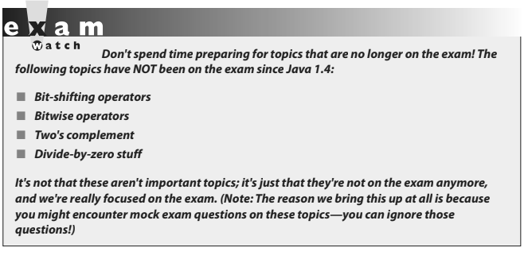
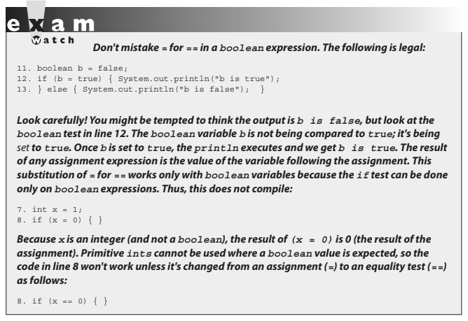

# CHAPTER 4: OPERATORS

- ## [1 Assignment operators](#1_Assignment_operators)
- ## [2 Relational Operators](#2_Relational_Operators)
- ## [3 instanceof Comparison](#3_instanceof_Comparison)
- ## [4 Arithmetic Operators](#4_Arithmetic_Operators)
- ## [5 Conditional Operator](#5_Conditional_Operator)
- ## [6 Logical Opeartor](#6_Logical_Opeartor)
- ## [7 Operator Precedence](#7_Operator_Precedence)

# <a name="1_Assignment_operators"></a> 1 Assignment operators

### OCA Objectives

- **3.1 Use Java operators; including parentheses to override operator precedence.**
- **3.2 Test equality between Strings and other objects using == and equals().**
- **3.3 Create if and if/else and ternary constructs**

Java operators produce new values from one or more operands. Operands are the things on the left and right sides of the operator.

In Java there are a few exceptional operators that come overloaded:

- ### The + operator can be used to add two numeric primitives together or to perform a concatenation operation if either operand is a String.
- ### The &, |, and ^ operators can all be uused in two different ways, although on this version of the exam, their bit-twiddling capabilities won't be tested.

Operators are often the section of the exam where candidates see their lowest scores. Additionally, operators and assignments are a part of many questions dealing with other topics.

> ### Operators and assignments are a part of many questions dealing with other topics.

## Assignment operators

We covered most of the functionality of the equal (=) assignment operator in Chapter 3. To summarize:

- When assigning a value to a primitive, size matters. **Be sure you know when implicit casting will occur, when explicit casting is necessary, and when truncation might occur.**
- Remember that a reference variable isn't an object; it's a way to get to an object.
- When assigning a value to a reference variable, type matters. Remember the rules for supertypes, subtypes, and arrays.

Next we'll cover a few more details about the assignment operators that are on the exam, and when we get to the next chapter, we'll take a look at how the assignment operator = works with Strings (which are immutable).



## Compound assignment operators

There are actually 11 or so compound assignment operators, but only the 4 most commonly used (`+=`, `-=`, `*=`, and `/=`) are on the exam. The compound assignment operators let lazy typists shave a few keystrokes off their workload.

Here are several example assignments, first without using a compound operator:

```java
y = y - 6;
x = x + 2 * 5;
```

Now, with compound operators:

```java
y -= 6;
x += 2 * 5;
```

The last two assignments give the same result as the first two.

# <a name="2_Relational_Operators"></a> 2 Relational Operators

The exam covers six relational operators (<, <=, >, >=, ==, and !=). Relational operators always result in a boolean (true or false) value. This boolean value is most often used in an if test, as follows:

```java
int x = 8;
if (x < 9) {
  // do something
}
```

But the resulting value can also be assigned directly to a boolean primitive:

```java
class CompareTest {
  public static void main(String [] args) {
    boolean b = 100 > 99;
    System.out.println("The value of b is " + b);
  }
}
```

Java has four relational operators that can be used to compare any combination of integers, floating-point numbers, or characters:

■ > Greater than

■ >= Greater than or equal to

■ < Less than

■ <= Less than or equal to

Let's look at some legal comparisons:

```java
class GuessAnimal {
  public static void main(String[] args) {
    String animal = "unknown";
    int weight = 700;
    char sex = 'm';
    double colorWaveLength = 1.630;
    if (weight >= 500) { animal = "elephant"; }
    if (colorWaveLength > 1.621) { animal = "gray " + animal; }
    if (sex <= 'f') { animal = "female " + animal; }
    System.out.println("The animal is a " + animal);
  }
}
```

In the preceding code, we are using a comparison between characters. It's also legal to compare a character primitive with any number (although it isn't great programming style). Running the preceding class will output the following:

`The animal is a gray elephant`

We mentioned that characters can be used in comparison operators. **When comparing a character with a character or a character with a number, Java will use the Unicode value of the character as the numerical value for comparison.**

## "Equality" Operators

Java also has two relational operators (sometimes called "equality operators") that compare two similar "things" and return a boolean (true or false) that represents what's true about the two "things" being equal. These operators are:

■ == Equal (also known as equal to)
■ != Not equal (also known as not equal to)

Each individual comparison can involve two numbers (including char), two boolean values, or two object reference variables. You can't compare incompatible types, however. What would it mean to ask if a boolean is equal to a char? Or if a Button is equal to a String array? (This is nonsense, which is why you can't do it.)

There are four different types of things that can be tested:

■ Numbers
■ Characters
■ Boolean primitives
■ Object reference variables

So what does `==` look at? The value in the variable—in other words, the bit pattern.

### Equality for primitives

Most programmers are familiar with comparing primitive values. The following
code shows some equality tests on primitive variables:

```java
class ComparePrimitives {
  public static void main(String[] args) {
    System.out.println("char 'a' == 'a'? " + ('a' == 'a'));
    System.out.println("char 'a' == 'b'? " + ('a' == 'b'));
    System.out.println("5 != 6? " + (5 != 6));
    System.out.println("5.0 == 5L? " + (5.0 == 5L));
    System.out.println("true == false? " + (true == false));
  }
}
```

This program produces the following output:

```java
char 'a' == 'a'? true
char 'a' == 'b'? false
5 != 6? true
5.0 == 5L? true
true == false? false
```

> #### As you can see, if a _floating-point_ number is compared with an _integer_ and the values are the same, the `==` operator usually returns `true` as expected.

### Equality for reference variables

As you saw earlier, two reference variables can refer to the same object, as the following code snippet demonstrates:

```java
JButton a = new JButton("Exit");
JButton b = a;
```



After running this code, both variable a and variable b will refer to the same object (a JButton with the label Exit). Reference variables can be tested to see if they refer to the same object by using the `==` operator. Remember, **the `==` operator is looking at the bits in the variable, so for reference variables, this means that if the bits in both reference variables are identical, then both refer to the same object.**

Look at the following code:

```java
import javax.swing.JButton;
class CompareReference {
  public static void main(String[] args) {
    JButton a = new JButton("Exit");
    JButton b = new JButton("Exit");
    JButton c = a;
    System.out.println("Is reference a == b? " + (a == b));
    System.out.println("Is reference a == c? " + (a == c));
  }
}
```

This code creates three reference variables. The first two, `a` and `b`, are separate `JButton` objects that happen to have the same label. The third reference variable, `c`, is initialized to refer to the same object that a refers to. When this program runs, the following output is produced:

```java
Is reference a == b? false
Is reference a == c? true
```

This shows us that `a` and `c` reference the same instance of a JButton. The `==` operator will not test whether two objects are "meaningfully equivalent," a concept we'll cover in much more detail in Chapter 6, when we look at the `equals()` method (as opposed to the equals operator we're looking at here).

## Equality for Strings and `java.lang.Object.equals()`

We just used `==` to determine whether two reference variables refer to the same object.

> #### Because objects are so central to Java, every class in Java inherits a method from class Object that tests to see if two objects of the class are "equal." Not surprisingly, this method is called equals().

In this case of the `equals()` method, the phrase "meaningfully equivalent" should be used instead of the word "equal." So the `equals()` method is used to determine if two objects of the same class are "meaningfully equivalent." For classes that you create, you have the option of overriding the `equals()` method that your class inherited from class Object and creating your own definition of "meaningfully equivalent" for instances of your class.

In terms of understanding the `equals()` method for the OCA exam, you need to understand two aspects of the `equals()` method:

- What `equals()` means in class `Object`
- What `equals()` means in class `String`

### - The `equals()` Method in Class Object

The `equals()` method in class Object works the same way that the `==` operator works. If two references point to the same object, the `equals()` method will return `true`. If two references point to different objects, even if they have the same values, the method will return `false`.

### - The equals() Method in Class String

The `equals()` method in class String has been overridden. When the `equals()` method is used to compare two strings, it will return `true` if the strings have the same value, and it will return `false` if the strings have different values. For String's `equals()` method, values ARE case sensitive.

Let's take a look at how the equals() method works in action (notice that the Budgie class did NOT override `Object.equals()`):

```java
class Budgie {
  public static void main(String[] args) {
    Budgie b1 = new Budgie();
    Budgie b2 = new Budgie();
    Budgie b3 = b1;
    String s1 = "Bob";
    String s2 = "Bob";
    String s3 = "bob"; // lower case "b"
    System.out.println(b1.equals(b2)); // false, different objects
    System.out.println(b1.equals(b3)); // true, same objects
    System.out.println(s1.equals(s2)); // true, same values
    System.out.println(s1.equals(s3)); // false, values are case sensitive
  }
}
```

### Equality for enums

Once you've declared an `enum`, it's not expandable. At runtime, there's no way to make additional `enum` constants. Of course, you can have as many variables as you'd like refer to a given `enum` constant, so it's important to be able to compare two `enum` reference variables to see if they're "equal"—that is, do they refer to the same enum constant? You can use either the == operator or the `equals()` method to determine whether two variables are referring to the same `enum` constant:

```java
class EnumEqual {
  enum Color {RED, BLUE} // ; is optional
    public static void main(String[] args) {
      Color c1 = Color.RED; Color c2 = Color.RED;
      if(c1 == c2) { System.out.println("=="); }
      if(c1.equals(c2)) { System.out.println("dot equals"); }
} }
```

(We know } } is ugly; we're prepping you.) This produces the output:

```java
==
dot equals
```

# <a name="3_instanceof_Comparison"></a> 3 instanceof Comparison

# <a name="4_Arithmetic_Operators"></a> 4 Arithmetic Operators

# <a name="5_Conditional_Operator"></a> 5 Conditional Operator

# <a name="6_Logical_Opeartor"></a> 6 Logical Opeartor

# <a name="7_Operator_Precedence"></a> 7 Operator Precedence
