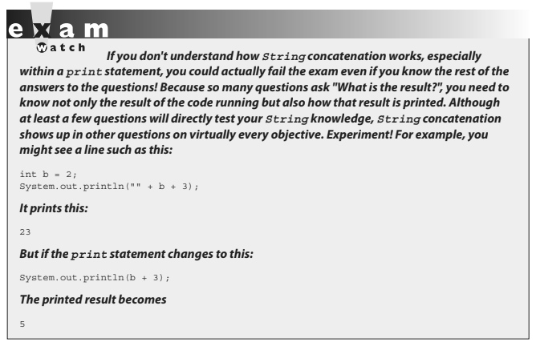
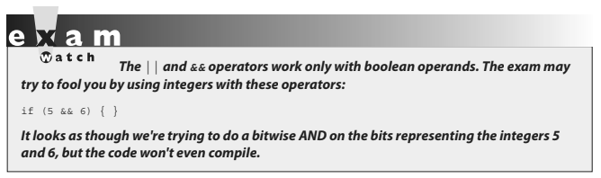

# CHAPTER 4: OPERATORS

- ## [1 Assignment operators](#1_Assignment_operators)
- ## [2 Relational Operators](#2_Relational_Operators)
- ## [3 instanceof Comparison](#3_instanceof_Comparison)
- ## [4 Arithmetic Operators](#4_Arithmetic_Operators)
- ## [5 Conditional Operator](#5_Conditional_Operator)
- ## [6 Logical Opeartor](#6_Logical_Opeartor)
- ## [7 Operator Precedence](#7_Operator_Precedence)

# <a name="1_Assignment_operators"></a> 1 Assignment operators

### OCA Objectives

- **3.1 Use Java operators; including parentheses to override operator precedence.**
- **3.2 Test equality between Strings and other objects using == and equals().**
- **3.3 Create if and if/else and ternary constructs**

Java operators produce new values from one or more operands. Operands are the things on the left and right sides of the operator.

In Java there are a few exceptional operators that come overloaded:

- ### The + operator can be used to add two numeric primitives together or to perform a concatenation operation if either operand is a String.
- ### The &, |, and ^ operators can all be uused in two different ways, although on this version of the exam, their bit-twiddling capabilities won't be tested.

Operators are often the section of the exam where candidates see their lowest scores. Additionally, operators and assignments are a part of many questions dealing with other topics.

> ### Operators and assignments are a part of many questions dealing with other topics.

## Assignment operators

We covered most of the functionality of the equal (=) assignment operator in Chapter 3. To summarize:

- When assigning a value to a primitive, size matters. **Be sure you know when implicit casting will occur, when explicit casting is necessary, and when truncation might occur.**
- Remember that a reference variable isn't an object; it's a way to get to an object.
- When assigning a value to a reference variable, type matters. Remember the rules for supertypes, subtypes, and arrays.

Next we'll cover a few more details about the assignment operators that are on the exam, and when we get to the next chapter, we'll take a look at how the assignment operator = works with Strings (which are immutable).


## Compound assignment operators

There are actually 11 or so compound assignment operators, but only the 4 most commonly used (`+=`, `-=`, `*=`, and `/=`) are on the exam. The compound assignment operators let lazy typists shave a few keystrokes off their workload.

Here are several example assignments, first without using a compound operator:

```java
y = y - 6;
x = x + 2 * 5;
```

Now, with compound operators:

```java
y -= 6;
x += 2 * 5;
```

The last two assignments give the same result as the first two.

# <a name="2_Relational_Operators"></a> 2 Relational Operators

The exam covers six relational operators (<, <=, >, >=, ==, and !=). Relational operators always result in a boolean (true or false) value. This boolean value is most often used in an if test, as follows:

```java
int x = 8;
if (x < 9) {
  // do something
}
```

But the resulting value can also be assigned directly to a boolean primitive:

```java
class CompareTest {
  public static void main(String [] args) {
    boolean b = 100 > 99;
    System.out.println("The value of b is " + b);
  }
}
```

Java has four relational operators that can be used to compare any combination of integers, floating-point numbers, or characters:

■ > Greater than

■ >= Greater than or equal to

■ < Less than

■ <= Less than or equal to

Let's look at some legal comparisons:

```java
class GuessAnimal {
  public static void main(String[] args) {
    String animal = "unknown";
    int weight = 700;
    char sex = 'm';
    double colorWaveLength = 1.630;
    if (weight >= 500) { animal = "elephant"; }
    if (colorWaveLength > 1.621) { animal = "gray " + animal; }
    if (sex <= 'f') { animal = "female " + animal; }
    System.out.println("The animal is a " + animal);
  }
}
```

In the preceding code, we are using a comparison between characters. It's also legal to compare a character primitive with any number (although it isn't great programming style). Running the preceding class will output the following:

`The animal is a gray elephant`

We mentioned that characters can be used in comparison operators. **When comparing a character with a character or a character with a number, Java will use the Unicode value of the character as the numerical value for comparison.**

## "Equality" Operators

Java also has two relational operators (sometimes called "equality operators") that compare two similar "things" and return a boolean (true or false) that represents what's true about the two "things" being equal. These operators are:

■ == Equal (also known as equal to)
■ != Not equal (also known as not equal to)

Each individual comparison can involve two numbers (including char), two boolean values, or two object reference variables. You can't compare incompatible types, however. What would it mean to ask if a boolean is equal to a char? Or if a Button is equal to a String array? (This is nonsense, which is why you can't do it.)

There are four different types of things that can be tested:

■ Numbers
■ Characters
■ Boolean primitives
■ Object reference variables

So what does `==` look at? The value in the variable—in other words, the bit pattern.

### Equality for primitives

Most programmers are familiar with comparing primitive values. The following
code shows some equality tests on primitive variables:

```java
class ComparePrimitives {
  public static void main(String[] args) {
    System.out.println("char 'a' == 'a'? " + ('a' == 'a'));
    System.out.println("char 'a' == 'b'? " + ('a' == 'b'));
    System.out.println("5 != 6? " + (5 != 6));
    System.out.println("5.0 == 5L? " + (5.0 == 5L));
    System.out.println("true == false? " + (true == false));
  }
}
```

This program produces the following output:

```java
char 'a' == 'a'? true
char 'a' == 'b'? false
5 != 6? true
5.0 == 5L? true
true == false? false
```

> #### As you can see, if a _floating-point_ number is compared with an _integer_ and the values are the same, the `==` operator usually returns `true` as expected.

### Equality for reference variables

As you saw earlier, two reference variables can refer to the same object, as the following code snippet demonstrates:

```java
JButton a = new JButton("Exit");
JButton b = a;
```


After running this code, both variable a and variable b will refer to the same object (a JButton with the label Exit). Reference variables can be tested to see if they refer to the same object by using the `==` operator. Remember, **the `==` operator is looking at the bits in the variable, so for reference variables, this means that if the bits in both reference variables are identical, then both refer to the same object.**

Look at the following code:

```java
import javax.swing.JButton;
class CompareReference {
  public static void main(String[] args) {
    JButton a = new JButton("Exit");
    JButton b = new JButton("Exit");
    JButton c = a;
    System.out.println("Is reference a == b? " + (a == b));
    System.out.println("Is reference a == c? " + (a == c));
  }
}
```

This code creates three reference variables. The first two, `a` and `b`, are separate `JButton` objects that happen to have the same label. The third reference variable, `c`, is initialized to refer to the same object that a refers to. When this program runs, the following output is produced:

```java
Is reference a == b? false
Is reference a == c? true
```

This shows us that `a` and `c` reference the same instance of a JButton. The `==` operator will not test whether two objects are "meaningfully equivalent," a concept we'll cover in much more detail in Chapter 6, when we look at the `equals()` method (as opposed to the equals operator we're looking at here).

## Equality for Strings and `java.lang.Object.equals()`

We just used `==` to determine whether two reference variables refer to the same object.

> #### Because objects are so central to Java, every class in Java inherits a method from class Object that tests to see if two objects of the class are "equal." Not surprisingly, this method is called equals().

In this case of the `equals()` method, the phrase "meaningfully equivalent" should be used instead of the word "equal." So the `equals()` method is used to determine if two objects of the same class are "meaningfully equivalent." For classes that you create, you have the option of overriding the `equals()` method that your class inherited from class Object and creating your own definition of "meaningfully equivalent" for instances of your class.

In terms of understanding the `equals()` method for the OCA exam, you need to understand two aspects of the `equals()` method:

- What `equals()` means in class `Object`
- What `equals()` means in class `String`

### - The `equals()` Method in Class Object

The `equals()` method in class Object works the same way that the `==` operator works. If two references point to the same object, the `equals()` method will return `true`. If two references point to different objects, even if they have the same values, the method will return `false`.

### - The equals() Method in Class String

The `equals()` method in class String has been overridden. When the `equals()` method is used to compare two strings, it will return `true` if the strings have the same value, and it will return `false` if the strings have different values. For String's `equals()` method, values ARE case sensitive.

Let's take a look at how the equals() method works in action (notice that the Budgie class did NOT override `Object.equals()`):

```java
class Budgie {
  public static void main(String[] args) {
    Budgie b1 = new Budgie();
    Budgie b2 = new Budgie();
    Budgie b3 = b1;
    String s1 = "Bob";
    String s2 = "Bob";
    String s3 = "bob"; // lower case "b"
    System.out.println(b1.equals(b2)); // false, different objects
    System.out.println(b1.equals(b3)); // true, same objects
    System.out.println(s1.equals(s2)); // true, same values
    System.out.println(s1.equals(s3)); // false, values are case sensitive
  }
}
```

### Equality for enums

Once you've declared an `enum`, it's not expandable. At runtime, there's no way to make additional `enum` constants. Of course, you can have as many variables as you'd like refer to a given `enum` constant, so it's important to be able to compare two `enum` reference variables to see if they're "equal"—that is, do they refer to the same enum constant? You can use either the == operator or the `equals()` method to determine whether two variables are referring to the same `enum` constant:

```java
class EnumEqual {
  enum Color {RED, BLUE} // ; is optional
    public static void main(String[] args) {
      Color c1 = Color.RED; Color c2 = Color.RED;
      if(c1 == c2) { System.out.println("=="); }
      if(c1.equals(c2)) { System.out.println("dot equals"); }
} }
```

(We know } } is ugly; we're prepping you.) This produces the output:

```java
==
dot equals
```

# <a name="3_instanceof_Comparison"></a> 3 instanceof Comparison

> #### The instanceof operator is used for object reference variables only, and you can use it to check whether an object is of a particular type (class or interface).

By "type," we mean class or interface type—in other words, whether the object referred to by the variable on the left side of the operator passes the `IS-A` test for the class or interface type on the right side. (Chapter 2 covered `IS-A` relationships in detail.)

The following simple example:

```java
public static void main(String[] args) {
  String s = new String("foo");
  if (s instanceof String) {
    System.out.print("s is a String");
  }
}
```

prints this:

`s is a String`

Even if the object being tested is not an actual instantiation of the class type on the right side of the operator, `instanceof` will still return true if the object being compared is **assignment compatible** with the type on the right.

The following example demonstrates a common use for `instanceof`: testing an object to see if it's an instance of one of its subtypes before attempting a downcast:

```java
class A { }
class B extends A {
  public static void main (String [] args) {
    A myA = new B();
    m2(myA);
  }
  public static void m2(A a) {
    if (a instanceof B)
      ((B)a).doBstuff(); // downcasting an A reference to a B reference
    }
   static void doBstuff() {
    System.out.println("'a' refers to a B");
  }
}
```

The code compiles and produces this output:

`'a' refers to a B`

In examples like this, the use of the `instanceof` operator protects the program from attempting an **illegal downcast**.

You can test an object reference against its own class type or any of its superclasses. This means that any object reference will evaluate to true if you use the instanceof operator against type Object, as follows:

```java
B b = new B();
  if (b instanceof Object) {
    System.out.print("b is definitely an Object");
  }
```

This prints

`b is definitely an Object`


In addition, it is legal to test whether the null reference is an instance of a class.
This will always result in `false`, of course. This example,

```java
class InstanceTest {
  public static void main(String [] args) {
    String a = null;
    boolean b = null instanceof String;
    boolean c = a instanceof String;
    System.out.println(b + " " + c);
}}
```

prints this:

`false false`

### instanceof Compiler Error

You can't use the `instanceof` operator to test across two different class hierarchies. For instance, the following will NOT compile:

```java
class Cat { }
class Dog {
  public static void main(String [] args) {
    Dog d = new Dog();
    System.out.println(d instanceof Cat);
  }
}
```

Compilation fails—there's no way d could ever refer to a `Cat` or a subtype of `Cat`.


# <a name="4_Arithmetic_Operators"></a> 4 Arithmetic Operators

We're sure you're familiar with the basic arithmetic operators:

■ + addition

■ – subtraction

■ \* multiplication

■ / division


These can be used in the standard way:

```java
int x = 5 * 3;
int y = x - 4;
System.out.println("x - 4 is " + y); // Prints 11
```

### The Remainder (%) Operator (a.k.a. the Modulus Operator)

The remainder operator divides the left operand by the right operand, and the result is the remainder.

> #### Expressions are evaluated from left to right by default. You can change this sequence, or precedence, by adding parentheses. Also remember that the \*, /, and % operators have a higher precedence than the + and - operators.


### String Concatenation Operator

The plus sign can also be used to concatenate two strings together,

The rule to remember is this:

> #### If either operand is a String, the + operator becomes a String concatenation operator. If both operands are numbers, the + operator is the addition operator.



### Increment and Decrement Operators

Java has two operators that will increment or decrement a variable by exactly one. These operators are either two plus signs (`++`) or two minus signs (`--`):

■ ++ Increment (prefix and postfix)

■ -- Decrement (prefix and postfix)

The operator is placed either before (prefix) or after (postfix) a variable to change its value. Whether the operator comes before or after the operand can change the outcome of an expression.

Expect to see questions mixing the increment and decrement operators with other operators, as in the following example:

```java
int x = 2; int y = 3;
if ((y == x++) | (x < ++y)) {
  System.out.println("x = " + x + " y = " + y);
}
```

The preceding code prints this:

`x = 3 y = 4`

You can read the code as follows: "If 3 is equal to 2 OR 3 < 4"
The first expression compares x and y, and the result is false, because the increment on x doesn't happen until after the == test is made. Next, we increment x, so now x is 3. Then we check to see if x is less than y, but we increment y before comparing it with x! So the second logical test is (3 < 4). The result is true, so the print statement runs. As with String concatenation, the increment and decrement operators are used throughout the exam, even on questions that aren't trying to test your knowledge of how those operators work. You might see them in questions on for loops, exceptions, or even threads. Be ready.

# <a name="5_Conditional_Operator"></a> 5 Conditional Operator

This operator is constructed using a `?` (question mark) and a `:` (colon). The parentheses are optional.

Here is its structure:

> #### `x = (boolean expression) ? value to assign if true : value to assign if false`

Let's take a look at a conditional operator in code:

```java
class Salary {
  public static void main(String [] args) {
    int numOfPets = 3;
    String status = (numOfPets<4) ? "Pet limit not exceeded" : "too many pets";
    System.out.println("This pet status is " + status);
  }
}
```

You can read the preceding code as `"Set numOfPets equal to 3"`.

Next we're going to assign a `String` to the status variable. If `numOfPets` is less than `4`, assign "Pet limit not exceeded" to the status variable; otherwise, assign "too many pets" to the status variable. A conditional operator starts with a `boolean` operation, followed by two possible values for the variable to the left of the assignment (`=`) operator.

You can even **_nest_** conditional operators into one statement:

```java
class AssignmentOps {
  public static void main(String [] args) {
    int sizeOfYard = 10;
    int numOfPets = 3;
    String status = (numOfPets<4)?"Pet count OK" : (sizeOfYard > 8)? "Pet limit on the edge" : "too many pets";
    System.out.println("Pet status is " + status);
  }
}
```

Don't expect many questions using conditional operators, but you might get one.

# <a name="6_Logical_Opeartor"></a> 6 Logical Opeartor

The exam objectives specify six "logical" operators (`&`, `|`, `^`, `!`, `&&`, and `||`).

Some Oracle documentation uses other terminology for these operators, but for our purposes and in the exam objectives, these six are the logical operators.

### Bitwise Operators (Not an Exam Topic!)

### Short-Circuit Logical Operators

Five logical operators on the exam are used to evaluate statements that contain more than one boolean expression. The most commonly used of the five are the two short-circuit logical operators:

■ `&&` Short-circuit AND

■ `||` Short-circuit OR

They are used to link little boolean expressions together to form bigger boolean expressions. The && and || operators evaluate only boolean values. For an AND (&&) expression to be true, both operands must be true. For example:
`if ((2 < 3) && (3 < 4)) { }`
The preceding expression evaluates to true because both operand one `(2 < 3)` and operand two `(3 < 4)` evaluate to true.
The short-circuit feature of the && operator is so named because it doesn't waste its time on pointless evaluations. A short-circuit && evaluates the left side of the operation first (operand one), and if it resolves to false, the && operator doesn't bother looking at the right side of the expression (operand two) since the && operator already knows that the complete expression can't possibly be true.

The `||` operator is similar to the `&&` operator, except that it evaluates to `true` if EITHER of the operands is `true`. If the first operand in an OR operation is `true`, the result will be `true`, so the short-circuit `||` doesn't waste time looking at the right side of the equation. If the first operand is `false`, however, the short-circuit `||` has to evaluate the second operand to see if the result of the OR operation will be `true` or `false`.

Pay close attention to the following example; you'll see quite a few questions like this on the exam:

```java
1. class TestOR {
2.    public static void main(String[] args) {
3.      if ((isItSmall(3)) || (isItSmall(7))) {
4.        System.out.println("Result is true");
5.      }
6.      if ((isItSmall(6)) || (isItSmall(9))) {
7.        System.out.println("Result is true");
8.      }
9.    }
10.
11.   public static boolean isItSmall(int i) {
12.     if (i < 5) {
13.       System.out.println("i < 5");
14.       return true;
15.       } else {
16.         System.out.println("i >= 5");
17.         return false;
18.       }
19.     }
20. }
```

What is the result?

```java
% java TestOR
i < 5
Result is true
i >= 5
i >= 5
```

Here's what happened when the main() method ran:

- 1. When we hit line 3, the first operand in the `||` expression (in other words, the left side of the `||` operation) is evaluated.

- 2. The `isItSmall(3)` method is invoked, prints "i < 5", and returns `true`.

- 3. Because the first operand in the `||` expression on line 3 is true, the `||` operator doesn't bother evaluating the second operand. So we never see the "i >= 5" that would have printed had the second operand been evaluated (which would have invoked `isItSmall(7)`).

- 4. Line 6 is evaluated, beginning with the first operand in the `||` expression.

- 5. The `isItSmall(6)` method is called, prints "i >= 5", and returns false.

- 6. Because the first operand in the `||` expression on line 6 is `false`, the `||` operator can't skip the second operand; there's still a chance the expression can be `true`, if the second operand evaluates to `true`.

- 7. The `isItSmall(9)` method is invoked and prints "i >= 5".

- 8. The `isItSmall(9)` method returns `false`, so the expression on line 6 is `false`, and thus line 7 never executes.



### Logical Operators (not Short-Circuit)

There are two non-short-circuit logical operators:

■ `&` Non-short-circuit AND

■ `|` Non-short-circuit OR

> #### These operators are used in logical expressions just like the `&&` and `||` operators are used, but because they aren't the short-circuit operators, they evaluate both sides of the expression—always! They're inefficient.

- If the first operand (left side) in an `&` expression is false, the second operand will still be evaluated—even though it's now impossible for the result to be true!

- The `|` is just as inefficient: if the first operand is `true`, the Java Virtual Machine (JVM) still plows ahead and evaluates the second operand even when it knows the expression will be `true` regardless.

You'll find a lot of questions on the exam that use both the short-circuit and non-short-circuit logical operators. You'll have to know exactly which operands are evaluated and which are not, because the result will vary depending on whether the second operand in the expression is evaluated. Consider this:

```java
int z = 5;
if(++z > 5 || ++z > 6) z++; // z = 7 after this code
```

versus this:

```java
int z = 5;
if(++z > 5 | ++z > 6) z++; // z = 8 after this code
```

The last two logical operators on the exam are:

■ `^` Exclusive-OR (XOR)

■ `!` Boolean invert

The `^` (exclusive-OR) operator evaluates only boolean values. The `^` operator is related to the non-short-circuit operators we just reviewed, in that it always evaluates both the left and right operands in an expression. For an exclusive-OR (`^`) expression to be `true`, **EXACTLY one operand must be `true`**.

This example:

```java
System.out.println("xor " + ((2 < 3) ^ (4 > 3)));
```

produces this output:

`xor false`

The preceding expression evaluates to false because **BOTH** operand one `(2 < 3)` and operand two `(4 > 3)` evaluate to `true`.

The 1 (boolean invert) operator returns the opposite of a boolean's current value. The following statement,

if(!(7 == 5)) { System.out.println("not equal"); }

can be read "If it's not true that 7 == 5," and the statement produces this output:

`not equal`

Here's another example using booleans:

```java
boolean t = true;
boolean f = false;
System.out.println("! " + (t & !f) + " " + f);
```

It produces this output:

`! true false`

In the preceding example, notice that the `&` test succeeded (printing `true`) and that the value of the boolean variable `f` did not change, so it printed `false`.

# <a name="7_Operator_Precedence"></a> 7 Operator Precedence

> #### The OCA 8 exam has reintroduced the topic of operator precedence. When several operators are used in combination, the order in which they are evaluated can alter the result of the expression.

Take a look at this code:

`System.out.println(true & false == false | true);`

What result would you expect? Imagine a more realistic version, evaluating some booleans:
`System.out.println(b1 & b2 == b3 | b4);`
What would you guess the programmer's intention was here? There are two likely scenarios:

- **Scenario 1: (b1 & b2) == (b3 | b4)** If this was the programmer's intention, then he just created a bug.
- **Scenario 2: b1 & (b2 == b3) | b4** If this was the programmer's intention, then the code will work as intended, but his boss and fellow workers will want to strangle him.

> #### This is a long-winded way to say that when you're writing code, you shouldn't rely on everyone's memory of operator precedence. You should just use parentheses like civilized people do.


There are three important general rules for determining how Java will evaluate expressions with operators:

- When two operators of the same precedence are in the same expression, Java evaluates the expression from left to right.
- When parts of an expression are placed in parentheses, those parts are evaluated first.
- When parentheses are nested, the innermost parentheses are evaluated first.

A good way to burn these precedence rules into your brain is to—as always— write some test code and play around with it. We've added an example of some test code that demonstrates several of the precedence hierarchy rules listed here. As you can see, we often compared parentheses-free expressions with their parentheses-rich counterparts to prove the rules:

```java
System.out.println((-7 - 4) + " " + (-(7 - 4))); // unary (-7), beats minus
// output: -11 -3
System.out.println((2 + 3 * 4) + " " + ((2 + 3) * 4)); // * beats +
// output: 14 20
System.out.println(7 > 5 && 2 > 3); // > beats &&
// output: false
System.out.print((true & false == false | true) + " "); // == beats & System.out.
print(((true & false) == (false | true))); // output: true
```

And to repeat, the output is:

```java
-11 -3
14 20
false
true false
```
