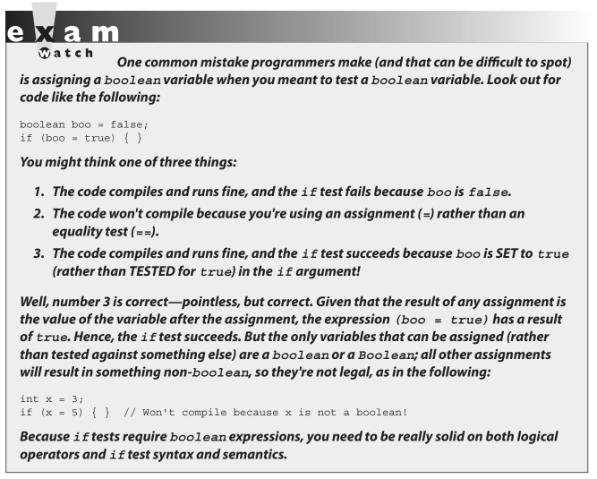
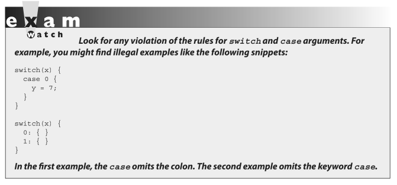
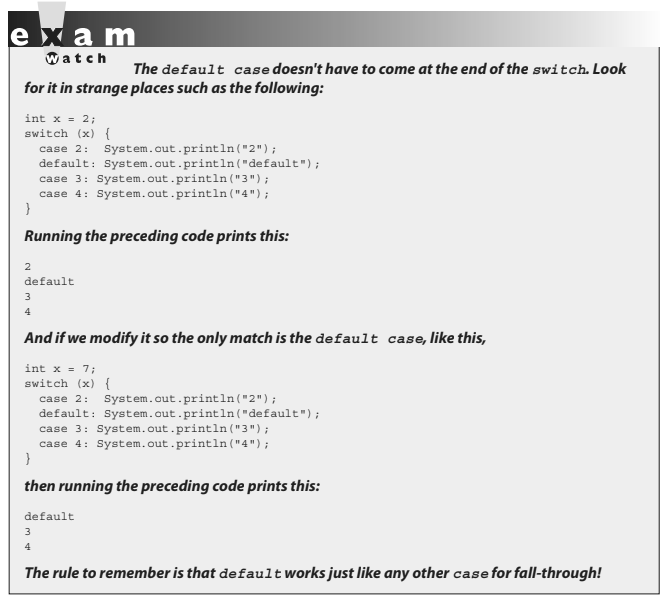

- ## [1 Using if & switch Statements](#1_Using_if_&_switch_Statements)
- ## [2 Creating Loops Constructs](#2_Creating_Loops_Constructs)
- ## [3 Handling Exceptions](#3_Handling_Exceptions)
- ## [4 Common Exceptions & Errors](#4_Common_Exceptions_&_Errors)

# <a name="1_Using_if_&_switch_Statements"></a> 1 Using if & switch Statements

### if-else Branching

The `if` and `switch` statements are commonly referred to as decision statements. When you use decision statements in your program, you're asking the program to evaluate a given expression to determine which course of action to take.

The basic format of an if statement is as follows:

```java
if (booleanExpression) {
    System.out.println("Inside if statement");
}
```

Typically, you're testing something to see if it's `true` and then running a code block (one or more statements) if it is `true` and (optionally) another block of code if it isn't.

```java
if (x > 3) {
    System.out.println("x is greater than 3");
} else {
    System.out.println("x is not greater than 3");
}
```

The following code example is legal (although not recommended for readability):

```java
if (x > 3) // bad practice, but seen on the exam
    y = 2;
z += 8;
a = y + x;
```

Most developers consider it good practice to enclose blocks within curly braces, even if there's only one statement in the block. Be careful with code like the preceding, because you might think it should read as:

"If x is greater than 3, then set y to 2, z to z + 8, and a to y + x."

But the last two lines are going to execute no matter what! They aren't part of the conditional flow. You might find it even more misleading if the code were indented as follows:

```java
if (x > 3)
    y = 2;
    z += 8;
    a = y + x;
```

This brings up the other if-else construct, the if, else if, else.

```java
if (price < 300) {
    buyProduct();
} else if (price < 400) {
    getApproval();
} else {
    dontBuyProduct();
}
```

There are a couple of rules for using else and else if:

- You can have zero or one `else` for a given `if`, and it must come after any `else ifs`.
- You can have zero to many `else ifs` for a given `if`, and they must come before the (optional) `else`.
- Once an `else if` succeeds, none of the remaining `else if`s nor the `else` will be tested.

Sometimes you can have a problem figuring out which if your else should pair with, as follows:

```java
if (exam.done())
if (exam.getScore() < 0.61)
System.out.println("Try again.");
// Which if does this belong to?
else System.out.println("Java master!");
```

We intentionally left out the indenting in this piece of code so it doesn't give clues as to which if statement the else belongs to.

> #### Java law decrees that an else clause belongs to the innermost if statement to which it might possibly belong (in other words, the closest preceding if that doesn't have an else).

In the case of the preceding example, the else belongs to the second if statement in the listing. With proper indenting, it would look like this:

```java
if (exam.done())
    if (exam.getScore() < 0.61)
        System.out.println("Try again.");
// Which if does this belong to?
    else
        System.out.println("Java master!");
```

Following our coding conventions by using curly braces, it would be even easier to read:

```java
if (exam.done()) {
    if (exam.getScore() < 0.61) {
        System.out.println("Try again.");
// Which if does this belong to?
    } else {
        System.out.println("Java master!");
    }
}
```

Be prepared for questions that not only fail to indent nicely but also intentionally indent in a misleading way. Pay close attention for misdirection like the following:

```java
if (exam.done())
    if (exam.getScore() < 0.61)
        System.out.println("Try again.");
else
System.out.println("Java master!"); // Hmmmmm... now where does it belong?
```

Of course, the preceding code is exactly the same as the previous two examples, except for the way it looks.

### Legal Expressions for if Statements

The expression in an if statement must be a boolean expression. Any expression that resolves to a boolean is fine, and some of the expressions can be complex. Assume doStuff() returns true,

```java
int y = 5;
int x = 2;
    if (((x > 3) && (y < 2)) | doStuff()) {
        System.out.println("true");
    }
```

which prints

`true`

You can read the preceding code as, "If both `(x > 3)` and `(y < 2)` are true, or if the result of `doStuff()` is `true`, then print `true`." So, basically, if just `doStuff()` alone is `true`, we'll still get `true`. If`doStuff()` is `false`, though, then both `(x > 3)` and `(y < 2)` will have to be `true` in order to print `true`.

The preceding code is even more complex if you leave off one set of parentheses as follows:

```java
int y = 5;
int x = 2;
    if ((x > 3) && (y < 2) | doStuff()) {
        System.out.println("true");
    }
```

This now prints...nothing! Because the preceding code (with one less set of parentheses) evaluates as though you were saying, "If `(x > 3)` is `true`, and either `(y < 2)` or the result of `doStuff()` is `true`, then print `true`.

> #### Remember that the only legal expression in an if test is a boolean. In some languages, 0 == false and 1 == true. Not so in Java!

The following code shows if statements that might look tempting but are illegal, followed by legal substitutions:

```java
int trueInt = 1;
int falseInt = 0;
if (trueInt) // illegal
if (trueInt == true) // illegal
if (1) // illegal
if (falseInt == false) // illegal
if (trueInt == 1) // legal
if (falseInt == 0) // legal
```



### switch Statements

You've seen how `if` and `else-if` statements can be used to support both simple and complex decision logic. In many cases, the `switch` statement provides a cleaner way to handle complex decision logic.

```java
int x = 3;
switch (x) {
    case 1:
        System.out.println("x equals 1");
        break;
    case 2:
        System.out.println("x equals 2");
        break;
    default:
        System.out.println("No idea what x is");
}
```

Note: The reason this `switch` statement emulates the `if` is because of the break statements that were placed inside of the `switch`. In general, `break` statements are optional, and as you will see in a few pages, their inclusion or exclusion causes huge changes in how a `switch` statement will execute.

### Legal Expressions for switch and case

The general form of the switch statement is

```java
switch (expression) {
    case constant1: code block
    case constant2: code block
    default: code block
}
```

> #### A switch's expression must evaluate to a char, byte, short, int, an enum (as of Java 5), and a String (as of Java 7). That means if you're not using an enum or a String, only variables and values that can be automatically promoted (in other words, implicitly cast) to an int are acceptable.

You won't be able to compile if you use anything else, including the remaining numeric types of long, float, and double.

A case constant must evaluate to the same type that the switch expression can use, with one additional—and big—constraint: **the case constant must be a compile-time constant!**

Since the case argument has to be resolved at compile time, you can use only a constant or final variable that is immediately initialized with a literal value. It is not enough to be final; it must be a compile-time constant.

Here's an example:

```java
final int a = 1;
final int b;
b = 2;
int x = 0;

switch (x) {
    case a: // ok
    case b: // compiler error
```

Also, the `switch` can only check for equality. This means the other relational operators such as greater than are rendered unusable in a `case`. The following is an example of a valid expression using a method invocation in a `switch` statement. Note that for this code to be legal, the method being invoked on the object reference **must return a value compatible with an int**.

```java
String s = "xyz";
switch (s.length()) {
    case 1:
        System.out.println("length is one");
        break;
    case 2:
        System.out.println("length is two");
        break;
    case 3:
        System.out.println("length is three");
        break;
    default:
        System.out.println("no match");
}
```

One other rule you might not expect involves the question, "What happens if I `switch` on a variable smaller than an int?"

Look at the following `switch`:

```java
byte g = 2;
switch(g) {
    case 23:
    case 128:
}
```

This code won't compile. Although the switch argument is legal—a byte is implicitly cast to an int—the second case argument (`128`) is too large for a byte, and the compiler knows it!

Attempting to compile the preceding example gives you an error something like this:

```java
Test.java:6: possible loss of precision
found : int
required: byte
case 128:
    ^
```

It's also illegal to have more than one case label using the same value. For example, the following block of code won't compile because it uses two cases with the same value of 80:

```java
int temp = 90;
switch(temp) {
    case 80 : System.out.println("80");
    case 80 : System.out.println("80"); // won't compile!
    case 90 : System.out.println("90");
    default : System.out.println("default");
}
```

It is legal to leverage the power of boxing in a `switch` expression. For instance, the following is legal:

```java
switch(new Integer(4)) {
    case 4: System.out.println("boxing is OK");
}
```



### An intro to String "equality"

We've talked about how we know when primitives are equal, but what does it mean for objects to be equal? This is another one of those surprisingly tricky topics, and for those of you who intend to take the OCP exam, you'll spend a lot of time studying "object equality."

> #### For you OCA candidates, all you have to know is that for a switch statement, two Strings will be considered "equal" if they have the same case-sensitive sequence of characters.

For example, in the following partial switch statement, the expression would match the case:

```java
String s = "Monday";
switch(s) {
case "Monday": // matches!
```

But the following would NOT match:

```java
String s = "MONDAY";
switch(s) {
case "Monday": // Strings are case-sensitive, DOES NOT match
```

### Break and Fall-Through in switch Blocks

The most important thing to remember about the flow of execution through a switch statement is this:

> #### Case constants are evaluated from the top down, and the first case constant that matches the switch's expression is the execution entry point.

In other words, once a case constant is matched, the Java Virtual Machine (JVM) will execute the associated code block and ALL subsequent code blocks (barring a `break` statement), too! The following example uses a `String` in a case statement:

```java
class SwitchString {
    public static void main(String [] args) {
        String s = "green";
        switch(s) {
            case "red": System.out.print("red ");
            case "green": System.out.print("green ");
            case "blue": System.out.print("blue ");
            default: System.out.println("done");
        }
    }
}
```

In this example case "green": matched, so the JVM executed that code block and all subsequent code blocks to produce the output:

`green blue done`

Again, when the program encounters the keyword `break` during the execution of a `switch` statement, execution will immediately move out of the `switch` block to the next statement after the `switch`. If `break` is omitted, the program just keeps executing the remaining case blocks until either a `break` is found or the `switch` statement ends.

> #### This dropping down is actually called "fall-through," because of the way execution falls from one case to the next. Remember, the matching case is simply your entry point into the `switch` block! If you do want that "just the matching code" behavior, you'll insert a `break`.

An interesting example of this fall-through logic is shown in the following code:

```java
int x = someNumberBetweenOneAndTen;
switch (x) {
case 2:
case 4:
case 6:
case 8:
case 10: {
    System.out.println("x is an even number"); break;
}}
```

This `switch` statement will print `x is an even number` or nothing, depending on whether the number is between one and ten and is odd or even. For example, if `x` is `4`, execution will begin at `case 4`, but then fall down through `6`, `8`, and `10`, where it prints and then `breaks`. The `break` at `case 10`, by the way, is not needed; we're already at the end of the `switch` anyway.

Note: Because fall-through is less than intuitive, Oracle recommends that you add a comment such as // fall through when you use fall-through logic.

### The default case

What if, using the preceding code, you wanted to print `x is an odd number` if none of the cases (the even numbers) matched? You couldn't put it after the `switch` statement, or even as the last case in the `switch`, because in both of those situations it would always print `x is an odd number`. To get this behavior, you'd use the _`default`_ keyword. The only change we need to make is to add the default case to the preceding code:

```java
int x = someNumberBetweenOneAndTen;
switch (x) {
case 2:
case 4:
case 6:
case 8:
case 10: { System.out.println("x is even"); break; }
default: System.out.println("x is an odd number");
}
```



# <a name="2_Creating_Loops_Constructs"></a> 2 Creating Loops Constructs

Java loops come in three flavors: `while`, `do`, and `for` (and as of Java 5, the for loop has two variations). All three let you repeat a block of code as long as some condition is `true` or for a specific number of iterations.

### 1 Using while loops

The while loop is good when you don't know how many times a block or statement should repeat but you want to continue looping as long as some condition is `true`.

A while statement looks like this:

```java
while (expression) {
// do stuff
}
```

Or this:

```java
int x = 2;
while(x == 2) {
    System.out.println(x);
    ++x;
}
```

In this case, as in all loops, the expression (test) must evaluate to a boolean result. The body of the while loop will execute only if the expression (sometimes called the "condition") results in a value of true. Once inside the loop, the loop body will repeat until the condition is no longer met because it evaluates to false. In the previous example, program control will enter the loop body because x is equal to 2. However, x is incremented in the loop, so when the condition is checked again it will evaluate to false and exit the loop. _Any variables used in the expression of a while loop must be declared before the expression is evaluated._

In other words, you can't say this:

`while (int x = 2) { } // not legal`

The key point to remember about a `while` loop is that it might not ever run. If the test expression is `false` the first time the `while` expression is checked, the loop body will be skipped and the program will begin executing at the first statement after the `while` loop.

Look at the following example:

```java
int x = 8;
while (x > 8) {
    System.out.println("in the loop");
    x = 10;
}
System.out.println("past the loop");
```

Running this code produces:

`past the loop`

Because the expression `(x > 8)` evaluates to `false`, none of the code within the while loop ever executes.

### 2 Using do loops

> #### The `do` loop is similar to the `while` loop, except the expression is not evaluated until after the `do` loop's code is executed. Therefore, the code in a `do` loop is guaranteed to execute at least once.

The following shows a do loop in action:

```java
do {
System.out.println("Inside loop");
} while(false);
```

The `System.out.println()` statement will print once, even though the expression evaluates to `false`. Remember, the do loop will always run the code in the loop body at least once. Be sure to note the use of the semicolon at the end of the while expression.

### 3 Using for loops

We'll call the old style of `for` loop the "basic `for` loop," and we'll call the new style of `for` loop the "enhanced `for` loop" (it's also sometimes called the `for-each`). The terms `for-in`, `for-each`, and "enhanced for" all refer to the same Java construct.

> #### The basic for loop is more flexible than the enhanced for loop, but the enhanced for loop was designed to make iterating through arrays and collections easier to code.

### The basic for loop

The `for` loop is especially useful for flow control when you already know how many times you need to execute the statements in the loop's block. The `for` loop declaration has three main parts besides the body of the loop:

- Declaration and initialization of variables
- The boolean expression (conditional test)
- The iteration expression

The three for declaration parts are separated by semicolons. The following two examples demonstrate the for loop. The first example shows the parts of a forloop in a pseudocode form, and the second shows a typical example of a for loop:

```java
for (/*Initialization*/ ; /*Condition*/ ; /* Iteration */) {
    /* loop body */
}
```

```java
for (int i = 0; i<10; i++) {
    System.out.println("i is " + i);
}
```

### The basic for loop declaration & initialization

The first part of the for statement lets you declare and initialize zero, one, or multiple variables of the same type inside the parentheses after the for keyword. If you declare more than one variable of the same type, you'll need to separate them with commas as follows:

`for (int x = 10, y = 3; y > 3; y++) { }`

The declaration and initialization happen before anything else in a `for` loop. And whereas the other two parts—the boolean test and the iteration expression — will run with each iteration of the loop, the declaration and initialization happen just once, at the very beginning. You also must know that the scope of variables declared in the `for` loop ends with the `for` loop!

The following demonstrates this:

```java
for (int x = 1; x < 2; x++) {
    System.out.println(x); // Legal
}
System.out.println(x); // Not Legal! x is now out of scope and can't be accessed.
```

If you try to compile this, you'll get something like this:

```java
Test.java:19: cannot resolve symbol
symbol : variable x
location: class Test
System.out.println(x);
                    ^
```

# <a name="3_Handling_Exceptions"></a> 3 Handling Exceptions

# <a name="4_Common_Exceptions_&_Errors"></a> 4 Common Exceptions & Errors
