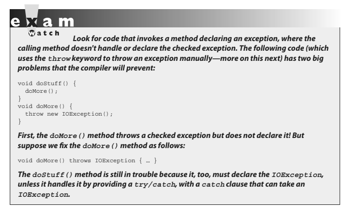

- ## [3 Handling Exceptions](#3_Handling_Exceptions)
- ## [4 Common Exceptions & Errors](#4_Common_Exceptions_&_Errors)

# <a name="3_Handling_Exceptions"></a> 3 Handling Exceptions

### OCA Objectives

- **8.1 Differentiate among checked exceptions, unchecked exceptions, and errors.**
- **8.2 Create a try-catch block and determine how exceptions alter normal program flow.**
- **8.3 Describe the advantages of Exception handling.**
- **8.4 Create and invoke a method that throws an exception.**
- **8.5 Recognize common exception classes (such as NullPointerException, ArithmeticException, ArrayIndexOutOfBoundsException, ClassCastException) (sic)**

In many languages, writing program code that checks for and deals with errors is tedious and bloats the application source into confusing spaghetti. Still, error detection and handling may be the most important ingredient of any robust application.

Here are some of the benefits of Java's exception-handling features:

- It _arms developers with an elegant mechanism for handling errors_ that produces efficient and organized error-handling code.

- It allows developers to _detect errors easily_ without writing special code to test return values.

- It lets us _keep exception-handling code cleanly separated from exception-generating code_.

- It also lets us use the same exception-handling _code to deal with a range of possible exceptions_.

Java 7 added several new exception-handling capabilities to the language. For our purposes, Oracle split the various exception-handling topics into two main parts:

- #### 1. The OCA exam covers the Java 6 version of exception handling.
- #### 2. The OCP exam adds the new exception features added in Java 7.

_In order to mirror Oracle's OCA 8 objectives versus the OCP 8 objectives, this chapter will give you only the basics of exception handling._

### Catching an Exception Using try and catch

Before we begin, let's introduce some terminology. The term exception means "exceptional condition" and is an occurrence that alters the normal program flow.

A bunch of things can lead to exceptions, including hardware failures, resource exhaustion, and good old bugs.

> ### When an exceptional event occurs in Java, an exception is said to be "thrown." The code that's responsible for doing something about the exception is called an "exception handler," and it "catches" the thrown exception. Exception handling works by transferring the execution of a program to an appropriate exception handler when an exception occurs.

For example, if you call a method that opens a file but the file cannot be opened, execution of that method will stop, and code that you wrote to deal with this situation will be run. Therefore, we need a way to tell the JVM what code to execute when a certain exception happens.

To do this, we use the `try` and `catch` keywords.

The `try` is used to define a block of code in which exceptions may occur. This block of code is called a "guarded region" (which really means "risky code goes here"). One or more catch clauses match a specific exception (or group of exceptions—more on that later) to a block of code that handles it.

Here's how it looks in pseudocode:

```java
1. try {
2. // This is the first line of the "guarded region"
3. // that is governed by the try keyword.
4. // Put code here that might cause some kind of exception.
5. // We may have many code lines here or just one.
6. }
7. catch(MyFirstException) {
8. // Put code here that handles this exception.
9. // This is the next line of the exception handler.
10. // This is the last line of the exception handler.
11. }
12. catch(MySecondException) {
13. // Put code here that handles this exception
14. }
15.
16. // Some other unguarded (normal, non-risky) code begins here
```

-> In this pseudocode example, lines 2 through 5 constitute the guarded region that is governed by the try clause.
-> Line 7 is an exception handler for an exception of type MyFirstException.
-> Line 12 is an exception handler for an exception of type MySecondException.

`catch` blocks immediately follow the `try` block. This is a requirement;
If you have one or more `catch` blocks, they must immediately follow the try block.

Additionally, the catch blocks must all follow each other, without any other statements or blocks in between. Also, the order in which the catch blocks appear matters, as we'll see a little later.

Execution of the guarded region starts at line 2. If the program executes all the way past line 5 with no exceptions being thrown, execution will transfer to line 15 and continue downward. However, if at any time in lines 2 through 5 (the `try` block) an exception of type `MyFirstException` is thrown, execution will immediately transfer to line 7. Lines 8 through 10 will then be executed so that the entire catch block runs, and then execution will transfer to line 15 and continue.

Note that if an exception occurred on, say, line 3 of the `try` block, the remaining lines in the `try` block (4 and 5) would never be executed. Once control jumps to the catch block, it never returns to complete the balance of the `try` block. This is exactly what you want, though.

Imagine that your code looks something like this pseudocode:

```java
try {
    getTheFileFromOverNetwork
    readFromTheFileAndPopulateTable
}
catch(CantGetFileFromNetwork) {
    displayNetworkErrorMessage
}
```

_This pseudocode demonstrates how you typically work with exceptions. Code that's dependent on a risky operation (as populating a table with file data is dependent on getting the file from the network) is grouped into a `try` block in such a way that if, say, the first operation fails, you won't continue trying to run other code that's also guaranteed to fail. In the pseudocode example, you won't be able to read from the file if you can't get the file off the network in the first place. One of the benefits of using exception handling is that code to handle any particular exception that may occur in the governed region needs to be written only once. Returning to our earlier code example, there may be three different places in our `try` block that can generate a `MyFirstException`, but wherever it occurs it will be handled by the same catch block (on line 7). We'll discuss more benefits of exception handling near the end of this chapter._

### Using Finally

Although try and catch provide a terrific mechanism for trapping and handling exceptions, we are left with the problem of how to clean up after ourselves if an exception occurs. The cleanup code can neither be placed at the bottom of a try block or within a catch block.

Exception handlers are a poor place to clean up after the code in the try block because each handler then requires its own copy of the cleanup code. If, for example, you allocated a network socket or opened a file somewhere in the guarded region, each exception handler would have to close the file or release the socket. That would make it too easy to forget to do cleanup and also lead to a lot of redundant code.

To address this problem, Java offers the finally block. A finally block encloses code that is always executed at some point after the try block, whether an exception was thrown or not. Even if there is a return statement in the try block, the finally block executes right after the return statement is encountered and before the return executes! This is the right place to close your files, release your network sockets, and perform any other cleanup your code requires.

> #### If the try block executes with no exceptions, the finally block is executed immediately after the try block completes. If there was an exception thrown, the finally block executes immediately after the proper catch block completes.

Let's look at another pseudocode example:

```java
1: try {
2: // This is the first line of the "guarded region".
3: }
4: catch(MyFirstException) {
5: // Put code here that handles this exception
6: }
7: catch(MySecondException) {
8: // Put code here that handles this exception
9: }
10: finally {
11: // Put code here to release any resource we
12: // allocated in the try clause
13: }
14:
15: // More code here
```

- As before, execution starts at the first line of the try block, line 2. If there are no exceptions thrown in the try block, execution transfers to line 11, the first line of the finally block.

- On the other hand, if a MySecondException is thrown while the code in the try block is executing, execution transfers to the first line of that exception handler, line 8 in the catch clause. After all the code in the catch clause is executed, the program moves to line 11, the first line of the finally clause.

_If an exception is thrown, finally runs. If an exception is not thrown, finally runs. If the exception is caught, finally runs. If the exception is not caught, finally runs. Later we'll look at the few scenarios in which finally might not run or complete._

> ### Remember, finally clauses are not required. Using a finally block allows the cleanup code to execute even when there isn't a catch clause.

If you don't write one, your code will compile and run just fine. In fact, if you have no resources to clean up after your try block completes, you probably don't need a finally clause. Also, because the compiler doesn't even require catch clauses, sometimes you'll run across code that has a try block immediately followed by a finally block. Such code is useful when the exception is going to be passed back to the calling method, as explained in the next section.

The following legal code demonstrates a try with a finally but no catch:

```java
try {
// do stuff
} finally {
// clean up
}
```

The following legal code demonstrates a `try`, `catch`, and `finally`:

```java
try {
// do stuff
} catch (SomeException ex) {
// do exception handling
} finally {
// clean up
}
```

The following ILLEGAL code demonstrates a try without a catch or finally:

```java
try {
// do stuff
}
// need a catch or finally here
System.out.println("out of try block");
```

The following ILLEGAL code demonstrates a misplaced catch block:

```java
try {
// do stuff
}
// can't have code between try/catch
System.out.println("out of try block");
catch(Exception ex) { }
```


### Propagating Uncaught Exceptions

> ####If a method doesn't provide a `catch` clause for a particular exception, that method is said to be "ducking" the exception (or "passing the buck").

So what happens to a ducked exception? Before we discuss that, we need to briefly review the concept of the _call stack_.

Most languages have the concept of a method stack or a _call stack_. Simply put, the _call stack_ is the chain of methods that your program executes to get to the current method. If your program starts in method `main()` and `main()` calls method `a()`, which calls method `b()`, which in turn calls method `c()`, the _call stack_ consists of the following:

```java
c
b
a
main
```

We will represent the stack as growing upward (although it can also be visualized as growing downward). As you can see, the last method called is at the top of the stack, while the first calling method is at the bottom. The method at the very top of the stack trace would be the method you were currently executing. If we move back down the call stack, we're moving from the current method to the previously called method.

Figure 5-1 illustrates a way to think about how the call stack in Java works.


_Now let's examine what happens to ducked exceptions. Imagine a building, say, five stories high, and at each floor there is a deck or balcony. Now imagine that on each deck, one person is standing holding a baseball mitt. Exceptions are like balls dropped from person to person, starting from the roof. An exception is first thrown from the top of the stack (in other words, the person on the roof); and if it isn't caught by the same person who threw it (the person on the roof), it drops down the call stack to the previous method, which is the person standing on the deck one floor down. If not caught there by the person one floor down, the exception/ ball again drops down to the previous method (person on the next floor down), and so on, until it is caught or until it reaches the very bottom of the call stack._

This is called "exception propagation." If an exception reaches the bottom of the call stack, it's like reaching the bottom of a very long drop; the ball explodes, and so does your program. An exception that's never caught will cause your application to stop running.

A description (if one is available) of the exception will be displayed, and the call stack will be "dumped." This helps you debug your application by telling you what exception was thrown, from what method it was thrown, and what the stack looked like at the time.


### Defining Exceptions

_We have been discussing exceptions as a concept. We know that they are thrown when a problem of some type happens, and we know what effect they have on the flow of our program._

In this section, we will develop the concepts further and use exceptions in functional Java code. Earlier we said that an exception is an occurrence that alters the normal program flow. But because this is Java, anything that's not a primitive must be...an object. Exceptions are no different.

> ### Every exception is an instance of a class that has class Exception in its inheritance hierarchy. In other words, exceptions are always some subclass of `java.lang.Exception`. When an exception is thrown, an object of a particular _Exception subtype is instantiated and handed to the exception handler as an **argument** to the catch clause_. An actual catch clause looks like this:

```java
try {
// some code here
}
catch (ArrayIndexOutOfBoundsException e) {
    e.printStackTrace();
}
```

In this example, `e` is an instance of the `ArrayIndexOutOfBoundsException` class. As with any other object, you can call its methods.

All exception classes are subtypes of class _Exception_. This class derives from the class Throwable (which derives from the class Object). Figure 5-2 shows the hierarchy for the exception classes.

### Exception Hierarchy


As you can see, there are two subclasses that derive from Throwable: _Exception_ and _Error_.

Classes that derive from _Error_ represent unusual situations that are not caused by program errors and indicate things that would not normally happen during program execution, such as the JVM running out of memory. Generally, your application won't be able to recover from an _Error_, so you're not required to handle them. If your code does not handle them (and it usually won't), it will still compile with no trouble. Although often thought of as exceptional conditions, Errors are technically not exceptions because they do not derive from class _Exception_.

In general, an exception represents something that happens not as a result of a programming error, but rather because some resource is not available or some other condition required for correct execution is not present. For example, if your application is supposed to communicate with another application or computer that is not answering, this is an exception that is not caused by a bug.

Figure 5-2 also shows a subtype of _Exception_ called _RuntimeException_. These exceptions are a special case because they sometimes do indicate program errors. They can also represent rare, difficult-to-handle exceptional conditions. Runtime exceptions are discussed in greater detail later in this chapter.

> ### Java provides many exception classes, most of which have quite descriptive names.

There are two ways to get information about an exception.

- The first is from the type of the exception itself.
- The next is from information that you can get from the exception object.

> ### Class Throwable (at the top of the inheritance tree for exceptions) provides its descendants with some methods that are useful in exception handlers. One of these is `printStackTrace()`.

As you would expect, if you call an exception object's `printStackTrace()` method, as in the earlier example, a stack trace from where the exception occurred will be printed. We discussed that a call stack builds upward with the most recently called method at the top. You will notice that the `printStackTrace()` method prints the most recently entered method first and continues down, printing the name of each method as it works its way down the call stack (this is called "unwinding the stack") from the top.


### Handling an Entire Class Hierarchy of Exceptions

We've discussed that the `catch` keyword allows you to specify a particular type of exception to `catch`.

> ### You can actually `catch` more than one type of exception in a single `catch` clause.

If the exception class that you specify in the `catch` clause has no subclasses, then only the specified class of exception will be caught. However, if the class specified in the `catch` clause does have subclasses, any exception object that subclasses the specified class will be caught as well. For example, class IndexOutOfBoundsException has two subclasses, ArrayIndexOutOfBoundsException and StringIndexOutOfBoundsException. You may want to write one exception handler that deals with exceptions produced by either type of boundary error, but you might not be concerned with which exception you actually have. In this case, you could write a `catch` clause like the following:

```java
try {
// Some code here that can throw a boundary exception
}
catch (IndexOutOfBoundsException e) {
    e.printStackTrace();
}
```

If any code in the try block throws `ArrayIndexOutOfBoundsException` or `StringIndexOutOfBoundsException`, the exception will be caught and handled. This can be convenient, but it should be used sparingly. By specifying an exception class's superclass in your catch clause, you're discarding valuable information about the exception. You can, of course, find out exactly what exception class you have, but if you're going to do that, you're better off writing a separate `catch` clause for each exception type of interest.

> ### Resist the temptation to write a single catchall exception handler such as the following:

```java
try {
// some code
}
catch (Exception e) {
    e.printStackTrace();
}
```

This code will catch every exception generated. Of course, no single exception handler can properly handle every exception, and programming in this way defeats the design objective. Exception handlers that trap many errors at once will probably reduce the reliability of your program, because it's likely that an exception will be caught that the handler does not know how to handle.

### Exception Matching

If you have an exception hierarchy composed of a superclass exception and a number of subtypes, and you're interested in handling one of the subtypes in a special way but want to handle all the rest together, you need write only two `catch` clauses.

When an exception is thrown, Java will try to find (by looking at the available `catch` clauses from the top down) a `catch` clause for the exception type. If it doesn't find one, it will search for a handler for a supertype of the exception. If it does not find a `catch` clause that matches a supertype for the exception, then the exception is propagated down the call stack. This process is called "exception matching."

Let's look at an example:

```java
1: import java.io.*;
2: public class ReadData {
3:      public static void main(String args[]) {
4:          try {
5:              RandomAccessFile raf =
6:              new RandomAccessFile("myfile.txt", "r");
7:              byte b[] = new byte[1000];
8:              raf.readFully(b, 0, 1000);
9:          }
10:         catch(FileNotFoundException e) {
11:             System.err.println("File not found");
12:             System.err.println(e.getMessage());
13:             e.printStackTrace();
14:         }
15:         catch(IOException e) {
16:             System.err.println("IO Error");
17:             System.err.println(e.toString());
18:             e.printStackTrace();
19:         }
20:     }
21: }
```

This short program attempts to open a file and to read some data from it. Opening and reading files can generate many exceptions, most of which are some type of `IOException`.

Imagine that in this program we're interested in knowing only whether the exact exception is a `FileNotFoundException`. Otherwise, we don't care exactly what the problem is. `FileNotFoundException` is a subclass of `IOException`. Therefore, we could handle it in the `catch` clause that catches all subtypes of `IOException`, but then we would have to test the exception to determine whether it was a `FileNotFoundException`. Instead, we coded a special exception handler for the `FileNotFoundException` and a separate exception handler for all other `IOException` subtypes. If this code generates a `FileNotFoundException`, it will be handled by the `catch` clause that begins at `line 10`. If it generates another `IOException` — perhaps `EOFException`, which is a subclass of `IOException` — it will be handled by the `catch` clause that begins at `line 15`.

If some other exception is generated, such as a runtime exception of some type, **neither** `catch` clause will be executed and the exception will be propagated down the call stack.

> ### Notice that the catch clause for the `FileNotFoundException` was placed above the handler for the `IOException`. This is really important! If we do it the opposite way, the program will not compile. The handlers for the most specific exceptions must always be placed above those for more general exceptions.

The following will not compile:

```java
try {
// do risky IO things
} catch (IOException e) {
// handle general IOExceptions
} catch (FileNotFoundException ex) {
// handle just FileNotFoundException
}
```

You'll get a compiler error something like this:

```java
TestEx.java:15: exception java.io.FileNotFoundException has
already been caught
} catch (FileNotFoundException ex) {
  ^
```

_If you think back to the people with baseball mitts (in the section "Propagating Uncaught Exceptions"), imagine that the most general mitts are the largest and can thus catch many kinds of balls. An `IOException` mitt is large enough and flexible enough to catch any type of `IOException`. So if the person on the fifth floor (say, Fred) has a big ol' `IOException` mitt, he can't help but catch a `FileNotFoundException` ball with it. And if the guy (say, Jimmy) on the second floor is holding a `FileNotFoundException` mitt, that `FileNotFoundException` ball will never get to him because it will always be stopped by Fred on the fifth floor, standing there with his big-enough-for-any-`IOException` mitt._

> ### If one Exception class is not a subtype or supertype of the other, then the order in which the catch clauses are placed doesn't matter.

### Exception Declaration and the Public Interface

So, how do we know that some method throws an exception that we have to catch?

> ### Just as a method must specify what type and how many arguments it accepts and what is returned, the exceptions that a method can throw must be declared (unless the exceptions are subclasses of `RuntimeException`). The list of thrown exceptions is part of a method's public interface. The `throws` keyword is used as follows to list the exceptions that a method can throw:

```java
void myFunction() throws MyException1, MyException2 {
// code for the method here
}
```

This method has a void return type, accepts no arguments, and declares that it can throw one of two types of exceptions: either type MyException1 or type MyException2. (Just because the method declares that it throws an exception doesn't mean it always will. It just tells the world that it might.)

_Suppose your method doesn't directly throw an exception but calls a method that does. You can choose not to handle the exception yourself and instead just declare it, as though it were your method that actually throws the exception. If you do declare the exception that your method might get from another method and you don't provide a try/catch for it, then the method will propagate back to the method that called your method and will either be caught there or continue on to be handled by a method further down the stack._

> #### Any method that might throw an exception (unless it's a subclass of `RuntimeException`) must declare the exception. That includes methods that aren't actually throwing it directly, but are "ducking" and letting the exception pass down to the next method in the stack. If you "duck" an exception, it is just as if you were the one actually throwing the exception.

RuntimeException subclasses are exempt, so the compiler won't check to see if you've declared them. But all non-RuntimeExceptions are considered "checked" exceptions because the compiler checks to be certain you've acknowledged that "bad things could happen here."

Remember this:

> ### Each method must either handle all checked exceptions by supplying a `catch` clause or list each unhandled checked exception as a `thrown` exception.

_This rule is referred to as Java's **"catch or declare"** requirement._



Again, some exceptions are exempt from this rule. An object of type `RuntimeException` may be thrown from any method without being specified as part of the method's public interface (and a handler need not be present). And even if a method does declare a `RuntimeException`, the calling method is under no obligation to handle or declare it.

> ### `RuntimeException`, Error, and all their subtypes are unchecked exceptions, and unchecked exceptions do not have to be specified or handled.

Here is an example:

```java
import java.io.*;
class Test {
    public int myMethod1() throws EOFException {
        return myMethod2();
    }
    public int myMethod2() throws EOFException {
        // code that actually could throw the exception goes here
        return 1;
    }
}
```

Let's look at `myMethod1()`. Because `EOFException` subclasses `IOException` and `IOException` subclasses `Exception`, it is a checked exception and must be declared as an exception that may be thrown by this method.

But where will the exception actually come from? The public interface for method `myMethod2()` called here declares that an exception of this type can be thrown. Whether that method actually throws the exception itself or calls another method that throws it is unimportant to us; we simply know that we either have to `catch` the exception or declare that we threw it. **The method `myMethod1()` does not `catch` the exception, so it declares that it throws it.**

Now let's look at another legal example, `myMethod3()`:

```java
public void myMethod3() {
// code that could throw a NullPointerException goes here
}
```

According to the comment, this method can throw a `NullPointerException`. Because `RuntimeException` is the superclass of `NullPointerException`, it is an unchecked exception and need not be declared. We can see that `myMethod3()` does not declare any exceptions.

> ### Runtime exceptions are referred to as unchecked exceptions. All other exceptions are checked exceptions, and they don't derive from `java.lang.RuntimeException`. A checked exception must be caught somewhere in your code. If you invoke a method that throws a checked exception but you don't catch the checked exception somewhere, your code will not compile. That's why they're called checked exceptions: the compiler checks to make sure they're handled or declared. A

number of the methods in the Java API throw checked exceptions, so you will often write exception handlers to cope with exceptions generated by methods you didn't write. You can also throw an exception yourself, and that exception can be either an existing exception from the Java API or one of your own.

To create your own exception, you simply subclass `Exception` (or one of its subclasses) as follows:

```java
class MyException extends Exception { }
```

And if you throw the exception, the compiler will guarantee that you declare it as follows:

```java
class TestEx {
    void doStuff() {
        throw new MyException(); // Throw a checked exception
    }
}
```

The preceding code upsets the compiler:

```java
TestEx.java:6: unreported exception MyException; must be caught or
declared to be thrown
throw new MyException();
^
```


You need to know how an `Error` compares with checked and unchecked exceptions. Objects of type `Error` are not Exception objects, although they do represent exceptional conditions.

> ### Both `Exception` and `Error` share a common superclass, `Throwable`; thus, both can be thrown using the `throw` keyword.

When an `Error` or a subclass of `Error` (like `StackOverflowError`) is thrown, it's unchecked. You are not required to `catch` `Error` objects or `Error` subtypes. You can also throw an `Error` yourself (although, other than `AssertionError`, you probably won't ever want to), and you can catch one, but again, you probably won't.

_What, for example, would you actually do if you got an `OutOfMemoryError`? It's not like you can tell the garbage collector to run; you can bet the JVM fought desperately to save itself (and reclaimed all the memory it could) by the time you got the error. In other words, don't expect the JVM at that point to say, "Run the garbage collector? Oh, thanks so much for telling me. That just never occurred to me. Sure, I'll get right on it." Even better, what would you do if a `VirtualMachineError` arose? Your program is toast by the time you'd catch the error, so there's really no point in trying to catch one of these babies. Just remember, though, that you can!_

The following compiles just fine:

```java
class TestEx {
    public static void main (String [] args) {
        badMethod();
    }
    static void badMethod() { // No need to declare an Error
        doStuff();
    }
    static void doStuff() { // No need to declare an Error
        try {
            throw new Error();
        }
        catch(Error me) {
            throw me; // We catch it, but then rethrow it
        }
    }
}
```

If we were throwing a checked exception rather than `Error`, then the `doStuff()` method would need to declare the exception. But remember, since `Error` is not a subtype of `Exception`, it doesn't need to be declared. You're free to declare it if you like, but the compiler just doesn't care one way or another when or how the `Error` is thrown or by whom.

Because Java has checked exceptions, it's commonly said that Java forces developers to handle exceptions. Yes, Java forces us to write exception handlers for each exception that can occur during normal operation, but it's up to us to make the exception handlers actually do something useful. We know software managers who melt down when they see a programmer write something like this:

```java
try {
callBadMethod();
} catch (Exception ex) { }
```

Notice anything missing? Don't "eat" the exception by catching it without actually handling it. You won't even be able to tell that the exception occurred because you'll never see the stack trace.

### Rethrowing the Same Exception

Just as you can `throw` a new exception from a `catch` clause, you can also `throw` the same exception you just caught. Here's a `catch` clause that does this:

```java
catch(IOException e) {
// Do things, then if you decide you can't handle it...
throw e;
}
```

All other `catch` clauses associated with the same `try` are ignored; if a `finally` block exists, it runs, and the exception is thrown back to the calling method (the next method down the call stack). If you `throw` a checked exception from a catch clause, you must also declare that exception! In other words, you must handle and declare, as opposed to handle or declare. The following example is illegal:

```java
public void doStuff() {
    try {
        // risky IO things
    } catch(IOException ex) {
        // can't handle it
        throw ex; // Can't throw it unless you declare it
    }
}
```

In the preceding code, the `doStuff()` method is clearly able to `throw` a checked exception — in this case an `IOException` — so the compiler says, "Well, that's just peachy that you have a `try`/`catch` in there, but it's not good enough. If you might rethrow the `IOException` you `catch`, then you must declare it (in the method signature)!"

_As nifty as exception handling is, it's still up to the developer to make proper use of it. Exception handling makes organizing code and signaling problems easy, but the exception handlers still have to be written. You'll find that even the most complex situations can be handled, and your code will be reusable, readable, and maintainable._

# <a name="4_Common_Exceptions_&_Errors"></a> 4 Common Exceptions & Errors

### OCA Objectives

**8.5 Recognize common exception classes (such as NullPointerException, ArithmeticException, ArrayIndexOutOfBoundsException, ClassCastException) (sic)**

The intention of this objective is to make sure that you are familiar with some of the most common exceptions and errors you'll encounter as a Java programmer.

This is another one of those objectives that will turn up all through the real exam (does _"An exception is thrown at runtime"_ ring a bell?), so make sure this section gets a lot of your attention.


### Where Exceptions Come From

It's important that you understand what causes _exceptions_ and _errors_ and where they come from. For the purposes of exam preparation, let's define two broad categories of exceptions and errors:

- 1 JVM exceptions - Those exceptions or errors that are either exclusively or most logically thrown by the JVM

- 2 Programmatic exceptions - Those exceptions that are thrown explicitly by application and/or API programmers

## JVM Thrown Exceptions

Let's start with a very common exception, the `NullPointerException`. As we saw in earlier chapters, this exception occurs when you attempt to access an object using a reference variable with a current value of `null`. There's no way that the compiler can hope to find these problems before runtime.

Take a look at the following:

```java
class NPE {
    static String s;
    public static void main(String [] args) {
        System.out.println(s.length());
    }
}
```

Surely, the compiler can find the problem with that tiny little program! Nope, you're on your own. The code will compile just fine, and the JVM will throw a `NullPointerException` when it tries to invoke the `length()` method. Earlier in this chapter we discussed the call stack. As you recall, we used the convention that `main()` would be at the bottom of the call stack, and that as `main()` invokes another method, and that method invokes another, and so on, the stack grows upward. Of course, the stack resides in memory, and even if your OS gives you a gigabyte of RAM for your program, it's still a finite amount.

> ### It's possible to grow the stack so large that the OS runs out of space to store the call stack. When this happens, you get (wait for it...) a StackOverflowError.

The most common way for this to occur is to create a recursive method. A recursive method invokes itself in the method body. Although that may sound weird, it's a very common and useful technique for such things as searching and sorting algorithms.

Take a look at this code:

```java
void go() { // recursion gone bad
go();
}
```

As you can see, if you ever make the mistake of invoking the `go()` method, your program will fall into a black hole — `go()` invoking `go()` invoking `go()`, until, no matter how much memory you have, you'll get a StackOverflowError. Again, only the JVM knows when this moment occurs, and the JVM will be the source of this error.

## Programmatically Thrown Exceptions

Now let's look at programmatically thrown exceptions (Created by an application and/or API developer). For instance, many classes in the Java API have methods that take `String` arguments and convert these Strings into numeric primitives. A good example of these classes is the so-called "wrapper classes" that we will study in Chapter 6.

Even though we haven't talked much about wrapper classes yet, the following example should make sense:

> ### At some point long ago, some programmer wrote the `java.lang.Integer` class and created methods like `parseInt()` and `valueOf()`. That programmer wisely decided that if one of these methods was passed a `String` that could not be converted into a number, the method should throw a `NumberFormatException`.

The partially implemented code might look something like this:

```java
int parseInt(String s) throws NumberFormatException {
boolean parseSuccess = false;
int result = 0;
// do complicated parsing
    if (!parseSuccess) // if the parsing failed
        throw new NumberFormatException();
return result;
}
```

Other examples of programmatic exceptions include an `AssertionError` (okay, it's not an exception, but it IS thrown programmatically) and throwing an `IllegalArgumentException`. In fact, our mythical API developer could have used `IllegalArgumentException` for her `parseInt()` method. But it turns out that `NumberFormatException` extends `IllegalArgumentException` and is a little more precise, so in this case, using `NumberFormatException` supports the notion we discussed earlier:

that when you have an exception hierarchy, you should use the most precise exception that you can. Of course, as we discussed earlier, you can also make up your very own special custom exceptions and throw them whenever you want to. These homemade exceptions also fall into the category of "programmatically thrown exceptions."

### A Summary of the exams Exceptions and Errors

Table 5-2 summarizes the ten exceptions and errors that are most likely a part of the OCA 8 exam.


