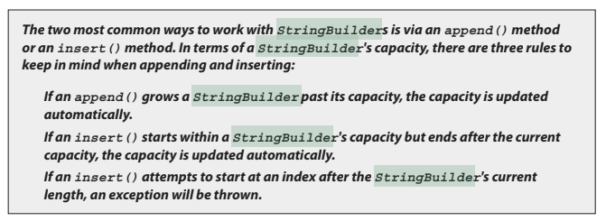

- ## [1 Using String & StringBuilder](#1_Using_String_&_StringBuilder)
- ## [2 Working with Calendar Data](#2_Working_with_Calendar_Data)
- ## [3 Using Arrays](#3_Using_Arrays)
- ## [4 Using ArrayLists & Wrappers](#4_Using_ArrayLists_&_Wrappers)
- ## [5 Advanced Encapsulation](#5_Advanced_Encapsulation)
- ## [6 Using Simple Lambdas](#6_Using_Simple_Lambdas)

This chapter focuses on the exam objectives related to searching, formatting, and parsing strings; creating and using calendar-related objects; creating and using arrays and `ArrayLists`; and using simple lambda expressions.

# <a name="1_Using_String_&_StringBuilder"></a> 1 Using String & StringBuilder

### OCA Objectives

- **9.2 Creating and manipulating Strings.**
- **9.1 Manipulate data using the StringBuilder class and its methods.**

Closely related to the `String` class are the `StringBuilder` class and the almost identical `StringBuffer` class. (For the exam, the only thing you need to know about the StringBuffer class is that it has exactly the same methods as the StringBuilder class, but StringBuilder is faster because its methods aren't synchronized.) Both classes, `StringBuilder` and `StringBuffer`, give you String-like objects and ways to manipulate them, with the important difference being that these objects are mutable.

## The `String` class

This section covers the `String` class, and the key concept for you to understand is that once a `String` object is created, it can never be changed. So, then, what is happening when a `String` object seems to be changing? Let's find out.

#### Strings are immutable objects

We'll start with a little background information about strings. You may not need this for the test, but a little context will help.

Handling "strings" of characters is a fundamental aspect of most programming languages. In Java, each character in a string is a 16-bit _Unicode_ character. Because _Unicode_ characters are 16 bits (not the skimpy 7 or 8 bits that ASCII provides), a rich, international set of characters is easily represented in _Unicode_.

Since strings are objects you can create an instance of a string with the new keyword:

`String s = new String();`

This line of code creates a new object of class `String` and assigns it to the reference variable `s`.
So far, `String` objects seem just like other objects. Now, let's give the string a value:

`s = "abcdef";`

(As you'll find out shortly, these two lines of code aren't quite what they seem, so stay tuned.)
It turns out the `String` class has about a zillion constructors, so you can use a more efficient shortcut:

`String s = new String("abcdef");`

And this is even more concise:

`String s = "abcdef";`

There are some subtle differences between these options that we'll discuss later, but what they have in common is that they all create a new `String` object, with a value of `"abcdef"`, and assign it to a reference variable `s`. Now let's say you want a second reference to the `String` object referred to by `s`:

`String s2 = s; // refer s2 to the same String as s`

So far so good. String objects seem to be behaving just like other objects, so what's all the fuss about? Immutability! (What the heck is immutability?) Once you have assigned a String a value, that value can never change—it's immutable, frozen solid, won't budge, fini, done. (We'll talk about why later; don't let us forget.)

The good news is that although the String object is immutable, its reference variable is not, so to continue with our previous example, consider this:

```java
s = s.concat(" more stuff"); // the concat() method 'appends'
// a literal to the end
```

Now, wait just a minute, didn't we just say that String objects were immutable? So what's all this "appending to the end of the string" talk? Excellent question: let's look at what really happened.

The Java Virtual Machine (JVM) took the value of string `s` (which was `"abcdef"`) and tacked `" more stuff"` onto the end, giving us the value `"abcdef more stuff"`. Since strings are immutable, the JVM couldn't stuff this new value into the old String referenced by `s`, so it created a new `String` object, gave it the value `"abcdef more stuff"`, and made `s` refer to it. At this point in our example, we have two `String` objects: the first one we created, with the value "abcdef", and the second one with the value `"abcdef more stuff"`. Technically there are now three String objects, because the literal argument to concat, `" more stuff"`, is itself a new `String` object. But we have references only to `"abcdef"` (referenced by `s2`) and `"abcdef more stuff"` (referenced by `s`).

What if we didn't have the foresight or luck to create a second reference variable for the `"abcdef"` string before we called `s = s.concat(" more stuff");`? In that case, the original, unchanged string containing `"abcdef"` would still exist in memory, but it would be considered "lost." No code in our program has any way to reference it—it is lost to us. Note, however, that the original `"abcdef"` string didn't change (it can't, remember; it's immutable); only the reference variable `s` was changed so that it would refer to a different string.


Figure 6-1 shows what happens on the heap when you reassign a reference variable. Note that the dashed line indicates a deleted reference.

To review our first example:

```java
String s = "abcdef"; // create a new String object, with value "abcdef", refer s to it
String s2 = s; // create a 2nd reference variable referring to the same String
s = s.concat(" more stuff");
// create a new String object, with value "abcdef more stuff", refer s to it. (Change s's reference from the old String
// to the new String.) (Remember s2 is still referring to the original "abcdef" String.)
```

Let's look at another example:

```java
String x = "Java";
x.concat(" Rules!");
System.out.println("x = " + x); // the output is "x = Java"
```

The first line is straightforward: Create a new `String` object, give it the value `"Java"`, and refer `x` to it. Next the JVM creates a second `String` object with the value `"Java Rules!"` but nothing refers to it. The second `String` object is instantly lost; you can't get to it. The reference variable `x` still refers to the original `String` with the value `"Java"`.

Figure 6-2 shows creating a `String` without assigning a reference to it.


Let's expand this current example. We started with String x = "Java";

```java
x.concat(" Rules!");
System.out.println("x = " + x); // the output is: x = Java
```

Now let's add

```java
x.toUpperCase();
System.out.println("x = " + x); // the output is still:
// x = Java
```

(We actually did just create a new String object with the value "JAVA", but it was lost, and x still refers to the original unchanged string "Java".) How about adding this:

```java
x.replace('a', 'X');
System.out.println("x = " + x); // the output is still: x = Java
```

Can you determine what happened? The JVM created yet another new String object, with the value "JXvX", (replacing the a's with X's), but once again this new String was lost, leaving x to refer to the original unchanged and unchangeable String object, with the value "Java". In all these cases, we called various string methods to create a new String by altering an existing String, but we never assigned the newly created String to a reference variable.

But we can put a small spin on the previous example:

```java
String x = "Java";
x = x.concat(" Rules!"); // assign new string to x
System.out.println("x = " + x); // output: x = Java Rules!
```

This time, when the JVM runs the second line, a new `String` object is created with the value `"Java Rules!"`, and `x` is set to reference it. But wait...there's more—now the original `String` object, "Java", has been lost, and no one is referring to it. So in both examples, we created **two `String` objects and only one reference variable**, so one of the two `String` objects was left out in the cold.

Figure 6-3 shows a graphic depiction of this sad story:


Let's take this example a little further:

```java
String x = "Java";
x = x.concat(" Rules!");
System.out.println("x = " + x); // output: x = Java Rules!

x.toLowerCase(); // no assignment, create a new, abandoned String
System.out.println("x = " + x); // no assignment, the output is still: x = Java Rules!

x = x.toLowerCase(); // create a new String, assigned to x
System.out.println("x = " + x); // the assignment causes the output: x = java rules!
```

The preceding discussion contains the keys to understanding Java string immutability. If you really, really get the examples and diagrams, backward and forward, you should get 80 percent of the `String` questions on the exam correct. We will cover more details about strings next, but make no mistake—in terms of bang for your buck, what we've already covered is by far the most important part of understanding how `String` objects work in Java. We'll finish this section by presenting an example of the kind of devilish `String` question you might expect to see on the exam. Take the time to work it out on paper. (Hint: try to keep track of how many objects and reference variables there are, and which ones refer to which.)

```java
String s1 = "spring ";  // s1 = spring
String s2 = s1 + "summer ";   // s2 = spring summer
s1.concat("fall "); // spring fall (lost)
s2.concat(s1);  // spring summer spring (lost)
s1 += "winter "; // s1 = spring winter
System.out.println(s1 + " " + s2); // spring winter spring summer
```

What is the output? For extra credit, how many String objects and how many reference variables were created prior to the println statement?

Answer: The result of this code fragment is `spring winter spring summer`.

There are two reference variables: `s1` and `s2`. A total of eight `String` objects were created as follows: `"spring "`, `"summer "` (lost), `"spring summer "`, `"fall "` (lost), `"spring fall "` (lost), `"spring summer spring "` (lost), `"winter "` (lost), `"spring winter "` (at this point `"spring "` is lost).

Only two of the eight `String` objects are not lost in this process.

## Important Facts About Strings and Memory

In this section, we'll discuss how Java handles String objects in memory and some of the reasons behind these behaviors.

_One of the key goals of any good programming language is to make efficient use of memory. As an application grows, it's very common for string literals to occupy large amounts of a program's memory, and there is often a lot of redundancy within the universe of `String` literals for a program. To make Java more memory efficient, the JVM sets aside a special area of memory called the **String constant pool**._

> #### When the compiler encounters a `String` literal, it checks the pool to see if an identical `String` already exists. If a match is found, the reference to the new literal is directed to the existing `String`, and no new `String` literal object is created. (The existing `String` simply has an additional reference.)

Now you can start to see why making `String` objects immutable is such a good idea. If several reference variables refer to the same String without even knowing it, it would be very bad if any of them could change the `String`'s value. You might say, "Well that's all well and good, but what if someone overrides the `String` class functionality; couldn't that cause problems in the pool?"

That's one of the main reasons that the **String class is marked final**. Nobody can override the behaviors of any of the `String` methods, so you can rest assured that the `String` objects you are counting on to be immutable will, in fact, be immutable.

## Creating New Strings

Earlier we promised to talk more about the subtle differences between the various methods of creating a `String`. Let's look at a couple of examples of how a `String` might be created, and let's further assume that no other `String` objects exist in the pool.

In this simple case, `"abc"` will go in the pool, and `s` will refer to it:

```java
String s = "abc"; // creates one String object and one reference variable
```

In the next case, because we used the `new` keyword, Java will create a new `String` object in normal (nonpool) memory, and `s` will refer to it. In addition, the literal `"abc"` will be placed in the pool:

```java
String s = new String("abc"); // creates two objects,
// and one reference variable
```

## Important Methods in the String Class

The following methods are some of the more commonly used methods in the `String` class, and they are also the ones you're most likely to encounter on the exam.

- > ### `charAt()` Returns the character located at the specified index
- > ### `concat()` Appends one string to the end of another (+ also works)
- > ### `equalsIgnoreCase()` Determines the equality of two strings, ignoring case
- > ### `length()` Returns the number of characters in a string
- > ### `replace()` Replaces occurrences of a character with a new character
- > ### `substring()` Returns a part of a string
- > ### `toLowerCase()` Returns a string, with uppercase characters converted to lowercase
- > ### `toString()` Returns the value of a string
- > ### `toUpperCase()` Returns a string, with lowercase characters converted to uppercase
- > ### `trim()` Removes whitespace from both ends of a string

Let's look at these methods in more detail.

### `public char charAt(int index)`

This method returns the character located at the String's specified index. Remember, String indexes are zero-based—here's an example:

```java
String x = "airplane";
System.out.println( x.charAt(2) ); // output is 'r'
```

### `public String concat(String s)`

This method returns a string with the value of the String passed in to the method appended to the end of the String used to invoke the method—here's an example:

```java
String x = "taxi";
System.out.println( x.concat(" cab") ); // output is "taxi cab"
```

The overloaded `+` and `+=` operators perform functions similar to the `concat()` method—here's an example:

```java
String x = "library";
System.out.println( x + " card"); // output is "library card"
String x = "Atlantic";
x+= " ocean";
System.out.println( x ); // output is "Atlantic ocean"
```

In the preceding `"Atlantic ocean"` example, notice that the value of `x` really did change! Remember the `+=` operator is an assignment operator, so line 2 is really creating a new string, `"Atlantic ocean"`, and assigning it to the `x` variable. After line 2 executes, **the original string `x` was referring to, `"Atlantic"`, is abandoned**.

### `public boolean equalsIgnoreCase(String s)`

This method returns a `boolean` value (`true` or `false`) depending on whether the value of the `String` in the argument is the same as the value of the `String` used to invoke the method. This method will return true even when characters in the `String` objects being compared have differing cases—here's an example:

```java
String x = "Exit";
System.out.println( x.equalsIgnoreCase("EXIT")); // is "true"
System.out.println( x.equalsIgnoreCase("tixe")); // is "false"
```

### `public int length()`

This method returns the length of the `String` used to invoke the method—here's an example:

```java
String x = "01234567";
System.out.println( x.length() ); // returns "8"
```


> #### Remember that `length` is for arrays and `length()` is for strings.

### `public String replace(char old, char new)`

This method returns a `String` whose value is that of the `String` used to invoke the method, but updated so that any occurrence of the char in the first argument is replaced by the char in the second argument—here's an example:

```java
String x = "oxoxoxox";
System.out.println( x.replace('x', 'X') ); // output is "oXoXoXoX"
```

### `public String substring(int begin)` and

### `public String substring(int begin, int end)`

The `substring()` method is used to return a part (or substring) of the `String` used to invoke the method. The first argument represents the starting location (zero-based) of the substring.

- If the call has only one argument, the substring returned will include the characters at the end of the original String.

- If the call has two arguments, the substring returned will end with the character located in the nth position of the original `String` where `n` is the second argument.

Unfortunately, **the ending argument is not zero-based**, so if the second argument is 7, the last character in the returned `String` will be in the original String's 7 position, which is index 6 (ouch).

Let's look at some examples:

```java
String x = "0123456789"; // as if by magic, the value of each char is the same as its index!
System.out.println( x.substring(5) ); // output is "56789"
System.out.println( x.substring(5, 8)); // output is "567"
```

> #### The first example should be easy: start at index 5 and return the rest of the String.

> #### The second example should be read as follows: start at index 5 and return the characters up to and including the 8th position _(index 7)_.

### `public String toLowerCase()`

Converts all characters of a `String` to lowercase—here's an example:

```java
String x = "A New Moon";
System.out.println( x.toLowerCase() ); // output is "a new moon"
```

### `public String toString()`

This method returns the value of the `String` used to invoke the method. What? Why would you need such a seemingly "do nothing" method?

All objects in Java must have a `toString()` method, which typically returns a `String` that in some meaningful way describes the object in question.

In the case of a `String` object, what's a more meaningful way than the String's value? For the sake of consistency, here's an example:

```java
String x = "big surprise";
System.out.println( x.toString() ); // output? [reader's exercise :-) ]
```

### public String toUpperCase()

Converts all characters of a String to uppercase—here's an example:

```java
String x = "A New Moon";
System.out.println( x.toUpperCase() ); // output is "A NEW MOON"
```

### public String trim()

This method returns a `String` whose value is the `String` used to invoke the method, but with any leading or trailing whitespace removed—here's an example:

```java
String x = " hi ";
System.out.println( x + "t" ); // output is " hi t"
System.out.println( x.trim() + "t"); // output is "hit"
```

## The StringBuilder Class

The `java.lang.StringBuilder` class should be used when you have to make a lot of modifications to strings of characters.

_As discussed in the previous section, **`String` objects are immutable, so if you choose to do a lot of manipulations with `String` objects, you will end up with a lot of abandoned `String` objects** in the `String` pool. (Even in these days of gigabytes of RAM, it's not a good idea to waste precious memory on discarded `String` pool objects.)_

> ### On the other hand, objects of type `StringBuilder` can be modified over and over again without leaving behind a great effluence of discarded `String` objects.

On the job:

A common use for `StringBuilders` is file I/O when large, ever-changing streams of input are being handled by the program. In these cases, large blocks of characters are handled as units, and `StringBuilder` objects are the ideal way to handle a block of data, pass it on, and then reuse the same memory to handle the next block of data.

### Prefer StringBuilder to StringBuffer

The `StringBuilder` class was added in Java 5. It has exactly the same API as the `StringBuffer` class, except `StringBuilder` is not thread-safe. In other words, its methods are not synchronized. Oracle recommends that you use `StringBuilder` instead of `StringBuffer` whenever possible, because `StringBuilder` will run faster (and perhaps jump higher).

> ### So apart from `StringBuilders` methods not being synchronized and therefore being faster, anything we say about `StringBuilder`'s methods holds true for StringBuffer's methods, and vice versa.

That said, for the OCA 8 exam, `StringBuffer` is not tested.

### Using StringBuilder (and This Is the Last Time We'll Say This: StringBuffer)

In the previous section, you saw how the exam might test your understanding of `String` immutability with code fragments like this:

```java
String x = "abc";
x.concat("def");
System.out.println("x = " + x); // output is "x = abc"
```

Because no new assignment was made, the new `String` object created with the `concat()` method was abandoned instantly. You also saw examples like this:

```java String x = "abc";
x = x.concat("def");
System.out.println("x = " + x); // output is "x = abcdef"
```

---

#### Introducting StringBuilder

We got a nice new `String` out of the deal, but the downside is that the old `String` `"abc"` has been lost in the `String` pool, thus wasting memory. If we were using a `StringBuilder` instead of a `String`, the code would look like this:

```java
StringBuilder sb = new StringBuilder("abc");
sb.append("def");
System.out.println("sb = " + sb); // output is "sb = abcdef"
```

All of the `StringBuilder` methods we will discuss operate on the value of the `StringBuilder` object invoking the method. So a call to `sb.append("def");` is actually appending `"def"` to itself (`StringBuilder sb`). In fact, these method calls can be chained to each other—here's an example:

```java
StringBuilder sb = new StringBuilder("abc");
sb.append("def").reverse().insert(3, "---");
System.out.println( sb ); // output is "fed---cba"
```

Notice that in each of the previous two examples, there was a single call to new, so in each example we weren't creating any extra objects. Each example needed only a single StringBuilder object to execute.




### Important Methods in the StringBuilder Class

The `StringBuilder` class has a zillion methods. Following are the methods you're most likely to use in the real world and, happily, the ones you're most likely to find on the exam.

### public StringBuilder append(String s)

As you've seen earlier, this method will update the value of the object that invoked the method, **whether or not the returned value is assigned to a variable**. Versions of this heavily overloaded method will take many different arguments, including boolean, char, double, float, int, long, and others, but the one most likely used on the exam will be a `String` argument—for example,

```java
StringBuilder sb = new StringBuilder("set ");
sb.append("point");
System.out.println(sb); // output is "set point"
StringBuilder sb2 = new StringBuilder("pi = ");
sb2.append(3.14159f);
System.out.println(sb2); // output is "pi = 3.14159"
```

### public StringBuilder delete(int start, int end)

This method modifies the value of the `StringBuilder` object used to invoke it. The starting index of the substring to be removed is defined by the first argument (which is zero-based), and the ending index of the substring to be removed is defined by the second argument (but it is one-based)!

Study the following example carefully:

```java
StringBuilder sb = new StringBuilder("0123456789");
System.out.println(sb.delete(4,6)); // output is "01236789" -> ("45" was deleted)
```


### public StringBuilder insert(int offset, String s)

This method updates the value of the `StringBuilder` object that invoked the method call. The `String` passed in to the second argument is inserted into the `StringBuilder` starting at the offset location represented by the first argument (the offset is zero-based). Again, other types of data can be passed in through the second argument (`boolean`, `char`, `double`, `float`, `int`, `long`, and so on), but the `String` argument is the one you're most likely to see:

```java
StringBuilder sb = new StringBuilder("01234567");
sb.insert(4, "---");
System.out.println( sb ); // output is "0123---4567"
```

### public StringBuilder reverse()

This method updates the value of the `StringBuilder` object that invoked the method call. When invoked, the characters in the `StringBuilder` are **reversed** - **_the first character becoming the last, the second becoming the second to the last_**, and so on:

```java
StringBuilder sb = new StringBuilder("A man a plan a canal Panama");
sb.reverse();
System.out.println(sb); // output: "amanaP lanac a nalp a nam A"
```

### public String toString()

This method returns the value of the StringBuilder object that invoked the method call as a String:

```java
StringBuilder sb = new StringBuilder("test string");
System.out.println( sb.toString() ); // output is "test string"
```

That's it for `StringBuilders`.

> ### If you take only one thing away from this section, it's that unlike `String` objects, `StringBuilder` objects can be changed.

Method chaining on `String`:


---

# <a name="2_Working_with_Calendar_Data"></a> 2 Working with Calendar Data

### OCA Objectives

**9.3 Create and manipulate calendar data using the following classes: `java.time.LocalDateTime`, `java.time.LocalDate`, `java.time.LocalTime`, `java.time.format.DateTimeFormatter`, `java.time.Period`**

Java 8 introduced a large collection (argh) of new packages related to working with calendars, dates, and times. The OCA 8 creators chose to include knowledge of a subset of these packages and classes as an exam objective. If you understand the classes included in the exam objective, you'll have a good introduction to the entire calendar/date/time topic.

As we work through this section, we'll use the phrase "calendar object," which we use to refer to objects of one of the several types of calendar-related classes we're covering. So "calendar object" is a made-up umbrella term.

Here's a summary of the five calendar-related classes we'll study, plus an interface that looms large:

■ java.time.LocalDateTime This class is used to create immutable
objects, each of which represents a specific date and time. Additionally,
this class provides methods that can manipulate the values of the date/
time objects created and assign them to new immutable objects.
LocalDateTime objects contain BOTH information about days, months,
and years, AND about hours, minutes, seconds, and fractions of seconds.

■ java.time.LocalDate This class is used to create immutable objects,
each of which represents a specific date. Additionally, this class provides
methods that can manipulate the values of the date objects created and
assign them to new immutable objects. LocalDate objects are accurate
only to days. Hours, minutes, and seconds are not part of a LocalDate
object.

■ java.time.LocalTime This class is used to create immutable objects,
each of which represents a specific time. Additionally, this class provides
methods that can manipulate the values of the time objects created and
assign them to new immutable objects. LocalTime objects refer only to
hours, minutes, seconds, and fractions of seconds. Days, months, and years
are not a part of LocalTime objects.

# <a name="3_Using_Arrays"></a> 3 Using Arrays

# <a name="4_Using_ArrayLists_&_Wrappers"></a> 4 Using ArrayLists & Wrappers

# <a name="5_Advanced_Encapsulation"></a> 5 Advanced Encapsulation

# <a name="6_Using_Simple_Lambdas"></a> 6 Using Simple Lambdas
