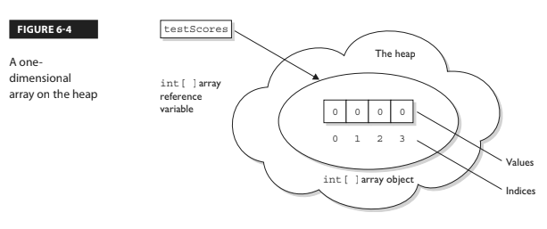
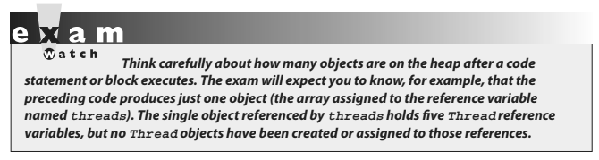
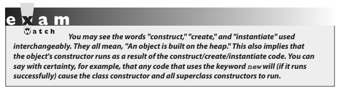
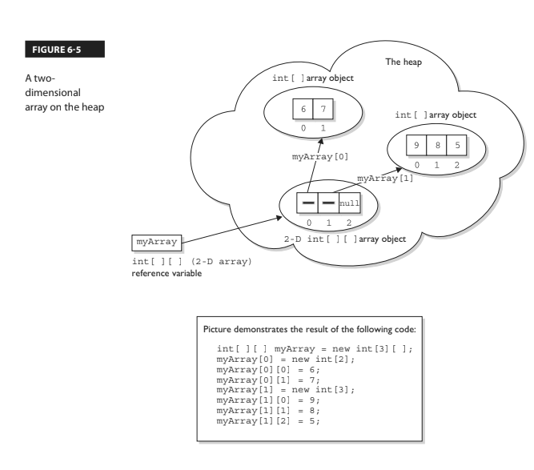
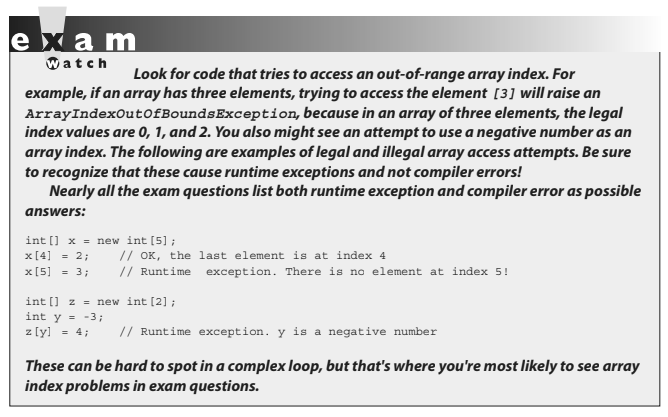
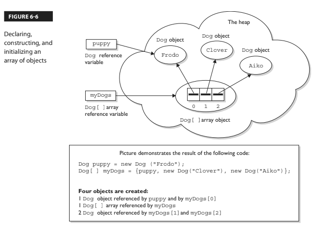
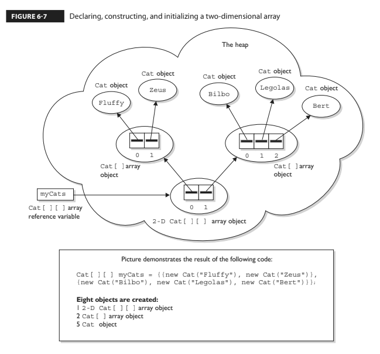
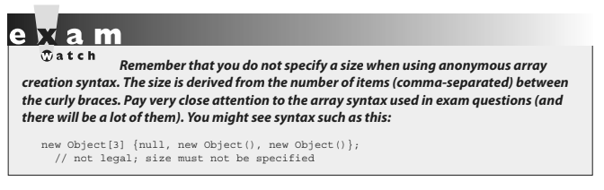
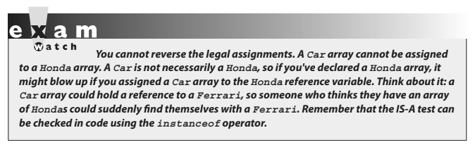
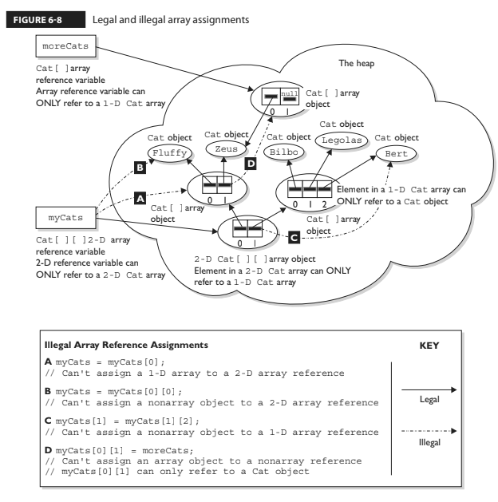

- ## [3 Using Arrays](#3_Using_Arrays)
- ## [4 Using ArrayLists & Wrappers](#4_Using_ArrayLists_&_Wrappers)
- ## [5 Advanced Encapsulation](#5_Advanced_Encapsulation)
- ## [6 Using Simple Lambdas](#6_Using_Simple_Lambdas)

# <a name="3_Using_Arrays"></a> 3 Using Arrays

### OCA Objectives

**4.1 Declare, instantiate, initialize, and use a one-dimensional array.**
**4.2 Declare, instantiate, initialize, and use a multi-dimensional array.**

Arrays are objects in Java that store multiple variables of the same type. Arrays can hold either primitives or object references, but the array itself will always be an object on the heap, even if the array is declared to hold primitive elements. In other words, there is no such thing as a primitive array, but you can make an array of primitives.

For this objective, you need to know three things:

- How to make an array reference variable (declare)
- How to make an array object (construct)
- How to populate the array with elements (initialize)

There are several different ways to do each of these, and you need to know about all of them for the exam.

#### On the job:

Arrays are efficient, but most of the time you'll want to use one of the `Collection` types from `java.util`:

- `HashMap`
- `ArrayList`
- `TreeSet`

Collection classes offer more flexible ways to access an object (for insertion, deletion, and so on), and unlike arrays, they can expand or contract dynamically as you add or remove elements (they're really managed arrays, since they use arrays behind the scenes). There's a Collection type for a wide range of needs. Do you need a fast sort? A group of objects with no duplicates? A way to access a name/value pair? A linked list? The OCP 8 exam covers collections in more detail.

## Declaring an Array

Arrays are declared by stating the type of element the array will hold, which can be an object or a primitive, followed by square brackets to the left or right of the identifier.

#### Declaring an array of primitives

```java
Declaring an array of primitives:
int[] key; // brackets before name (recommended)
int key []; // brackets after name (legal but less readable); spaces between the name and [] legal, but bad
```

#### Declaring an array of object references

```java
Thread[] threads; // Recommended
Thread threads[]; // Legal but less readable
```

When declaring an array reference, you should always put the array brackets immediately after the declared type rather than after the identifier (variable name). That way, anyone reading the code can easily tell that, for example, `key` is a reference to an int array object and not an int primitive.

We can also declare multidimensional arrays, which are, in fact, arrays of arrays. This can be done in the following manner:

```java
String[][][] occupantName; // recommended
String[] managerName []; // yucky, but legal
```

_The first example is a three-dimensional array (an array of arrays of arrays) and the second is a two-dimensional array. Notice in the second example we have one square bracket before the variable name and one after. This is perfectly legal to the compiler, proving once again that just because it's legal doesn't mean it's right. It is never legal to include the size of the array in your declaration._

Yes, we know you can do that in some other languages, which is why you might see a question or two in the exam that include code similar to the following:

```java
int[5] scores; // will NOT compile
```

> #### The preceding code won't make it past the compiler. It is never legal to include the size of the array in your declaration. Remember, the JVM doesn't allocate space until you actually instantiate the array object. That's when size matters.

## Constructing an Array

Constructing an array means creating the array object on the heap (where all objects live) — that is, doing a new on the array type. To create an array object, Java must know how much space to allocate on the heap, so you must specify the size of the array at creation time. The size of the array is the number of elements the array will hold.

### Constructing One-Dimensional Arrays

The most straightforward way to construct an array is to **use the keyword `new` followed by the array type, with a bracket specifying how many elements of that type the array will hold**. The following is an example of constructing an array of type int:

```java
int[] testScores; // Declares the array of ints
testScores = new int[4]; // constructs an array and assigns it to the testScores variable
```

The preceding code puts one new object on the heap — an array object holding four elements — with each element containing an int with a default value of 0.

Think of this code as saying to the compiler, "Create an array object that will hold four ints, and assign it to the reference variable named testScores. Also, go ahead and set each int element to zero."

Figure 6-4 shows the testScores array on the heap, after construction.



You can also declare and construct an array in one statement, as follows:

int[] testScores = new int[4];

This single statement produces the same result as the two previous statements.
Arrays of object types can be constructed in the same way:

```java
Thread[] threads = new Thread[5]; // no Thread objects created!
// one Thread array created
```

Remember that, despite how the code appears, the `Thread` constructor is not being invoked. We're not creating a `Thread` instance, but rather a single `Thread` array object. After the preceding statement, there are still no actual `Thread` objects!



Remember, arrays must always be given a size at the time they are constructed. The JVM needs the size to allocate the appropriate space on the heap for the new array object. It is never legal, for example, to do the following:

```java
int[] carList = new int[]; // Will not compile; needs a size
```

So don't do it, and if you see it on the test, run screaming toward the nearest answer marked "Compilation fails."



In addition to being constructed with new, arrays can be created using a kind of syntax shorthand that creates the array while simultaneously initializing the array elements to values supplied in code (as opposed to default values). We'll look at that in the next section. For now, understand that because of these syntax shortcuts, objects can still be created even without you ever using or seeing the keyword new.

### Constructing Multidimensional Arrays

Multidimensional arrays, remember, are simply arrays of arrays. So a two- dimensional array of type int is really an object of type int array (int []), with each element in that array holding a reference to another int array. The second dimension holds the actual int primitives.

The following code declares and constructs a two-dimensional array of type int:

```java
int[][] myArray = new int[3][];
```

Notice that only the first brackets are given a size. That's acceptable in Java because the JVM needs to know only the size of the object assigned to the variable myArray.

Figure 6-5 shows how a two-dimensional int array works on the heap.



### Initializing an Array

Initializing an array means putting things into it. The "things" in the array are the array's elements, and they're either primitive values (2, x, false, and so on) or objects referred to by the reference variables in the array. If you have an array of objects (as opposed to primitives), the array doesn't actually hold the objects — just as any other nonprimitive variable never actually holds the object — but instead holds a reference to the object.

But we talk about arrays as, for example, "an array of five strings," even though what we really mean is "an array of five references to String objects." Then the big question becomes whether those references are actually pointing (oops, this is Java, we mean referring) to real String objects or are simply null. Remember, a reference that has not had an object assigned to it is a null reference. And if you actually try to use that null reference by, say, applying the dot operator to invoke a method on it, you'll get the infamous NullPointerException.

The individual elements in the array can be accessed with an index number. The index number always begins with zero (0), so for an array of ten objects, the index numbers will run from 0 through 9.

Suppose we create an array of three Animals as follows:

```java
Animal [] pets = new Animal[3];
```

We have one array object on the heap, with three null references of type `Animal`, but we don't have any `Animal` objects. The next step is to create some `Animal` objects and assign them to index positions in the array referenced by pets:

```java
pets[0] = new Animal();
pets[1] = new Animal();
pets[2] = new Animal();
```

This code puts three new Animal objects on the heap and assigns them to the three index positions (elements) in the pets array.



> ### Remember that accessing an element at an index number which does not exist will result in a runtime exception and not an error!

A two-dimensional array (an array of arrays) can be initialized as follows:

```java
int[][] scores = new int[3][];
// Declare and create an array (scores) holding three references to int arrays
scores[0] = new int[4];
// the first element in the scores array is an int array of four int elements
scores[1] = new int[6];
// the second element is an int array of six int elements
scores[2] = new int[1];
// the third element is an int array of one int element
```

### Initializing Elements in a Loop

Array objects have a single public variable, length, that gives you the number of elements in the array. The last index value, then, is always one less than the length. For example, if the length of an array is 4, the index values are from 0 through 3. Often, you'll see array elements initialized in a loop, as follows:

```java
Dog[] myDogs = new Dog[6]; // creates an array of 6 Dog references
for(int x = 0; x < myDogs.length; x++) {
myDogs[x] = new Dog(); // assign a new Dog to index position x
}
```

The length variable tells us how many elements the array holds, but it does not tell us whether those elements have been initialized.

### Declaring, Constructing, and Initializing on One Line

You can use two different array-specific syntax shortcuts both to initialize (put explicit values into an array's elements) and construct (instantiate the array object itself) in a single statement. The first is used to declare, create, and initialize in one statement, as follows:

```java
1. int x = 9;
2. int[] dots = {6,x,8};
```

Line 2 in the preceding code does four things:

- Declares an int array reference variable named dots.
- Creates an int array with a length of three (three elements).
- Populates the array's elements with the values 6, 9, and 8.
- Assigns the new array object to the reference variable dots.

The size (length of the array) is determined by the number of comma-separated items between the curly braces. The code is functionally equivalent to the following longer code:

```java
int[] dots;
dots = new int[3];
int x = 9;
dots[0] = 6;
dots[1] = x;
dots[2] = 8;
```

This begs the question, "Why would anyone use the longer way?" One reason comes to mind. You might not know, at the time you create the array, the values that will be assigned to the array's elements.

With object references rather than primitives, it works exactly the same way:

```java
Dog puppy = new Dog("Frodo");
Dog[] myDogs = {puppy, new Dog("Clover"), new Dog("Aiko")};
```

The preceding code creates one `Dog` array, referenced by the variable `myDogs`, with a length of three elements. It assigns a previously created `Dog` object (assigned to the reference variable `puppy`) to the first element in the array. It also creates two new `Dog` objects (`Clover` and `Aiko`) and adds them to the last two Dog reference variable elements in the `myDogs` array. This array shortcut alone (combined with the stimulating prose) is worth the price of this book.

Figure 6-6 shows the result.



You can also use the shortcut syntax with multidimensional arrays, as follows: `int[][] scores = {{5,2,4,7}, {9,2}, {3,4}};`

This code creates a total of four objects on the heap.

- First, an array of int arrays is constructed (the object that will be assigned to the scores reference variable).

The scores array has a length of three, derived from the number of comma-separated items between the outer curly braces. Each of the three elements in the scores array is a reference variable to an int array, so the three int arrays are constructed and assigned to the three elements in the scores array.

The size of each of the three int arrays is derived from the number of items within the corresponding inner curly braces. For example, the first array has a length of four, the second array has a length of two, and the third array has a length of two.

So far, we have four objects:

- one array of int arrays (each element is a reference to an int array), and
- three int arrays (each element in the three int arrays is an int value).

Finally, the three int arrays are initialized with the actual int values within the inner curly braces. Thus, the first int array contains the values 5,2,4,7.

The following code shows the values of some of the elements in this two-dimensional array:

```java
scores[0] // an array of 4 ints
scores[1] // an array of 2 ints
scores[2] // an array of 2 ints
scores[0][1] // the int value 2
scores[2][1] // the int value 4
```

Figure 6-7 shows the result of declaring, constructing, and initializing a two-dimensional array in one statement.



### Constructing & Initializing an Anonymous Array

The second shortcut is called "anonymous array creation" and can be used to construct and initialize an array and then assign the array to a previously declared array reference variable:

```java
int[] testScores;
testScores = new int[] {4,7,2};
```

The preceding code creates a new int array with three elements; initializes the three elements with the values `4`, `7`, and `2`; and then assigns the new array to the previously declared `int` array reference variable `testScores`.

We call this anonymous array creation because with this syntax, you don't even need to assign the new array to anything. Maybe you're wondering, "What good is an array if you don't assign it to a reference variable?" You can use it to create a just-in-time array to use, for example, as an argument to a method that takes an array parameter.

The following code demonstrates a just-in-time array argument:

```java
public class JIT {
void takesAnArray(int[] someArray) { // use the array
  public static void main (String [] args) {
    JIT j = new JIT();
    j.takesAnArray(new int[] {7,7,8,2,5}); // pass an array
  }
}
```



### Legal Array Element Assignments

What can you put in a particular array?

> ### For the exam, you need to know that arrays can have only one declared type (`int[]`, `Dog[]`, `String[]`, and so on), but that doesn't necessarily mean that only objects or primitives of the declared type can be assigned to the array elements.

And what about the array reference itself? What kind of array object can be assigned to a particular array reference? For the exam, you'll need to know the answers to all of these questions. And, as if by magic, we're actually covering those very same topics in the following sections. Pay attention.

Arrays of Primitives

Primitive arrays can accept any value that can be promoted implicitly to the declared type of the array. For example, an int array can hold any value that can fit into a 32-bit int variable.

Thus, the following code is legal:

```java
int[] weightList = new int[5];
byte b = 4;
char c = 'c';
short s = 7;
weightList[0] = b; // OK, byte is smaller than int
weightList[1] = c; // OK, char is smaller than int
weightList[2] = s; // OK, short is smaller than int
```

#### Arrays of Object References

> ### If the declared array type is a class, you can put objects of any subclass of the declared type into the array.

For example, if Subaru is a subclass of Car, you can put both Subaru objects and Car objects into an array of type Car as follows:

```java
class Car {}
class Subaru extends Car {}
class Ferrari extends Car {}
...
Car [] myCars = {new Subaru(), new Car(), new Ferrari()};
```

It helps to remember that the elements in a `Car` array are nothing more than `Car` reference variables. So anything that can be assigned to a `Car` reference variable can be legally assigned to a `Car` array element.

> ### If the array is declared as an interface type, the array elements can refer to any instance of any class that implements the declared interface.

The following code demonstrates the use of an interface as an array type:

```java
interface Sporty {
  void beSporty();
}

class Ferrari extends Car implements Sporty {
  public void beSporty() {
    // implement cool sporty method in a Ferrari-specific way
  }
}

class RacingFlats extends AthleticShoe implements Sporty {
  public void beSporty() {
    // implement cool sporty method in a RacingFlat-specific way
  }
}

class GolfClub { }

class TestSportyThings {
  public static void main (String [] args) {
    Sporty[] sportyThings = new Sporty [3];
    sportyThings[0] = new Ferrari(); // OK, Ferrari implements Sporty
    sportyThings[1] = new RacingFlats(); // OK, RacingFlats implements Sporty
    sportyThings[2] = new GolfClub(); // NOT ok..
    // Not OK; GolfClub does not implement Sporty
    // I don't care what anyone says
  }
}
```

The bottom line is this: any object that passes the IS-A test for the declared array type can be assigned to an element of that array.

#### Array Reference Assignments for One-Dimensional Arrays

> #### For the exam, you need to recognize legal and illegal assignments for array reference variables. We're not talking about references in the array (in other words, array elements), but rather references to the array object.

For example, if you declare an `int` array, the reference variable you declared can be reassigned to any `int` array (of any size), but the variable cannot be reassigned to anything that is not an `int` array, including an `int` value. Remember, all arrays are objects, so an `int` array reference cannot refer to an `int` primitive.

The following code demonstrates legal and illegal assignments for primitive arrays:

```java
int[] splats;
int[] dats = new int[4];
char[] letters = new char[5];
splats = dats; // OK, dats refers to an int array
splats = letters; // NOT OK, letters refers to a char array
```

It's tempting to assume that because a variable of type byte, short, or char can be explicitly promoted and assigned to an int, an array of any of those types could be assigned to an int array. You can't do that in Java, but it would be just like those cruel, heartless (but otherwise attractive) exam developers to put tricky array assignment questions in the exam.

Arrays that hold object references, as opposed to primitives, aren't as restrictive. Just as you can put a Honda object in a Car array (because Honda extends Car), you can assign an array of type Honda to a Car array reference variable as follows:

```java
Car[] cars;
Honda[] cuteCars = new Honda[5];
cars = cuteCars; // OK because Honda is a type of Car
Beer[] beers = new Beer [99];
cars = beers; // NOT OK, Beer is not a type of Car
```

> ### Apply the IS-A test to help sort the legal from the illegal.

`Honda` IS-A `Car`, so a `Honda` array can be assigned to a `Car` array. `Beer` IS-A `Car` is not true; `Beer` does not extend `Car` (plus it doesn't make sense, unless you've already had too much of it). The rules for array assignment apply to interfaces as well as classes. An array declared as an interface type can reference an array of any type that implements the interface.

> ### Remember, any object from a class implementing a particular interface will pass the IS-A (`instanceof`) test for that interface.

For example, if `Box` implements `Foldable`, the following is legal:

```java
Foldable[] foldingThings;
Box[] boxThings = new Box[3];
foldingThings = boxThings;
// OK, Box implements Foldable, so Box IS-A Foldable
```



> ### Remember that the IS-A test can be checked in code using the `instanceof` operator.

### Array Reference Assignments for Multidimensional Arrays

> ### When you assign an array to a previously declared array reference, the array you're assigning must be in the same dimension as the reference you're assigning it to.

For example, a two-dimensional array of int arrays cannot be assigned to a regular int array reference, as follows:

```java
int[] blots;

int[][] squeegees = new int[3][];
blots = squeegees; // NOT OK, squeegees is a two-d array of int arrays

int[] blocks = new int[6];
blots = blocks; // OK, blocks is an int array
```

Pay particular attention to array assignments using different dimensions. You might, for example, be asked if it's legal to assign an int array to the first element in an array of int arrays, as follows:

```java
int[][] books = new int[3][];
int[] numbers = new int[6];
int aNumber = 7;
books[0] = aNumber; // NO, expecting an int array not an int
books[0] = numbers; // OK, numbers is an int array
```

Figure 6-8 shows an example of legal and illegal assignments for references to an array.



# <a name="4_Using_ArrayLists_&_Wrappers"></a> 4 Using ArrayLists & Wrappers

### OCA Objectives

**9.3 Declare and use an ArrayList of a given type.**
**2.5 Develop code that uses wrapper classes such as Boolean, Double, and Integer**.

Data structures are a part of almost every application you'll ever work on.

The Java API provides an extensive range of classes that support common data structures such as Lists, Sets, Maps, and Queues. For the purpose of the OCA exam, you should remember that the classes that support these common data structures are a part of what is known as "The Collection API" (one of its many aliases). (The OCP exam covers the most common implementations of all these structures.)

### When to Use ArrayLists

We've already talked about arrays. Arrays seem useful and pretty darned flexible. So why do we need more functionality than arrays provide? Consider these two situations:

- You need to be able to increase and decrease the size of your list of things.
- The order of things in your list is important and might change.

Both situations can be handled with arrays, but it's not easy.... Suppose you want to plan a vacation to Europe. You have several destinations in mind (Paris, Oslo, Rome), but you're not yet sure in what order you want to visit these cities, and as your planning progresses, you might want to add or subtract cities from your list. Let's say your first idea is to travel from north to south, so your list looks like this:

Oslo, Paris, Rome.

If we were using an array, we could start with this:

`String[] cities = {"Oslo", "Paris", "Rome"};`

# <a name="5_Advanced_Encapsulation"></a> 5 Advanced Encapsulation

# <a name="6_Using_Simple_Lambdas"></a> 6 Using Simple Lambdas
