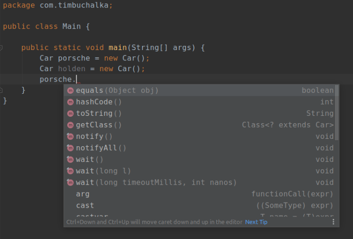
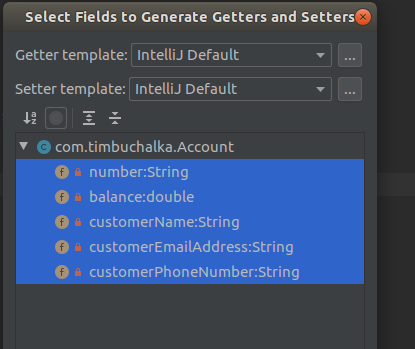

# SECTION 6 CLASSES, CONSTRUCTORS & INHERITANCE PART 1

- ### [1 Classes](#1_classes)
- ### [2 Constructors](#2_contructors)
- ### [3 Inheritance](#3_inheritance)

# <a name="1_classes"></a> 1 Classes

Classes are templates or blueprints for creating objects.  Software objects store their state in fields (variables) and expose their behavior with methods.  

Here we declare a car class: 
**Car.java**
```java
package com.warwick;

public class Car {
    private int doors;
    private int wheels;
    private String model;
    private String engine;
    private String colour;
}
```
We create two car objects in the main method.  Objects are initialised with the *new* keyword.     
**Main.java**
```java
package com.warwick;

public class Main {

    public static void main(String[] args) {
	    Car porsche = new Car();
        Car holden = new Car();
        porsche.model = "Carrera"; // Compiler error due to model being a private field
    }
}
```
You will notice that if you type 'porsche.' intellij brings up methods that are accessible from this object.  They are created automatically by Java when we create a new object.



___ 
## *Classes continued*
___

Its best practice to keep variables private and to use setters and getters which are defined in the class to access their values.  This ensures that data is validated and set correctly.  Notice how we can use conditional logic in the setter.

**Car.java**
```java
package com.warwick;

public class Car {

    private int doors;
    private int wheels;
    private String model;
    private String engine;
    private String colour;

    public void setModel(String model) {
        String validModel = model.toLowerCase();
        //setModel setter limits the model type to carrera or commodore
        if(validModel.equals("carrera") || validModel.equals("commodore")) {
            this.model = model;
        } else {
            this.model = "Unknown";
        }
    }

    public String getModel() {
        return this.model;
    }
}
```
**Main.java**
```java
package com.warwick;

public class Main {

    public static void main(String[] args) {
	    Car porsche = new Car();
        Car holden = new Car();
        porsche.setModel("911");

        System.out.println("Model is " + porsche.getModel()); 
        // Since it is not carrera or commodore
        // Output: Model is Unknown 
    }
}
```
___ 
## *Another class example*
___

> ### Intellij has a trick to quickly create getters and setters.  Click on *code -> generate* and choose desired fields to target.  There is also a hotkey.



The class below also has two methods.  One for setting a balance and another for withdrawal which checks if it is possible to make a withdrawal before doing so.

**Account.java**
```java
package com.warwick;

public class Account {

    private String number;
    private double balance;
    private String customerName;
    private String customerEmailAddress;
    private String customerPhoneNumber;


    public String getNumber() {
        return number;
    }

    public void setNumber(String number) {
        this.number = number;
    }

    public double getBalance() {
        return balance;
    }

    public void setBalance(double balance) {
        this.balance = balance;
    }

    public String getCustomerName() {
        return customerName;
    }

    public void setCustomerName(String customerName) {
        this.customerName = customerName;
    }

    public String getCustomerEmailAddress() {
        return customerEmailAddress;
    }

    public void setCustomerEmailAddress(String customerEmailAddress) {
        this.customerEmailAddress = customerEmailAddress;
    }

    public String getCustomerPhoneNumber() {
        return customerPhoneNumber;
    }

    public void setCustomerPhoneNumber(String customerPhoneNumber) {
        this.customerPhoneNumber = customerPhoneNumber;
    }

    public void deposit(double depositAmount) {
        this.balance += depositAmount;
        System.out.println("Deposit of " + depositAmount + " made. New balance is " + this.balance);
    }

    public void withdrawal(double withdrawalAmount) {
        
        if (this.balance - withdrawalAmount < 0) {
            System.out.println("Only " + this.balance + " available. Withdrawal not processed");
         } else {
            this.balance -= withdrawalAmount;
            System.out.println("Withdrawal of " + withdrawalAmount + " processed, Remaining balance = " + thisbalance);
        }
    }
}
```
**Main.java**
```java
package com.warwick;

public class Main {
    public static void main(String[] args) {
        
        Account bobsAccount = new Account();

        bobsAccount.setNumber("12345");
        bobsAccount.setBalance(0.00);
        bobsAccount.setCustomerName("Bob Brown");
        bobsAccount.setCustomerEmailAddress("bob@gmail.com");
        bobsAccount.setCustomerPhoneNumber("082 505 8736");

        bobsAccount.withdrawal(100.0);

        bobsAccount.deposit(50.0);
        bobsAccount.withdrawal(100.0);

        bobsAccount.deposit(51.0);
        bobsAccount.withdrawal(100.0);

        //Output: Only 0.0 available. Withdrawal not processed
        //Deposit of 50.0 made. New balance is 50.0
        //Only 50 available.  Withdrawal not processed
        //Deposit of 51.0 made. New balance is 101.0
        //Withdrawal of 100.0 processed. Remaining balance = 1.0
    }
}
```
Instead of initialising everything using getters and setters there is another way we can do this when we are creating an object for the first time using a class.  This is by using constructors to set the initial values.

# <a name="2_constructors"></a> 2 Constructors

- ### Whenever we are initialising a class with the new keyword, the constructor will be executed to create the object for us  
- ### Constructors can be created with or without parameters and you can have more than one constructor is a class  
- ### Constructors' name must be the same as the classes name and it has no return type 
- ### Constructors can be overloaded so there can be more than one constructor
- ### Constructors with no parameters can pass default values to the constructor with parameters given it uses the this keyword on the first line of the constructor body

Lets add constructors to the Account class:
Notice how the constructor without any paramters uses the '*this*' keyword to pass default paramters which are then assigned in the second constructor.  

**Account.java**
```java
package com.timbuchalka;

public class Account {
    private String number;
    private double balance;
    private String customerName;
    private String customerEmailAddress;
    private String customerPhoneNumber;

    public Account() {
        this("56789", 2.50, "default name", "default address", "default phone");
        System.out.println("Empty constructor called");
    }

    public Account(String number, double balance, String customerName, String customerEmailAddress,
                   String customerPhoneNumber) {
        System.out.println("Account constructor with parameters called");
        this.number = number;
        this.balance = balance;
        this.customerName = customerName;
        this.customerEmailAddress = customerEmailAddress;
        this.customerPhoneNumber = customerPhoneNumber;
    }

    // METHODS GO HERE
    
    // GETTERS AND SETTERS GO HERE
}
```
**Main.java**
```java
package com.timbuchalka;

public class Main {

    public static void main(String[] args) {

        Account bobsAccount = new Account();
        // Parameterless constructor called &
        // Default values specified are passed on to the second constructor as a result of the 'this' keyword
        
        //Outputs: 
        // Account constructor with parameters called // This line is outputted first because the 'this' keyword called the second constructor 
        // Empty constructor called 

        //Respective getter and setter values will be: "56789", 2.5, "default name", "default address", "default phone"
    }
}
```
___ 
## *Constructors continued*
___

As a general rule of thumb when working with constructors it is better to use the *this* keyword for assigning values to instance variables.  This is the point where the object is being created and it is less error-prone approach. 

> ### Intellij has a trick to quickly create constructors.  Click on *code -> generate* and choose desired fields to target.

- ## It is not uncommon to have multiple constructors but there will always be a main constructor which assigns all the classes' instance variables values. 

- ### Other constructors may have zero parameters or only a few parameters.  Zero parameters will set all the default parameter values using the this keyword whereas constructors with a few parameters will pass the respective default and parameter values to the this keyword.   

See VipPerson class below which has **3** constructors: 

**VipPerson.java**
```java
package com.timbuchalka;

public class VipPerson {
    private String name;
    private double creditLimit;
    private String emailAddress;

    public VipPerson() {
        this("Default name", 50000.00, "default@email.com");
    }
    public VipPerson(String name, double creditLimit) {
        this(name, creditLimit, "unknown@email.com");
    }

    public VipPerson(String name, double creditLimit, String emailAddress) {
        this.name = name;
        this.creditLimit = creditLimit;
        this.emailAddress = emailAddress;
    }

    public String getName() {
        return name;
    }

    public double getCreditLimit() {
        return creditLimit;
    }

    public String getEmailAddress() {
        return emailAddress;
    }
}
```
**Main.java**
```java
package com.warwick;

public class Main {

    public static void main(String[] args) {
        // Purely default contructor
        VipPerson person1 = new VipPerson();
        System.out.println(person1.getName());

        // 2 Parameter constructor
        VipPerson person2 = new VipPerson("Bob", 25000.00);
        System.out.println(person2.getName());
        System.out.println(person2.getEmailAddress());
        // Email address here outputs: unknown@email.com since it is the default for the 2 parameter constructor

        // All Parameter constructor 
        VipPerson person3 = new VipPerson("Tim", 100.00, "tim@email.com");
        System.out.println(person3.getName());
        System.out.println(person3.getEmailAddress());
    }
}
```
# <a name="3_inheritance"></a> 3 Inheritance


