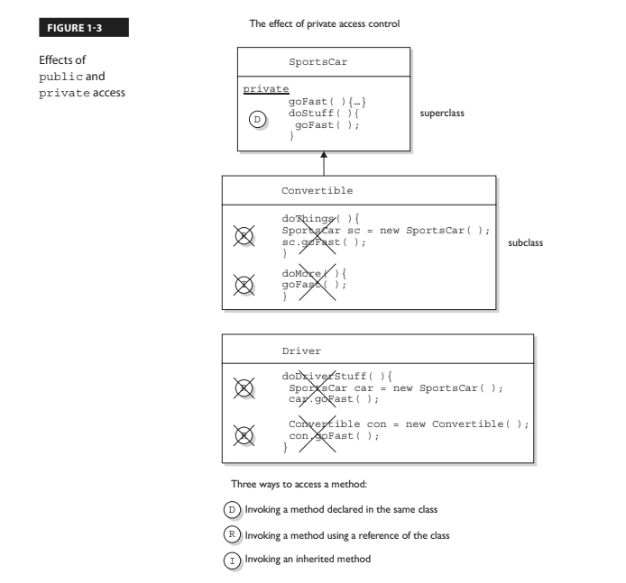
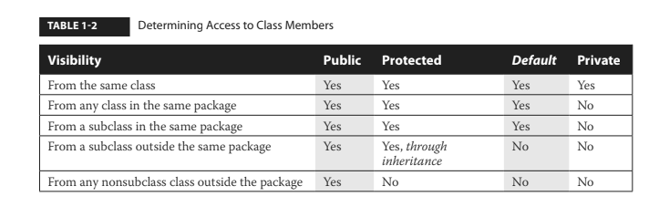

# VARIABLE AND METHODS ACCESS MODIFIERS 

# ACCESS MEMBER MODIFIERS (PUBLIC, PRIVATE, PROTECTED & DEFAULT)

> ## Its crucial that you understand access control inside-out for the exam.  

We've looked at what it means to use a modifier on a class declaration, next we will look at what it means to use a modifier on a method or variable declaration.  You can *modify a member with both **access** and **non-access modifiers*** and you have more modifiers to choose from and combine than when you're declaring a class.

Classes can only use default or public but members can use all four:
- ### 1 public
- ### 2 private
- ### 3 protected &
- ### default 

Default access is what you get when you don't type an access modifier in the variable declaration.  Default and protected access control modifiers have almost identical behavior.  When used in an interfaces method declaration default has a different meaning than what we are describing here.

You need to understand 2 different access issues:

- ### 1 Whether method code in one class can access a member of another class usind ( . ) notation
- ### 2 Whether a subclass can inherit a member of its superclass

The **first** type of access occurs when a method in one class tries to access a method or variable in another class, using the dot operator ( . ) to invoke a method or retrieve a variable.  For example:
```java
class Zoo {
    public String coolMethod(){
        return "Wow baby";
    }
}

class Moo {
    public void useAzoo(){
        Zoo z = new Zoo();
        // If the preceding line compiles Moo has access to the Zoo class, but does it have access to the coolMethod()?
        System.out.println("A Zoo says, " + z.coolMethod());
        // It works because Moo can access the public method
    }
}
```
The **second** type of access revolves around whether a subclass can **inherit** a method of a superclass.  Remember, if a subclass *inherits* a member its exactly as if the subclass actually declared the member itself.  In other words if the subclass *inherits* the member, the subclass *has* the member.
```java
class Zoo {
    public String coolMethod(){
        return "Wow baby";
    }
}

class Moo extends Zoo {
    public void useMyCoolMethod(){
        // Does an instance of Moo inherit the coolMethod()?
        System.out.println("A Zoo says, " + this.coolMethod());
        // It works because Moo can inherit the public method and invoke it as its own
        
        // Can an instance of Moo invoke a coolMethod() on an instance of Zoo?
        Zoo z = new Zoo();
        System.out.println("Zoo says, " + z.coolMethod());
        // coolMethod is public so Moo can invoke it on a Zoo reference
    }
}
```
Much of access control (both types) centers on whether the two classes involved are in the same or different packages.  
> ### First look at the access level of the class even if its members are declared public.  Once you've confirmed a class is visible then it makes sense to look at access levels on individual members. 

## 1 Public Members 

Public Members -> Full Access By Instance Or Inheritance In Any Package

### 1.1 Accessing through a new instance and dot notation

When a method or variable member (field) is delcared public it means that all other classes, regardless of the package they belong to, can access the member (assuming the class itself is visible).
Look at the following source file:
```java
package book;
import cert.*;

class Goo {
    public static void main(String[] args){
        Sludge o = new Sludge();
        o.testIt();
    }
}
```
Now look at the second file:
```java
package cert;

public class Sludge {
    public void testIt(){
        System.out.println("sludge");
    }
}
```
Even though Goo and Sludge are in different packages Goo can invoke the Sludge method after creating a new Sludge instance without problems because both the Sludge class and its testIt() method are marked public.
____

### 1.2 Accessing through inheritance and this. (optional)

For a subclass if a member of its superclass is declared public, the subclass inherits that member regardless of whether both classes are in the same package:
```java
package cert;

public class Roo {
    public String doRooThings(){
        return "fun";
    }
}
```
When a subclass of the Roo class is created any code in the Roo subclass can call its own inherited doRooThings() method.
```java
package notcert;

class Cloo extends Roo {
    public void testCloo(){
        System.out.println(doRooThings());
    }
}
```
If you see a method invoked without the dot operator ( . ) it means the method or variable belongs to the class where you see that code. It also means the method or variable is implicitly being accessed using the *this* reference.  
Code from some other class can also call the doRooThings() method on a Cloo instance. 
```java
package notcert;

class Toon {
    public static void main(String[] args) {
        Cloo c = new Cloo();
        System.out.println(c.doRooThings()); // No problem; method is public 
    }
}
```
____
## 2 Private Members 

Private Members -> Cannot Be Accessed 

> ## A private member is invisible to any code outside the members own class - no other class can access it
Members marked private cannot be accessed by code in any class other than the class in which the member was declared.  This is true for both accessing through a new instance and dot notation ( . ) as well as through inheritance and this. 
```java
package cert;

public class Roo {
    private String doRooThings(){
        // Only the Roo class knows about the fun code that goes here
        return "fun";
    }
}
```
Attempt to access using **inheritance**:
```java
package notcert;
import cert.Roo;

class UseARoo extends Roo {
    public void testIt(){
        System.out.println(this.doRooThings()); // Compiler error method is private!
    }
}
```
Attempt to access using a **new instance and dot ( . ) notation**:   
```java
package notcert;
import cert.Roo;

class UseARoo {
    public void testIt(){
        Roo r = new Roo();
        System.out.println(c.doRooThings()); // Compiler error method is private!
    }
}
```
Overriding depends on inheritance.  A subclass cannot override a private method because it cannot inherit it.  You can however create a newly-declared-but-just-happens-to-match method name with a different return type or anything else.  

Figure 1-3 illustrates the effects of the public and private modifiers from classes on the same or different packages:  



## 3 Protected and Default Members 
Default Members -> Same Package Only

In the next several sections the word default refers to access control - we're not talking about the new Java 8 interface that can be declared default. The protected and default access control levels are almost identical, but with one critical difference.  A **default** member may only be accessed if the class accessing the member **belongs to the same package**, 
whereas a **protected member** can can be **accessed (through inheritance) by a subclass even if the subclass is in a different package**.  

```java
package certification;

public class OtherClass {
    void testIt() { // No modifier means method has default access
        System.out.println("OtherClass");
    }
}
```

```java
package something;
import certification.OtherClass;

class AccessClass {
    public static void main(String[] args) {
        OtherClas o = new OtherClass();
        o.testIt(); // Error testIt() only has default level access/no access from outside package
    }
}
```
## Protected Details (Protected in depth)
Protected Members -> Package Level Access & Inheritance for Different Package

Lets take a look at the protected instance variable (an instance variable is a member) of a superclass.  The variable x is protected meaing it has package level access and will only be accessible through inheritance to classes outside its package, a subclass outside the superclass package cannot access it using the parent class reference. 
```java
package certification;

public class Parent {
    protected int x = 9; // Protected access member
}
```
Attempt to access using **inheritance**:
```java
package other;
import certification.Parent;

class Child extends Parent {
    public void testIt(){
        System.out.println("x is " + x); // No problem, child inherits x and is available on the Child instance
    }
}
```
Attempt to access using a **new instance and dot ( . ) notation**: 
```java
package other;
import certification.Parent;

class Child extends Parent {
    public void testIt() {
        System.out.println("x is " + x); //No problem, child inherits x and is available on the Child instance

        Parent p = new Parent();

        System.out.println("X in parent is " + p.x); // Error! Cannot be accessed via p reference!
    }
}
```
So far we've established that a protected member has essentially package level or default access to all classes except for subclasses.  We've seen that subclasses outside the package can inherit a protected member.  Finally we've seen that subclasses outside the package can't use a superclass reference to access a protected member.  For a subclass outside the package, the protected member can only be accessed through inheritance.  

Once a subclass outside-the-package inherits the protected member, that member (as inherited by the subclass) becomes private to any code outside the subclass, with the exception of subclasses of the subclass.  So if a class neighbor instantiates a child object, then even if class neighbor is in the same package as the class Child, class Neighbor won't have access to the Child's inherrited (but protected) variable x. 


## Default details (default in depth)
If you dont type an access modifier in front of a class or member declaration, the access control is default, which means package level only.  
```java
package certification;

public class parent {
    int x = 9; // No access modifier means default (package) access
}
```
```java
package certification;

class Child extends Parent{
    static public void main(String[] args) {
        Child sc = new Child();
        sc.testIt();
    }
    public void testIt(){
        System.out.println("Variable x is " + x); // No problem - same package
    }
}
```
## Local variables and access modifiers
There is never a case where an access modifier can be applied to a local variable.  Only one modifier can be applied to local variables - final. Watch out for code like the following:
```java
class Foo {
    void doStuff(){
        private int x = 7;
        this.doMore(x);
    }
}
```



